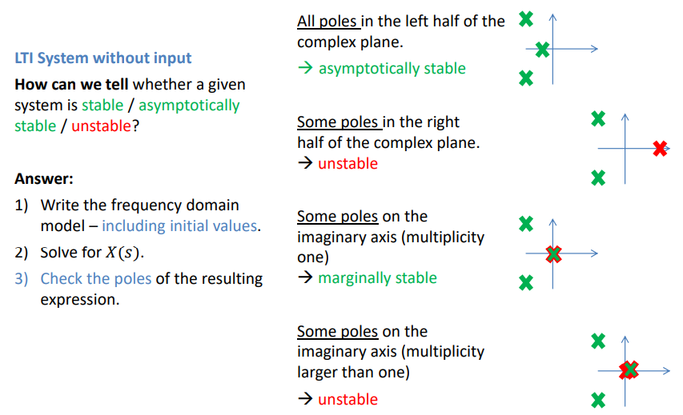
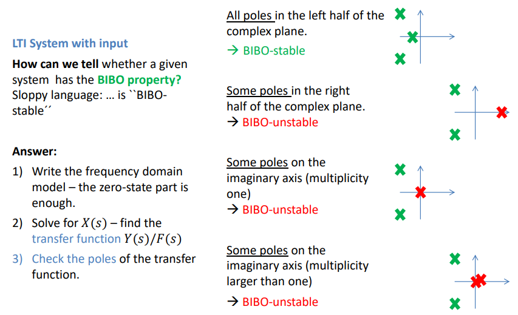
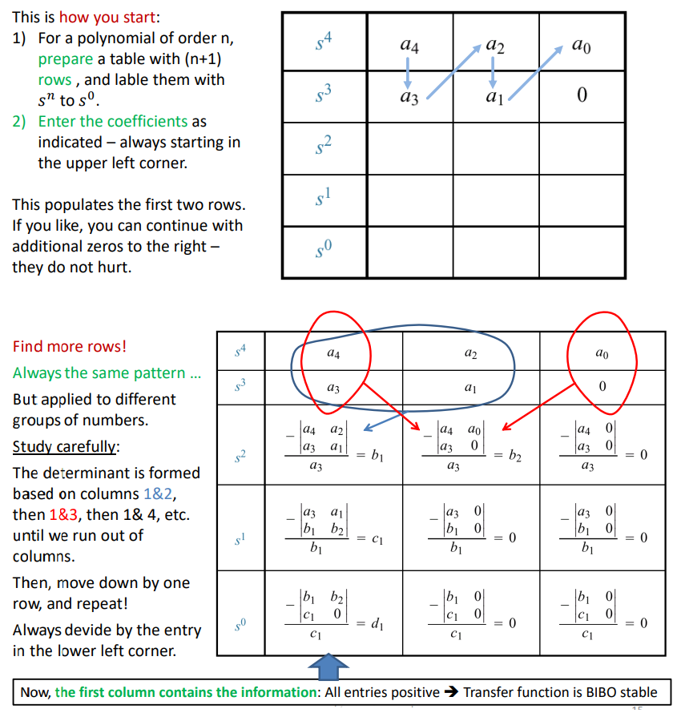

# Introduction to Robotics 

*Author: Daria Shutina*

[TOC]

## 23-02-03

### Sections of mechanics

**Statics** is concerned with the analysis of loads (force and torque, or "moment") acting on physical systems that do not experience an acceleration (a=0), but rather, are in static equilibrium with their environment.

**Kinematics** describes the motion of points, bodies (objects), and systems of bodies (groups of objects) without considering properties of objects (mass, density) or the forces that caused the motion.

**Kinetics** is concerned with the relationship between motion and its causes, specifically, forces and torques. 

**Dynamics** studies forces and their effect on motion. 

## 23-02-07

### Vector 

#### Vector norm

A norm is a function $f \ : \ R^n \rightarrow R$ that satisfies 4 properties:

1.  Non-negativity: $\forall x \in R^n \ : \ f(x) \geqslant 0$
2.  Definiteness: $f(x) = 0 \Rightarrow x = 0$
3.  Homogeneity: $\forall x \in R^n, t \in R \ : \ f(tx) = |t| f(x)$
4. Triangle inequality: $\forall x, y \in R^n \ : \ f(x + y) \leqslant f(x) + f(y)$

Euclidean vector norm (2-norm): $||x||_2 = \sqrt{\sum \limits_{i = 1}^{n} x_i^2}$

$||x||_2 = \sqrt{x^{T} x}$

General $p$-norms, $p \geqslant 1$:   $||x||_p = (\sum \limits_{i=1}^n |x_i|^p)^{\frac{1}{p}}$

$||x||_{\infty} = \max \limits_i |x_i|$

#### Dot product 

It is an operation between <u>two vectors</u> that results in a scalar (a single value).

$[x_1 ... x_n] \cdot \begin{bmatrix} y_1 \\ \vdots \\ y_n \end{bmatrix} = \sum \limits_{1}^{n} x_iy_i$

#### Cross product 

It is an operation between <u>two vectors</u> that results in a third vector perpendicular to the plane formed by the original vectors. 

Properties:

- $a \times a = 0$
- $||a \times b|| = ||a|| \cdot ||b|| \cdot \sin \theta$ where $\theta$ is the angle between $a$ and $b$
- if $a$ and $b$ are parallel, then $a \times b = 0$  $\textcolor{grey}{\scriptsize (since \ \sin \theta = 0)}$
- cross product is not commutative: $a \times b = - b \times a$
- cross product is not associative: $a \times (b \times c) \neq (a \times b) \times c $
- cross product is distributive: $a \times (b + c) = a \times b + a \times c$

**Direction of the result vector**

### Matrix operations

1. Addition

2. Scaling: $\begin{pmatrix} a & b \\ c & d \end{pmatrix} \cdot 3 = \begin{pmatrix} 3a & 3b \\ 3c & 3d \end{pmatrix}$

3. Dot product (inner product): $\begin{pmatrix} x_1 \ldots x_n \end{pmatrix} \cdot \begin{pmatrix} x_1 \\ \vdots \\ x_n \end{pmatrix} = \begin{pmatrix} a_1 \end{pmatrix}$

4. Multiplication -- consists of several dot product operations 

   It is a right-associative.

5. Transposition: $A^T \ : \ a^T_{ij} = a_{ji}, \ \forall i, j$

   Also, $(ABC)^T = C^T B^T A^T$

6. Inverse

7. Determinant

8. Power (only for square matrices)

9. Trace -- sum of elements on the diagonal

   $\textnormal{tr} AB = \textnormal{tr} BA$

   $\textnormal{tr} (A + B) = \textnormal{tr} A + \textnormal{tr} B$

10. etc (maybe)

#### Multiplication

- associative: $(AB)C = A(BC)$
- distributive: $A(B+C) = AB + AC$
- non-commutative: $AB \neq BA$

#### Determinant

Properties:

- $\det AB = \det BA$
- $\det A^{-1} = \frac{1}{\det A}$
- $\det A^T = \det A$

#### Inverse

Given a matrix $A$, its inverse is a matrix $A^{-1}$ such that $A A^{-1} = A^{-1} A = 1$. 

$\exists A^{-1} \ \Rightarrow$ $A$ is invertible and non-singular. Otherwise, it is singular. 

Inverse matrices do not exist for non-square matrices. 

Properties:

- $(A^{-1})^{-1} = A$
- $(AB)^{-1} = B^{-1} A^{-1}$

## 23-02-10

### 2d rotation matrix

A 2-dimensional vector consists of basic vectors $(1, 0)$ and $(0, 1)$ multiplied by some constants. Rotating the basic vectors, we rotate the original vector. 

As a result, the rotation matrix $R = \begin{pmatrix} T[\begin{pmatrix} 1 \\ 0 \end{pmatrix}] & T[\begin{pmatrix} 0 \\ 1 \end{pmatrix}] \end{pmatrix} = \begin{pmatrix} \cos \theta & -\sin \theta \\ \sin \theta & \cos \theta \end{pmatrix}$.

Counter-clockwise by the angle $\theta$:

$R = \begin{pmatrix} \cos \theta & -\sin \theta \\ \sin \theta & \cos \theta \end{pmatrix}$

Clockwise by the angle $\theta$:

$R^T = \begin{pmatrix} \cos \theta & \sin \theta \\ -\sin \theta & \cos \theta \end{pmatrix}$

Properties of $R$:

- $R \cdot R^T = E$
- $\det R = 1$

### Homogeneous coordinates

#### Adding a constant

In order to be able to add a constant, we add `1` to every vector: 

$\begin{pmatrix} a & b & c \\ d & e & f \\ 0 & 0 & 1 \end{pmatrix} \cdot \begin{pmatrix} x \\ y \\ 1 \end{pmatrix} = \begin{pmatrix} ax + by + c \\ dx + ey + f \\ 1 \end{pmatrix}$.

Such systems are called *homogeneous*. A homogeneous transformation matrix will have a row `[0 0 1]` at the bottom, so there will be `1` at the bottom of the result matrix. 

#### 2d translation

The matrix have the form of $T = \begin{pmatrix} 1 & 0 & \ldots & t_1 \\ 0 & 1 & \ldots & t_2 \\ 0 & 0 & \ldots & t_3 \\ & \ldots \\ 0 & 0 & \ldots & 1 \end{pmatrix}$. 

$\begin{pmatrix} t_1 \\ \ldots \\ t_n \end{pmatrix}$ is an addition of a constants to the initial coordinates. 

#### Scaling

The matrix has a form of $\begin{pmatrix} s_1 & 0 & \ldots & 0 & 0 \\0 & s_2 & \ldots & 0 & 0 \\ && \ldots \\0 & 0 & \ldots & s_n & 0 \\ 0 & 0 & \ldots & 0 & 1 \\ \end{pmatrix}$.

$s_1, ..., s_n$ are scalars for the initial coordinates. 

### Linear independence

$I$ is a set of indexes. 

The system $\{ v_i \}_{i \in I}$ is *linearly dependent*, if one of the statements below are true:

1. $\nexists i \in I \ : \ v_i = \sum \limits_{j \neq i} v_j$
2. $\forall \{ a_i \} \in R \ : \ \Sigma a_i v_i = 0 \ \Rightarrow \ a_i = 0, \forall i \in I$.

### Matrix rank

Suppose we have a $m \times m$ matrix. 

If its rank is $m$ then it is *full rank* and it has an inverse matrix. 

If its rank is $<m$ then it is *singular* and does not have an inverse matrix. We also cannot restore the input. 

### Eigenvectors and eigenvalues

Given a matrix $\mathcal{A}$ of size $n \times n$.

$v \in V/\{0\}$ is an *eigenvector* if $\exists \lambda \ : \ \mathcal{A}(v) = \lambda v$.

$\lambda$ is an *eigenvalue*.

$p_{\mathcal{A}}(\lambda) = \det(\mathcal{A} - \lambda E)$ is a *characteristic polynomial* of matrix $\mathcal{A}$.

#### Th. (why do we need to substract $\lambda$ on the diagonal of the matrix)

$\lambda$ is an eigenvalue $\Leftrightarrow$ $(\mathcal{A} - \lambda E)(v) = 0$ $\Leftrightarrow$ $\det(A - \lambda E) = 0$

*Proof:*

$\mathcal{A} - \lambda v = 0 \ \Leftrightarrow \ (\mathcal{A} - \lambda E) v = 0 \ \Leftrightarrow Ker(\mathcal{A} - \lambda E) \neq \varnothing \ \underset{(*)}{\Leftrightarrow} \ \det(\mathcal{A} - \lambda E) = 0$.

For $(*)$, $\det(\mathcal{A} - \lambda E) = 0 \Leftrightarrow$ $\mathcal{A} - \lambda E$ is not inversible $\Leftrightarrow$ $Im(\mathcal{A} - \lambda E) \neq V$ $\Leftrightarrow$ $Ker(\mathcal{A} - \lambda E) \neq \varnothing$.

#### Th. (relation between eigenvalue and characteristic polynomial)

$\lambda$ is an eigenvalue  $\Leftrightarrow$  $\lambda$ is the root of the characteristic polynomial

*Proof:*  

$\lambda$ is an eigenvalue  $\Leftrightarrow$  $\det(\mathcal{A} - \lambda E) = p_{\mathcal{A}}(\lambda) = 0$ 

#### Example

$\mathcal{A} = \begin{pmatrix} 3 & -1 \\ -3 & 5 \end{pmatrix}$.

$p_{\mathcal{A}}(\lambda) = \det \begin{pmatrix} 3 - \lambda & -1 \\ -3 & 5 - \lambda \end{pmatrix} = \lambda^2 - 8 \lambda + 12 = 0$.

$\lambda_1 = 6, \ \lambda_2 = 2$.

$\mathcal{A} v_1 = \lambda_1 v_1 \ \Rightarrow \ v_1 = \begin{pmatrix} 1 \\ -3 \end{pmatrix}$. Normalized $\frac{1}{\sqrt{10}} \begin{pmatrix} 1 \\ -3 \end{pmatrix}$    $\color{grey}{\textnormal{(length is equal to 1)}}$ 

$\mathcal{A} v_2 = \lambda_2 v_2 \ \Rightarrow \ v_2 = \begin{pmatrix} 1 \\ 1 \end{pmatrix}$. Normalized $\frac{1}{\sqrt{2}} \begin{pmatrix} 1 \\ 1 \end{pmatrix}$

#### Diagonolization

Typically an $n \times n$ matrix has $n$ different eigenvalues and $n$ associated eigenvectors. 

If there are $n$ independent eigenvectors, they can be used as a basis for $V$. Thus, we get a matrix $B = \begin{pmatrix} v_1 & ... & v_n \end{pmatrix}$ of the size $n \times n$. 

The diagonal matrix for $\mathcal{A}$ is $D = \begin{pmatrix} \lambda_1 & 0 & \ldots & 0 & 0 \\ 0 & \lambda_2 & \ldots & 0 & 0 \\ && \ldots \\ 0 & 0 & \ldots & 0 & \lambda_n \end{pmatrix}$. 

Finally, we come to $\mathcal{A} = B D B^{-1}$. You should be able to confirm this statement :^)

#### Trace and determinant

$p_{\mathcal{A}}(\lambda) = \det(\mathcal{A} - \lambda E) = \lambda^n - \textcolor{blue}{\textnormal{tr} \mathcal{A}} \cdot \lambda^{n-1} + \ldots + (-1)^n \cdot \textcolor{red}{\det \mathcal{A}}$.

$\textnormal{tr} \mathcal{A} = \textnormal{tr} D = \lambda_1 + \ldots + \lambda_n$.

$\det \mathcal{A} = \det D = \lambda_1 \cdot \ldots \cdot \lambda_n$. 

## 23-02-14

### Vector math

$a_x = a \cos \theta, \ a_y = a \sin \theta$

$a = \sqrt{a_x^2 + a_y^2}$

$\theta = \arctan \frac{a_y}{a_x}$

## 23-02-17

### 3d rotation

Rotate over the angle $\alpha$ around the $z$ axis:

$x' = x \cos \alpha - y \sin \alpha$

$y' = x \sin \alpha + y \cos \alpha$

$z' = z$

Counter-clockwise direction

- around z-axis:

  $R_z(\alpha) = \begin{pmatrix} \cos \alpha & -\sin \alpha & 0 & 0 \\ \sin \alpha & \cos \alpha & 0 & 0 \\ 0 & 0 & 1 & 0 \\  0 & 0 & 0 & 1 \end{pmatrix}$

  

- around y-axis:

  $R_y(\alpha) = \begin{pmatrix} \cos \alpha & 0 & \sin \alpha & 0 \\ 0 & 1 & 0 & 0 \\ -\sin \alpha & 0 & \cos \alpha & 0 \\ 0 & 0 & 0 & 1 \end{pmatrix}$

  

- around x-axis:

  $R_z(\alpha) = \begin{pmatrix} 1 & 0 & 0 & 0 \\ 0 & \cos \alpha & -\sin \alpha & 0 \\ 0 & \sin \alpha & \cos \alpha & 0  \\ 0 & 0 & 0 & 1 \end{pmatrix}$

A square matrix $R$ is a **rotation matrix** if $R^T = R^{-1}$ and $\det R = 1$. 

$Rv = v \ \Rightarrow v$ is a rotation matrix. 

$Tr(R) = m - 2 + 2 \cos \theta$ where $m$ is the matrix's size and $\theta$ is the angle of rotation. 

## 23-02-21

### Quaternions

Usually, quaternions are expressed as a scalar and a 3-dimensional vector:

$q = (a, v) = (a, b, c, d)$ where $a$ is a scalar, $(b, c, d)$ is a vector.

$q = (a, b, c, d) = a + bi + cj + dk$

$i, j, k$ are basis vectors of 3-dimensional matrix. They satisfy the rule:

*Proof:*

 

$ijk = -1 \ \underset{i \cdot...}{\Rightarrow} -jk = -i \Rightarrow jk = i$

#### Operations

**Addition / subtraction**

$q_1 = (a_1, v_1)$ and $q_2 = (a_2, v_2)$

$q_1 \pm q_2 = (a_1 \pm a_2, v_1 \pm v_2)$ 

Addition / subtraction are commutative and associative 

**Multiplication**

$q_1 = a_1 + b_1 i + c_1 j + d_1 k$

$q_2 = a_2 + b_2 i + c_2 j + d_2 k$

$q_1 \cdot q_2 = (a_1 + b_1 i + c_1 j + d_1 k) \cdot (a_2 + b_2 i + c_2 j + d_2 k) = $ just expand brackets  

Multiplication is associative, but not commutative 

The **norm** $||q || = ||(a, v)|| = ||(a, b, c, d) || = \sqrt{a^2 + b^2 + c^2 + d^2}$

Quaternion **conjugate** (сопряженная матрица) of $q = (a, v)$ is  $q^* = (a, -v)$.  

$q \cdot q^* = |q|^2 \ \Rightarrow$ Quaternion **inverse** $q^{-1} = \frac{q^*}{|q|^2}$

#### Get a 4-dimensional matrix

$$
q = (a, b, c, d) = 
\begin{bmatrix} 
a & -b & -c & -d \\
b & a & -d & c \\
c & d & a & -b \\
d & -c & b & a 
\end{bmatrix}
$$

## 23-02-24

### 3d-rotations

#### Rodriquez Rotation

We want to rotate vector $v$ around axis $n$ with the angle $\theta$. 

$v_{||}$ is a projection of $v$ on axis $n$. $v_{\bot}$ is a projection on the plain. 

$v = v_{||} + v_{\bot}$ -- the initial vector 

$v' = v'_{||} + v'_{\bot}$ -- the result vector 

$v'_{||} = v_{||} = (v \cdot n) \times n$   ($n$ is normalized, value in brackets is a scalar)

$v' = \cos \theta \cdot v + (1 - \cos \theta ) \cdot v_{ll} + \sin \theta \cdot (n \times v)$

#### Quaternions

Given a point $\bar{p}$. We want to rotate $\bar{p}$ by the angle $\theta$ around the axis $\bar{n}$. 

$q = (\cos \frac{\theta}{2} , \frac{\bar{n}}{||n||} \sin \frac{\theta}{2})$.

The resulting point is equal to $p' = qpq^*$ $\textcolor{grey}{(\ \textnormal{if } q = (a, v) \textnormal{, then } q^* = (a, -v) \ )}$ 

**Example** 

Given a point $P = \begin{pmatrix} 1 \\ 2 \\ 3 \end{pmatrix}$. Rotate the point by $60 \degree$ around the axis $n = \begin{pmatrix}  1 \\ 1 \\ 1 \end{pmatrix}$. 

$p = (0, P) = \begin{pmatrix} 0 & 1 & 2 & 3 \end{pmatrix}$.

$q = (\cos 30 \degree, \frac{n}{\sqrt{3}} \sin 30 \degree) = \begin{pmatrix} \cos 30 \degree & \frac{1}{\sqrt{3}} \sin 30 \degree & \frac{1}{\sqrt{3}} \sin 30 \degree & \frac{1}{\sqrt{3}} \sin 30 \degree \end{pmatrix}$

#### Intrinsic / extrinsic rotations

**Intrinsic rotations**, also known as body-fixed rotations or rotations in local coordinates, involve rotating an object around its own coordinate axes. This means that the axes of rotation are attached to the object itself and move with the object as it rotates. 

Intrinsic rotations are often described using a sequence of rotations (such as yaw, pitch, and roll), where each rotation occurs around one of the object's local axes. The order of rotation matters.

**Extrinsic rotations**, also known as world-fixed rotations or rotations in global coordinates, involve rotating an object around fixed external coordinate axes. The order of rotation also matters.

## 23-02-28

### Straight line motion: $\bar{a}$ as a constant

$v = v_0 + at$

$s = s_0 + v_0t + \frac{at^2}{2}$

$v^2 = v_0^2 + 2a (s - s_0)$

### Curvilinear motion

#### Measuring angles 

**Absolute angle** (segment angle) -- angle between a segment (a line or object) and the horizontal of the distal end (the outermost point) of the segment. In simple words, it is an angle between the line (it represents the object's direction) and the horizontal line. 

**Relative angle** (joint angle) -- angle between the longitudinal axis of two adjacent segments. In simpler terms, it's the angle between the lines that represent the direction of two connected objects. The value $\leqslant 90$ is taken (it means if $\alpha > 90$, then $180 - \alpha$ is taken). 

#### Angular and linear velocity 

**Angular velocity** $w$ is a measure of how quickly an object is rotating or spinning (around a particular axis).  If you curl your fingers in the direction of rotation, your thumb points in the direction of the angular velocity vector.

 $w = \frac{\Delta \theta}{\Delta t} \ (rad / s)$. 

$\Delta \theta$ is in radians. It is the angle between two segments. 

Lets have the initial and the final segments. Then:
$$
w_f = w_i + at \\
\theta_f = \theta_i + w_i t + \frac{at^2}{2} \\
w_f^2 = w_i^2 + 2a (\theta_f - \theta_i)
$$

Every spinning object has both angular and linear velocity. **Linear velocity** $v$ is a measure of how quickly an object is moving along a straight path. The direction of linear velocity is along the path of motion. It is also called **tangential velocity**.

Linear velocity $v = wR \ (m / s)$. 

#### Accelerations

**Angular acceleration** measures how quickly the angular velocity changes. 
$$
\alpha = \frac{\Delta w}{\Delta t}
$$
**Tangential acceleration** is the measure of how quickly a tangential velocity changes. Its direction is perpendicular to the direction of $a_c$.

Tangential acceleration will work if an object is moving in a circular path. 
$$
a_t = \frac{\Delta v}{\Delta t} \\
a_t = \alpha r
$$

Even if the velocity vector does not change the magnitude, its direction is constantly changing during angular motion. **Centripetal acceleration** is an acceleration towards the axis of rotation. 
$$
a_c = w^2 r = \frac{v^2}{r}
$$

Since $a_t$ and $a_c$ are perpendicular, the **resultant linear acceleration** can be found using the Pythagorean Theorem: 
$$
a = \sqrt{a_t^2 + a_c^2}
$$

## 23-03-07

### Force and moment 

### Couple forces

Couple of forces are:

- two parallel forces at points $p_1$ and $p_2$
- same magnitude but opposite direction 
- separated by perpendicular distance $d$
- resultant linear force is $0$

**Couple moment** = $(r_1 - r_2) \times F$

Direction of the couple moment is determined by the right-hand rule. It is perpendicular to the plane containing the forces. 

### Polar representations 

$x \rightarrow r \cos \theta$

$y \rightarrow r \sin \theta$

$z \rightarrow z$

## 23-03-14

### LTI systems 

A **signal** is an input or an output of the LTI system. It has a property called **amplitude** -- the strength of the signal. 

The input/output signal is **bounded**, if its amplitude is finite. In other words, the input and the output do not grow uncontrollably. This ensures that the system's behavior is predictable and doesn't lead to any undesirable outcomes.

#### Damping

**Damping** refers to the mechanism that reduces the amplitude of oscillations in a system over time. 

**Positive damping** occurs when the damping force makes the system return to its equilibrium position without overshooting. The amplitude of oscillations gradually decreases until the system comes to rest. For example, it is a door closer mechanism. 

**Negative damping** (or overdamping) occurs when the damping force is strong enough to cause the system to return to its equilibrium position without oscillating. In other words, it is when the equilibrium position is overshot in a dynamic system. 

#### Stability & unsuitability

LTI systems $\textcolor{green}{\textnormal{without input}}$ are 

- *stable* if for any initial condition $x(0)$, the system's response $x(t)$ remains bounded as time $t$ goes to infinity: 
  $$
  \forall x(0) \ \exists k > 0 \ : \ ||x(t)|| < k, \forall t > 0
  $$
  
- *asymptotically stable* if for any initial condition $x(0)$, the system's response $x(t)$ converges to the origin (zero) as time $t$ goes to infinity:
  $$
  \lim \limits_{t \rightarrow \infty} ||x(t)|| = 0
  $$
  The system's response gradually approaches and settles at the equilibrium point (i.e., zero) over time.

  

- *unstable* if its solutions do not remain bounded over time. The response of the system grows uncontrollably as time progresses. 

LTI systems $\textcolor{green}{\textnormal{with input}}$ are considered **stable** if bounded input always lead to bounded output (BIBO criteria). 

#### Check system's stability

The **poles of a system** refer to the values of the <u>complex variable</u> that make the denominator of the system's transfer function equal to zero. 

For LTI systems without input:

For LTI systems with input: 

#### Routh table 

Finding poles can be problematic if a polynomial in the denominator is not factorized. You can find out the approximate position of the poles using the **Routh table**. 

- if there is a negative or zero coefficient, the system is **not** BIBO-stable

- otherwise, use the Routh table:

  

  It is allowed to reduce a complete row by a common positive factor 
