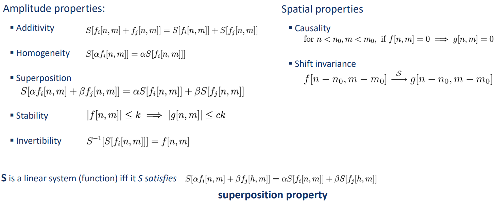
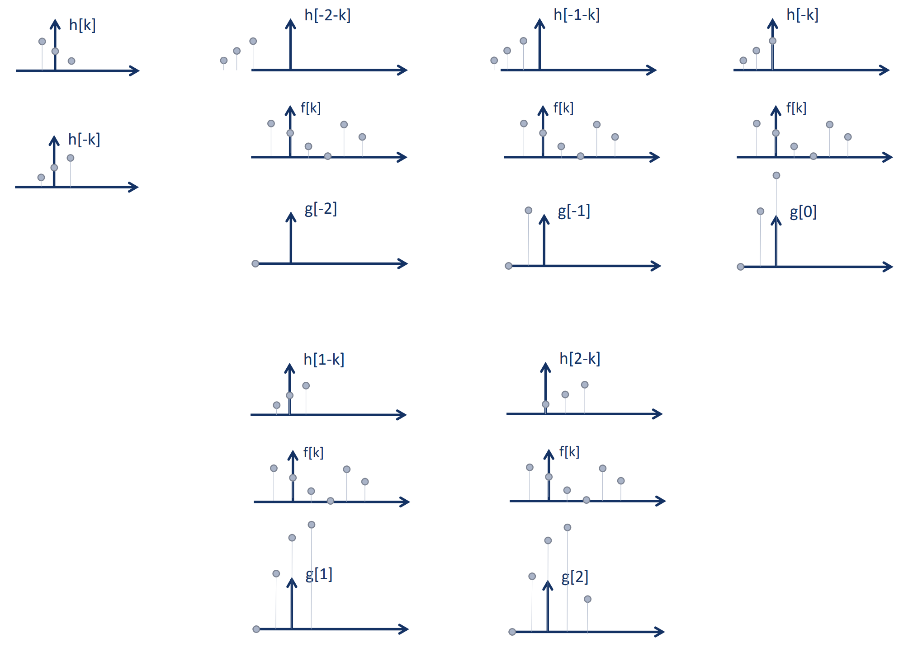

# Computer vision

[TOC]

# 23-09-07

### Physics of color 

The white light is composed of almost equal energy in all wavelengths of the visible spectrum. Actually, *the white is a combination of red, blue and green*. When the light passes through the triangular prism, you see a rainbow. This is because the prism separates the colors by a different angle (by varying [refractive index](https://www.britannica.com/science/refractive-index)). 

[Prism experiments](https://www.youtube.com/watch?v=uucYGK_Ymp0)

In simple words, **color** is the result of the interaction between physical light and our visual system. Sientifically (and broader), reflected color is the result of interaction of light source spectrum with surface reflectance. Spectral radiometry is a field of science that deals with the measurement and analysis of light or electromagnetic radiation. 

[Amaizing math behind colors](https://www.youtube.com/watch?v=gnUYoQ1pwes)

Electromagnetic spectrum:

### Human eye

Cones and rods are the two types of light-sensitive receptors (dwell in the retina). 

 **Rods** are rod-shaped and highly sensitive to light. They are responsible for the gray-scale (black & white) vision. Rods are bad at detecting colors. They are more suited for detecting motion and shapes under low-light conditions.

**Cones** are cone-shaped, responsible for color vision and provide high-resolution, detailed images. Cones are less sensitive to light, meaning they require more light to become activated.

There are three types of cones: short-wavelength cones (blue), medium-wavelength cones (green), and long-wavelength cones (red). Each type detects the light of definite wavelength (the range can be found in the pic below). Depending on the wavelength, different amounts of cone types are activated. The brain combines the signals from the cones to create our perception of colors.

You can also notice that cones of different types have different responsivity. If we add three functions together, it gives us a function of a total responsivity. Its maximum is in the range of green and yellow wavelengths. It explains why we see colors around yellow as a lot brighter than others. 

### Color spaces

#### Linear color space

Linear color space is defined by three primaries. The coordinates of a color are given by the weights of the primaries used to match it.

One of the most well-known examples of a linear color space is CIELAB.

#### RGB space

RGB space describes how to express every color as a combination of red, green and blue. Primaries used in RGB space are monochromatic lights (consist of a single wavelength).

#### HSV space

HSV color space is a cylindrical coordinate representation of points in an RGB color model. `HSV` stands for:

- `Hue` - the dominant color as perceived by an observer. It is a chromaticity angle between 0 and 360.
- `Saturation` - the intensity of the color. It represents the amount of white light mixed with a Hue. Its value is equal to the radius of the cylinder.
- `Value` (0 to 100) - controls luminance. Its value is the height of the cylinder. 

HSV space can be converted into RGB space:

- $(R, G, B)$ is the color in the RGB space
- $r = \frac{R}{255}, \ g = \frac{G}{255}, \ b = \frac{B}{255}$
- $m_1 = \min(r, g, b), \ m_2 = \max (r, g, b)$
- $V = m_2 \cdot 100$
- $S = \frac{m_2 - m_1}{m_2} \cdot 100$
- \todo

### White balancing

White balance is the process of removing unnatural color casts.

**The von Kries adaptation** hypothesis suggests that the human eye adapts to changes in illumination by adjusting its sensitivity to different wavelengths of light. Cones adapt to changes by multiplying their responses to incoming light by a scaling factor. 

So, the idea of von Kries adaptation is to multiply each channel by a gain factor. One way to find the factor is to use the "gray card" method:

- take a picture of a neutral object (white or gray)
- deduce the weight of each channel. If the neutral object is recorded as $r_w, g_w, b_w$, then weights for custom white balance settings will be $\frac{1}{r_w}, \frac{1}{g_w}, \frac{1}{b_w}$. 

## 23-09-14

### Vector math

A **vector norm** is any function that satisfies 4 properties:

1. $\forall x \in R^n \ : \ f(x) \geqslant 0$
2. $f(x) = 0 \Rightarrow x = 0$
3. $\forall x \in R^n \ : \ f(tx) = |t| f(x)$
4. $\forall x, y \in R^n \ : \ f(x + y) \leqslant f(x) + f(y)$

$$
||x|| = \sqrt{\sum \limits_1^n x_i^2} \\

||x||_p = (\sum \limits_1^n x_i^p)^{\frac{1}{p}} \\

||x||_{\infty} = \max \limits_i |x_i|
$$

**Dot product (inner product)**

$x^T y = \sum \limits_1^n x_i y_i$

$x^T y = |x| \cdot |y| \cdot \cos \phi$ where $\phi$ is the angle between $x$ and $y$

The result of $x \cdot y$ gives the length of the component of $x$ which is parallel to $y$:

- positive $\Rightarrow$ $\phi < 90 \textdegree$ and the component lies in the same direction as $y$. 
- negative $\Rightarrow$ $\phi > 90 \textdegree$ and the component lies in the opposite direction. 
- zero $\Rightarrow$ $x$ and $y$ are perpenducilar

**Cross product**

The result is a vector perpendicular to the plane created by $x$ and $y$.

$x \times y = |x| \cdot |y| \cdot \sin \phi$

### Matrix math

**Multiplication**

- associative: $(AB)C = A(BC)$
- distributive: $A(B+C) = AB + AC$
- non-commutative: $AB \neq BA$

**Transpose**

- $(ABC)^T = C^T B^T A^T$

**Determinant**

- $\det AB = \det BA$
- $\det A^{-1} = \frac{1}{\det A}$
- $\det A^T = \det A$
- $det A = 0 \Rightarrow A$ is singular (a square matrix that is not invertible)

Besically, a determinant of a matrix $A = \begin{bmatrix} a & c \\ b& d \end{bmatrix}$ is a square of a parallelogram formed by vectors $\begin{bmatrix} a \\ b \end{bmatrix}$ and $\begin{bmatrix} c \\ d \end{bmatrix}$.

**Trace**

$tr(A) = $ sum of elements on the diagonal. 

- $\textnormal{tr} AB = \textnormal{tr} BA$
- $\textnormal{tr} (A + B) = \textnormal{tr} A + \textnormal{tr} B$

**Matrix norm**

Frobenius norm (or Euclidean norm): $||A||_F = \sqrt{\sum \limits_j \sum \limits_i a_{ij}^2} = \sqrt{Tr(A^T A)}$

**Rotation**

$R$ is a rotation matrix if it satisfies properties:

- $R \cdot R^T = E$
- $\det R = 1$

Rotating a system by $\phi$ is equivalent to rotating a point within that system by the angle $-\phi$. When you rotate a system by $\phi$, you change the directions of the axes. This operation affects all points that are *within that system*. On the other hand, when you rotate a point within the same coordinate system by the angle $-\phi$, you are changing the position of that point while keeping the system's orientation unchanged.

### Homogeneous coordinates

**Translation**

The matrix have the form of $T = \begin{pmatrix} 1 & 0 & \ldots & t_1 \\ 0 & 1 & \ldots & t_2 \\ 0 & 0 & \ldots & t_3 \\ & \ldots \\ 0 & 0 & \ldots & 1 \end{pmatrix}$. 

$\begin{pmatrix} t_1 \\ \ldots \\ t_n \end{pmatrix}$ is an addition of a constants to the initial coordinates. 

**Scaling**

The matrix has a form of $\begin{pmatrix} s_1 & 0 & \ldots & 0 & 0 \\0 & s_2 & \ldots & 0 & 0 \\ && \ldots \\0 & 0 & \ldots & s_n & 0 \\ 0 & 0 & \ldots & 0 & 1 \\ \end{pmatrix}$.

$s_1, ..., s_n$ are scalars for the initial coordinates. 

The order of scaling and translation is important. `Scalling * Translating` ends up in a bigger image, then `Translating * Scalling`. 

### Eigenvectors and eigenvalues

Given a matrix $\mathcal{A}$ of size $n \times n$.

$v \in V/\{0\}$ is an *eigenvector* if $\exists \lambda \ : \ \mathcal{A}(v) = \lambda v$.

$\lambda$ is an *eigenvalue*.

$p_{\mathcal{A}}(\lambda) = \det(\mathcal{A} - \lambda E)$ is a *characteristic polynomial* of matrix $\mathcal{A}$.

$\lambda$ is an eigenvalue  $\Leftrightarrow$  $\lambda$ is the root of the characteristic polynomial, which means $\det(\mathcal{A} - \lambda E) = p_{\mathcal{A}}(\lambda) = 0$. 

$tr(A) = \sum \limits_i \lambda_i$ ($\lambda_i$ are eigenvalues)

**Example**

$\mathcal{A} = \begin{pmatrix} 3 & -1 \\ -3 & 5 \end{pmatrix}$.

$p_{\mathcal{A}}(\lambda) = \det \begin{pmatrix} 3 - \lambda & -1 \\ -3 & 5 - \lambda \end{pmatrix} = \lambda^2 - 8 \lambda + 12 = 0$.

$\lambda_1 = 6, \ \lambda_2 = 2$.

$\mathcal{A} v_1 = \lambda_1 v_1 \ \Rightarrow \ v_1 = \begin{pmatrix} 1 \\ -3 \end{pmatrix}$. Normalized $\frac{1}{\sqrt{10}} \begin{pmatrix} 1 \\ -3 \end{pmatrix}$.  

$\mathcal{A} v_2 = \lambda_2 v_2 \ \Rightarrow \ v_2 = \begin{pmatrix} 1 \\ 1 \end{pmatrix}$. Normalized $\frac{1}{\sqrt{2}} \begin{pmatrix} 1 \\ 1 \end{pmatrix}$.

### Singular Value Deomposition (SVD)

SVD decomposes a matrix into three other matrices, allowing to represent the original matrix in a more interpretable and compact form. 
$$
A = U \Sigma V^T
$$
where:

- $A$ is the original matrix of size $m \times n$ 

- $U$ is an orthogonal matrix (meaning $U^T U = E$). Its size is $m \times m$.

  Columns of $U$ are called the left singular vectors of $A$.

- $\Sigma$ is a diagonal matrix with non-negative real numbers, called the singular values of A. They are typically arranged in descending order. $rank(\Sigma) = rank(A)$.

- $V$ is an orthogonal matrix of size $n \times n$. 

  Rows of $V^T$ are called the right singular vectors of $A$.

$U$ and $V$ are always rotation matrices. They represent rotations and reflections in the original space that transform the columns of $A$ into the coordinate axes. These transformations preserve the length of vectors. 

$\Sigma$ works like a scalling matrix. The values on the diagonal are the singular values $\sigma_1,..., \sigma_m$ of the matrix $A$ (singular value is a root of eigenvalue for $A^T A$). The values are typically ordered in descending order, meaning the largest singular value is at the top-left corner. Larger singular valueiis correspond to more significant contributions, meaning the karger coefficient of the corresponding component.

 

**Example**

Given the $A = \begin{bmatrix} 1&1&0 \\ 0&0&1 \end{bmatrix}$, find its SVD.

- Find eigenvalues and eigenvectors of $A^TA$:

  $A^TA = \begin{bmatrix} 1&1&0 \\ 1&1&0\\ 0&0&1 \end{bmatrix}$

  $\lambda_1 = 2, \ \lambda_2 = 1, \ \lambda_3 = 0$

  $w_1 = \begin{bmatrix} 1\\1\\0 \end{bmatrix}, \ w_2 = \begin{bmatrix} 0\\0\\1 \end{bmatrix}, \ w_3 = \begin{bmatrix} -1\\1\\0 \end{bmatrix}$

- Values of $\Sigma$ are roots of eigenvalues of $A^TA$:

  $\sigma_1 = \sqrt{2}, \ \sigma_2 = 1; \ \ \Sigma = \begin{bmatrix} \sqrt{2} & 0 & 0 \\ 0 & 1 & 0 \end{bmatrix}$

- Columns of $V$ are normalized eigenvectors of $A^TA$:

  $v_1 = \begin{bmatrix} 1/\sqrt{2}\\1/\sqrt{2}\\0 \end{bmatrix}, \ v_2 = \begin{bmatrix} 0\\0\\1 \end{bmatrix}, \ v_3 = \begin{bmatrix} -1/\sqrt{2}\\1/\sqrt{2}\\0 \end{bmatrix}$

  $V = \begin{bmatrix} v_1 & v_2 & v_3 \end{bmatrix}$

- $u_1 = \frac{1}{\sigma_1} A v_1 = \begin{bmatrix} 1\\0 \end{bmatrix}, \ \ u_2 = \frac{1}{\sigma_2} A v_2 = \begin{bmatrix} 0\\1 \end{bmatrix}$

  $U = \begin{bmatrix} u_1 & u_2 \end{bmatrix}$

### Gradient

$$
f \ : \ R^{n \times m} \rightarrow R \\

\nabla_Af(A) = \begin{bmatrix} 
	\frac{\partial f(A)}{\partial A_{11}} & \dotsb & \frac{\partial f(A)}{\partial A_{1m}} \\ 
	\vdots & \ddots & \vdots \\
	\frac{\partial f(A)}{\partial A_{n1}} & \dotsb & \frac{\partial f(A)}{\partial A_{nm}} \\
\end{bmatrix}
$$

## 23-09-21

### Image representation

Binary - value for each pixel can be 0 or 1. 

Gray-scale - each pixel has a value from 0 to 255 (intensity of black color). The size of one pixel is 1 byte. 

Color - every pixel in a color images consists of red, green and blue components. One color picture is a combination of red, green abd blue pictures. 

### Histogram

Histogram of an image provides the frequency of pixel intensity values in the image. Histogram captures the distribution of gray levels in the image. It analyses the digital image pixel by pixel and displays the graphical representation of the image.

The histogram has two axes. X-axis represents gray levels ranging from 0 to L-1, and Y-axis represents the total number of pixels. 

### Image as a function

Image can be represented as a 2d matrix of integer values. 

$f \ : \ R^2 \rightarrow R^M$

$(x, y)$ is the position in the image matrix. 

For a color image, $f(x, y) = \begin{bmatrix} r(x, y) \\ g(x, y) \\ b(x, y) \end{bmatrix}$.

### Linear systems

We define a **system** as a unit that converts an input function $f[n,m]$ into an output (or response) function $g[n,m]$, where $n, m$ are the independent variables.

Backets are square, since $f$ is a discrete function. 

$S$ is the **system operator**, defined as a mapping of a member of the set of possible outputs $g[n,m]$ to each member of the set of possible inputs $f[n,m]$.
$$
g = S[f]; \ \ \ g[n, m] = S\{ f[n, m]\} \\
f[n, m] \overset{S}{\rightarrow} g[n, m]
$$

### Filtering

**Filtering** is a technique for modifying or enhancing an image. It is a neighborhood operation, meaning the value of the output pixel is determined by applying some algorithm to pixels in the neighborhood of the corresponding input pixel.

 Ways of the filter usage:

- de-noising - removing salt and pepper noise (black and write pixels that create noise in the picture)
- super-resolution - improve resolution of the picture 
- in-painting - add missing pixels to the image

**Example 1: average over a window**

$g[n, m] = \frac{1}{9} \sum \limits_{k=n-1}^{n+1} \sum \limits_{l=m-1}^{m+1} f[k, l]$

The function calculates the average value in a $3\times3$ window, resulting in a blurred  version of the given image. 

**Example 2: image segmentation**

$g[n, m] = \left \{ \begin{array}{l} 255 \textnormal{ if } f[n, m] > 0 \\ 0, \textnormal{ otherwise}  \end{array} \right .$

**Example 3: sharpening**

### Discrete convolution

Convolution can be considered as an integral that expresses the amount of overlap of one function as it is shifted over another function.

Convolution is a filtering operation. 

#### 1D convolution

$$
g[n] = \sum \limits_k f[k] h[n- k]
$$

$h[k] \rightarrow h[-k]$ means the filter matrix $h$ is flipped horizontaly.

$h[-k] \rightarrow h[n-k]$ means the filter matrix is moved to the left or to the right (depends on the sign of $n$).

**Example:**

#### 2D convolution

Similar to 1D, but now we iterate over 2 axis instead of 1.
$$
g[n, m] = f[n, m] * h[n, m] = \sum \limits_k \sum \limits_l f[k, l] h[n-k, m-l]
$$

**Examples**

#### Details

### Cross correlation

Cross correlation measures the similarity between two input signals as they are shifted by one another. The correlation result reaches a maximum at the time when the two signals match best.

$$
r_{fg}[k, l] = f ** g \\
= \sum \limits_n \sum \limits_m f[n, m] \cdot g^*[n-k, m-l] \\
= \sum \limits_n \sum \limits_m f[n+k, m+l] \cdot g^*[n, m]
$$
$g^*$ is a complex conjugate[^complconj] of $g$. In this class, $g[n, m]$ are real numbers, so $g^* = g$.

**Properties:**

- associative: $(f ** h_1) **  h_2 = f ** (h_1 ** h_2)$

- ditributive: $f ** (h_1 + h_2) = (f ** h_1) + (f ** h_2)$

- $h_1 ** h_2 = h_2 ** h_1$

- shift property: $f[n, m] ** \delta_2[n-n_0,m-m_0] = f[n-n_0,m-m_0]$. 

  Here $\delta_2$ is a 2D matrix. It is equal to $1$ only at the center point $(0, 0)$:

  $\delta_2[n, m] = \left \{ \begin{array}{l} 1, \textnormal{ if } n=m=0 \\ 0, \textnormal{ otherwise} \end{array} \right.$

## 23-10-05

### Image gradient filters

Derivative of a function represents the amount of change in the function. In a 2D space, partial derivatives represent the amount of change along each dimension. 

#### Derivatives in 1D

$$
\frac{\partial f}{\partial x} = f'(x) = \lim \limits_{h \rightarrow 0} \frac{f(x + h) - f(x)}{h} \ \ \textcolor{grey}{\textnormal{(forward)}} \\

\frac{\partial f}{\partial x} = f'(x) = \lim \limits_{h \rightarrow 0} \frac{f(x) - f(x - h)}{h} \ \ \textcolor{grey}{\textnormal{(backward)}} \\

\frac{\partial f}{\partial x} = f'(x) = \lim \limits_{h \rightarrow 0} \frac{f(x + h) - f(x - h)}{2h} \ \ \textcolor{grey}{\textnormal{(central)}}
$$

When you want to compute the derivative of an image or a 1D signal, instead of finding the exact value of the derivative, you can apply a convolution operation using one of these filters:

- Backward filter: $\begin{bmatrix} 0 & 1 & -1 \end{bmatrix}$ -- computes the derivative by looking at the difference between a point and the point immediately before it.

- Forward filter: $\begin{bmatrix} -1 & 1 & 0 \end{bmatrix}$ -- computes the derivative by looking at the difference between a point and the point immediately after it.

- Central filter: $\begin{bmatrix} 1 & 0 & -1 \end{bmatrix}$ -- computes the derivative by looking at the difference between points both before and after the current point.

The choice of the filter kernel determines the method used to approximate the derivative.

#### Derivatives in 2D

### Edge detection

Edge detection is a fundamental image processing technique that is used to detect the boundaries or contours of objects within an image. It works by identifying sharp changes in intensity or color between neighboring pixels.

By detecting and analyzing edges, computer vision systems can extract info about **the shapes and structures** of objects, which can be useful for object recognition. 

Edges can also tell about **the geometry and relative positions** of objects in 3D space. The arrangement of edges can help determine the depth, orientation, and viewpoint of objects in the scene. This can be important for 3D reconstruction.

#### Canny edge detection

1. Filter image with $x, y$ derivaties of Gaussan
2. Find magnitude and orientation of the gradient 
3. Use **non-maximum suppression**, which makes lines more distinct  
4. 

The larger is $\sigma$, the smoother are the lines of the resulting image. 

### Line detection

Line detection is a technique used to identify and locate straight lines within an image or a video frame. 

Only edge detection is not enough for identifying straight lines. Edge detection may add fake lines or represent a straight line as a set of pixels which, in turn, do not form a straight line. 

#### Hough transform

The Hough Transform can be used for line detection. 

First, edge detection is applied. Then we use **the Hough transform** which goal is to find sets of pixels that form straight lines in the image. 

Consider a point $p=(x_i, y_i)$. There are lots of possible straight lines which go though $p$. The common thing is all those straight lines have a form $y_i = ax_i + b$. 

So, we get an equation
$$
b=-ax_i+y_i
$$
where $x_i,y_i$ are parameters and $a,b$ are variables. This is the *line* in **$(a, b)$ space** parameterized with $x_i, y_i$.

Objects in $(a, b)$ space are not dots but lines. A line of the $(a, b)$ space represents parameters for all possible lines in $(x, y)$ space which pass through the given point. 

Several points define several different lines in the $(a, b)$ space. The lines intersect in the point $(a', b')$ which coordinates are the parameters of the straight line we are looking for. 

Sometimes you have a point that is very close to a straight line but not exactly on it. There are certain techniques to handle such situations, **Voting Accumulation Threshold** is one of them. 

The $(a, b)$ space is split into cells. The number of votes = number of lines passing through that cell. You can introduce a threshold for the number of votes required to consider a line as detected. If a point is very close to a line but doesn't accumulate enough votes, it will be ignored. 

#### RANSAC

## 23-10-12

### Corner detection

In the region around the corner, the gradient has two or more dominant directions. 

We should easily recongnize the corner point by looking through a small window. When the window is moved, partial derivatives represent a change in intensity. If the change is large in two or more directions, the corner is detected. 

The explanation for $I_x$: the grey color means the value is low or zero, the white means strong positive values along the $OX$ axis, the black means strong negative valuethes along $OX$. 

#### Harris Corner Detector

We have a window which size is relatively small. $x, y$ are coordinates in the image. $(u, v)$ is a vector which represents the direction. The measure of change is:
$$
E(u, v) = \sum \limits_{x, y} w(x, y) \cdot [I(x + u, y + v) - I(x, y)]^2
$$

- $E(u, v)$ is the sum of squared intensity differences over a local neighborhood in the image.
- $I(x, y)$ and $I(x + u, y + v)$ represent the intensity at points $(x, y)$ and $(x + u, y + v)$ respectively. 

- $w(x, y)$ is a weight function. It is used to determine whether the point $(x, y)$ is in the window.  

  \todo insert a pic of window function (page 18)

$E(u, v)$ can be approzimated to $\begin{bmatrix} u & v \end{bmatrix} M \begin{bmatrix} u \\ v \end{bmatrix}$ where $M$ is a matrix:
$$
M = \sum \limits_{x, y} w(x, y) \begin{bmatrix} I_x^2 & I_x I_y \\ I_y I_x & I_y^2 \end{bmatrix}
$$

Properties of Harris corner detector:

- translation invariance 

- rotation invariance

- no scale invariance

  \todo insert a pic page 33

https://www.youtube.com/watch?v=Z_HwkG90Yvw

[5 Minutes with Cyrill](https://www.youtube.com/playlist?list=PLgnQpQtFTOGSO8HC48K9sPuNliY1qxzV9)

#### Harris-Laplacian detector \todo

### Local descriptors \todo

[^complconj]: A complex conjugate for $a + bi$ is $a-bi$.
