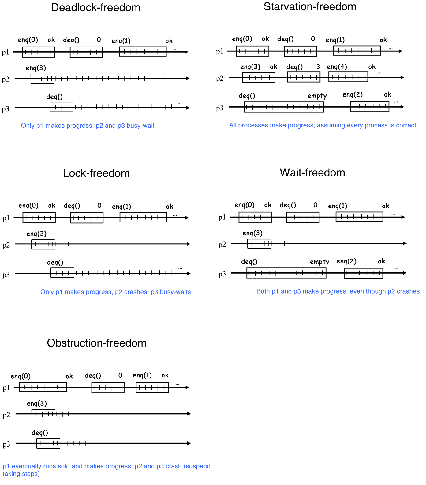

# Distributed systems

*Author: Daria Shutina*

[TOC]


## 23-09-12

This course is about distribute computing: independent processes that communicate. 

One of the key characteristics is concurrency. Single-processor performance does not improve. But we can add more cores and run code concurrently. 


### Amdahl's Law

The **speedup** is the ratio between the sequential time and the parallel time taken for executing a task.

$p$ - fraction of the work that can be done in parallel

$n$ - number of processors

$S$ - the maximum speedup - measures how much faster the program becomes when parallel processing is applied.
$$
S = \frac{1}{1 - p + \frac{p}{n}} \textcolor{red}{< \frac{1}{1- p}}
$$
For example, if $90\%$ of a program can be parallelized ($p=0.9$), and you have 10 processors ($n=10$), Amdahl's Law would indicate that the maximum speedup achievable is approximately $5.26$ times faster than the sequential execution:
$$
S = \frac{1}{0.1+\frac{0.9}{10}} = 5.26
$$


### Mutual exclusion

A **critical section** (CS) is code that must be executed by only one thread or process at a time. **Mutual exclusion** is a technique that ensures that only one process gets access to CS (mutexes are used to implement it). 

- deadlock-freedom: **at least one** process eventually enters its CS. It means that the system prevents deadlocks from occurring. One common approach to achieve deadlock-freedom is to require that threads always acquire mutexes in a specific order.
- starvation-freedom: **every** process eventually enters its CS. It means that the system ensures that no thread or process is continuously blocked from making progress.


#### Remote memory references (RMRs)

Remote memory references can access data that is stored in a location physically distant from the device which needs to manipulate that data. 

Data can be distributed across multiple servers or nodes for scalability or fault tolerance. RMRs are crucial for enabling communication and data sharing among components that are physically separated.

How to measure complexity of the distributed algorithm, where processes may need to busy-wait? *Amount of RMRs is a more realistic measure*. 


#### Peterson's lock

The algorithm is used to coordinate access of two processes to a shared resource. It relies on two shared variables called `turn` and `flag`. 


**Proof for safety:**

We know that the last write operation (before entering the critical section) was changing the `turn` variable. Assume it was `P0` process who assigned `1` to `turn`:


Then there are only read operations before entering the critical section, which means values of `turn` and `flag` variables do not change. `flag[0] and turn==0` condition turns out to be `true`, and P1 enters the critical section. `flag[1] and turn==1` is false, and P0 waits for P1 to finish. 


**Attempts to change the code:**

1. Each process assign another process's ID to `turn` variable. If the process assigns its own ID to `turn`, then both processes will enter the critical section.  
2. If we change the sequence of commands `flag[0]=true` and `turn=1`, then both processes will enter the critical section. 


We can understand `level` array as an array of waiting rooms: there can be zero or one process waiting in one room. And `waiting[m] = i` means the process `i` is waiting in the room `m`.

When the process `i` wants to enter the critical section, for every `m`, it first enters the room `m` (`level[i] = m`). Then we mark that there is a process waiting in room `m` (`waiting[m] = i`). 

In simple words, the process `i` enters the critical section only when `level[i]` appears to be the maximum value in the `level` array. After `N-1` iterations, only one process satisfies this condition. 


**Proof for safety:**

If processes are at the different stage of iteration over `m`, they cannot enter the critical section simultaneously, since the first condition of the while-loop will be true for the process with the lower `m` value. 

Lets consider the situation when there are processes `i_1, ..., i_k` and `level[i_1] = ... = level[i_k] = m` for some `m`. Assigning value to `waiting[m]` was the last write operation, assume we put `i_2` value into it. Then it means that the process `i_2` is stuck in the while-loop, and $k-1$ processes reach the next iteration.  

There are $N-1$ iterations in total, so, int the end, only one process reaches the critical point. 


**Complexity:**

The complexity is $O(n^2)$ RMRs. 


#### n-process tournament tree

The leaves are the processes that what to enter the critical section. The process which gets to the top of the tree receives the right to do it. 

The complexity is $O(\log N)$, since, in every node, Peterson's lock for two processes is executed, which means a constant amount of RMRs. The hight of the tree is $\log N$. 


#### Bakery algorithm


## 23-09-19

### Abstractions

The **system model** is the environment of our algorithm. The model should be simple and tractable. 


**Process abstraction** – an entity performing independent computation. In this course we deal with deterministic processes (based on the current state and the input, the process takes one particular step). 

Processes share common characteristics. Each of them has states, inputs, outputs and a sequential specification[^seqspec]. A distributive algorithm is a collection of such processes. 


**Communication abstraction** – includes shared memory and message-passing. Shared-memory objects also have states and interfaces. Interfaces describe operations you can apply on these objects and responses the objects may provide. They also have a sequential specification (current state + operation = new state & corresponding response). 

Examples: 

- read-write registers (simply a shared variable)
- TAS (test and set): read and write are combined in one atomic operation. It is assumed that the variable is binary. Value of the variable is first checked, then changed depending on the result. 
- CAS (compare and swap): the operation is atomic and takes two parameters. If the value of the variable is equal to the first parameter, then it is replaced with a value of the second parameter. 
- etc


### Correctness

- **Safety** - you classify states reachable by the algorithm into bad and good states, and you require your algorithm never reaches bad states. 

  reach a bad state = there is a *finite* sequence of steps which ends up in that bad state.

- **Liveness** - your require that eventually something good should happen.  

  can be violated only in an *infinite* execution.

Any automaton should satisfy both safety and liveness properties. 


Processes access a communication abstraction by invoking operations. An operation is implemented using a sequence of accesses to base objects. A process is **correct** if, taking infinitely many steps, it never fails in the middle of the operation. 


### Runs and properties 

A **system run (trace)** is a sequence of events (actions the process may take). Every event is atomic access to the shared data or invocation or response.

$\Sigma$ - **event alphabet** (a set of all possible events).

$\Sigma^{\omega}$ ($\Sigma^{\infty}$) - the **set of** finite (infinite) **runs** = set of finite (infinite) sequences of $\Sigma$. 


A **property** $P$ is a subset of $\Sigma^{\omega}$. An implementation satisfies $P$ if every its run $\in P$.  


$e_1, ..., e_k$ are events. $\sigma = e_1 ... e_k$ is a system run.

$P$ is a **safety property** if:

- prefix-closed: $\sigma = e_1...e_k \in P \ \Rightarrow \ \forall l \leqslant k \: \ \sigma'=e_1 ... e_l \in P$.
- limit-closed: for each infinite sequence of traces $\{ \sigma_n \}$, such that $\forall i \ : \sigma_i$ is a prefix of $\sigma_{i+1}$ $\and$ $\sigma_i \in P$, then $\sigma = \lim \limits_{n \rightarrow \infty} \sigma_n \in P$.


$P$ is a **liveness property** if every finite trace $\sigma$ has an extension in $P$. 

$\forall \sigma \ : \ \sigma=e_1...e_k \in \Sigma^{\omega} \ \exists \sigma' = e_1...e_ke_{k+1}... \in P$.


A SIDE REMARK: Safety makes the process closed, and liveness makes it dense. Every property is an intersection of a safety property and a liveness property:
$$
\forall P \subseteq \Sigma^{\omega} \ \exists S, L \in \Sigma^{\omega} \ : \ P = S \cap L
$$


**How to distinguish safety and liveness**

$P$ is a property (a set of runs).

- If every run that violates $P$ is *infinite*, then $P$ is liveness.
- If every run that violates $P$ *has a finite prefix* that violates $P$, then $P$ is safety
- otherwise, $P$ is both


**Examples**

We have a collection of processes. They have inputs and outputs. Their tasks are to propose values and decide on values (it does not matter what these operations actually do, forget about the sense). 

So, we have two kinds of events: $\texttt{propose}_{\texttt{i}}(v)$ and $\texttt{decide}_{\texttt{i}}(v)$ - "propose/decide value $\texttt{v}$" and events are performed by the process $\texttt{i}$. 
$$
\Sigma = 
\bigcup \limits_{i, v} \{ \texttt{propose}_{\texttt{i}}(v), \ \texttt{decide}_{\texttt{i}}(v) \} \ 
\cup
\left\{ \begin{array}{c} \textnormal{\small base-object accesses (read,} \\ \textnormal{\small write) to the shared memory} \end{array} \right\}
$$


**Property example 1:** "Every decided value $v$ was previously proposed" ($\texttt{decide}_\texttt{i}(v)$ happens after $\texttt{propose}_{\texttt{j}}(v)$ for some processes $\texttt{i}$ and $\texttt{j}$).

It is a safety and liveness property.


**Property example 2:** No two processes decide differently (means all processes should agree on the same value when making a decision).

It is safety and not liveness.


**Property example 3:** Every correct (taking infinitely many steps) process eventually decides. 

It is not safety, but liveness. 


**Property example 4:** No two correct processes decide differently.

It is safety and liveness. 


### Histories

A **history** is a sequence of invocations and responses. E.g. the history is `p1: enq(0)`, `p1: ok`, `p3: deq()`, `p1: enq(1)`, `p3: 0`, `p3: deq()`, `p1: ok`, `p2: deq()`, `p2: 1`.


It is **sequential** if every invocation is immediately followed by a corresponding response. A history can be either sequential or concurrent. 

E.g. a sequential history is `p1: enq(0)`, `p1: ok`, `p3: deq()`, `p3: 0`, `p1: enq(1)`, `p1: ok`, `p2: deq()`, `p2: 1`, `p3: deq()`.


A sequential history is **legal** if it satisfies the sequential specification of the shared
object (FIFO policy is used for queues or, for read-write registers, it is true that every read operation returns the last written value).


Let $H$ be a history.

An operation $p$ is **complete in $H$** if $H$ contains both invocation and response of $p$.

A **completion of** $H$ is a history $H'$ that includes all complete operations of $H$ and a subset of incomplete operations of $H$ followed with matching responses. 

 

$H | p_i$ is a projection of history $H$ to the process $p_i$ - subsequence of events of $p_i$ in $H$.

Histories $H$ and $H'$ are **equivalent** if $\forall i \ : \ H|p_i = H'|p_i$. 

Equivalent histories constitute the same sequence of events, but reordered. E.g. `H=p1-enq(0); p1-ok; p3-deq(); p3-3` and `H’=p1-enq(0); p3-deq(); p1-ok; p3-3`.


#### Linearizability (atomicity)

When an operation is invoked, it should take effect instantaneously. In other words, there should be no perceptible delay between the invocation of the operation and when its effect becomes visible.

Linearizability allows the operation to take some period of time (=not exactly atomic).


A history $H$ is **linearizable** if there exists a sequential legal history $S$ such that:

- $S$ is equivalent to some completion of $H$

- $S$ preserves the precedence relaions (the order of operations) in $H$:

  response of $op_i$ precedes invocation of $op_j$ in $H$ $\Rightarrow$ response of $op_i$ precedes invocation of $op_j$ in $S$


An implementation is linearizable if and only if all its finite histories are linearizable.


**Example 1:**


`S = p1-enq(0); p1-ok; p3-deq(); p3-0; p1-enq(1); p1-ok; p3-deq(); p3-1; p1-enq(2); p1-ok; p2-deq(); p2-2` - a sequence of black dots. Black dots represent entering the critical section. 


**Example 2:**


The history is not linearizable. `write(3)` is definitely after `write(1)`, but the last `read()` operation should return `1`, which means there is no such $S$ that is equivalent of $H$ and legal for read-write policy. 


**Example 3:**


The history is linearizable. Now `write(3)` can never be completed or completed after the last `read()` operation.


#### Linearizable composition

If you have two linearizable objects $A$ and $B$ and you have some concurrent history $H$ on them, then $H$ can be seen as a linearizable history of a **composition** (Cartesian product) of $A$ and $B$. 

A composition of registers $A$ and $B$ is a two-field register $(A, B)$. 


#### Linearizability is nonblocking

Every incomplete operation in a finite history can be independently completed. 

In other words, if you have an incomplete history in some process, there always exists a way to complete it without affecting other processes. 


## 23-09-26

Possible implementations of `enq` and `deq` functions:


### Liveness properties

Quick remainder: a process is correct if, taking infinitely many steps, it never fails in the middle of the operation. Liveness properties can be violated only in the infinite execution. 


- Deadlock-free

  *Provided that every process is correct, at least one process makes progress*

- Starvation-free

  *Provided that every process is correct, every process makes progress*

- Lock-free

  *Some correct process makes progress*

- Wait-free

  *Every correct process makes progress*

- Obstruction-free

  *Every process makes progress if it executes in isolation (starting from some point, it is the only process which takes steps)* 





#### Relations

Property $P'$ is **stronger** then property $P$ if every run satisfying $P'$ also satisfies $P$ ($P' \subseteq P$).

$P'$ is **strictly stronger** than $P$ id, additionally, some run in $P$ does not satisfy $P'$ ($P' \subset P$).


### Set

- `locate(x) ` - search starting from the head to the
  first node storing `x’` ≥ `x`, insert `x` before it and fix links.
- `remove(x)` - if `x’` = `x`, point `prev.next` to `curr.next`
- `insert(x)` - if `x’` > `x`, set `prev.next` to the new node storing `x` and
  pointing to `curr`.


#### `SetList`

Implementation of the set using a sorted linked list (not thread-safe):


#### `CoarseList`

Concurrent implementation. Assuming that the sequential implementation is correct, we just add locks at the beginning and the end of each operation:

```java
public class CoarseList{
    private Node head;
    private Lock lock = new ReentrantLock();
    // `ReentrantLock` is starvation-free

    public boolean insert(int item){
        lock.lock();
        Node pred=head;
        try {
            Node curr=head.next;
            while (curr.key < item){
                pred = curr;
                curr = pred.next;
            }
            if (curr.key==item) { return false; }
            Node node = new Node(item);
            node.next=curr;
            pred.next=node;
            return true;
        } finally {
        	lock.unlock();
    	}
    }
}
```

`try-finally` block is a convenient way to improve code readability (thus there is no need to unlock in line 14). 


#### Locking schemes

**Coarse-grained**

A lock is taken for the operation. As a result, the whole set is not available for other processes. The example is in [`CoarseList`](####`CoarseList`).


**2-phase locking**

Locks are taken on the way, starting for the head. access an object => take a lock on it, access the next object => take a lock on it. After modifying data, release all the locks. 

It is time-consuming, but works well for database transactions, since it ensures that ACID[^acid] properties are adhered. 


##### Hand-over-hand locking

The lock is taken only on elements which are modified. 

```java
public boolean insert(int item) {
    head.lock()  // should be locked at the beginning, so that nobody 
                 // could modify it
    Node pred = head;  // `head` will be released in lines 9 or 23
    Node curr = pred.next;
    try {
        curr.lock();
        try {
            while (curr.key < item) {
                pred.unlock();
                pred = curr;
                curr = pred.next;
                curr.lock()
            }
            if (curr.key == item) { return false; }
            Node node = new Node(item);
            node.next = curr;
            pred.next = node;
            return true;
        } finally {
        	curr.unlock();
        }
    } finally {
    	pred.unlock();
    }
}
```


Regarding **linearization**, there are two phases for each history: *traverse* and *update*. Both of them are considered as critical sections. 

Regarding **progress**, hand-over-hand locking is

- deadlock-free: locks are always acquired and released in the same order, so a cycle of lock dependencies cannot form.
- starvation-free. Starvation can occur if one thread keeps acquiring and releasing locks while others are waiting. Again, this cannot happen, because locks are acquired and released in a strict order. 


##### wait-free traversal + validation


 The traverse part is free of locks, they are acquired once the needed nodes `pred` and `curr` are found. 

`validate` function is used as a synchronization mechanism. For example, `pred` or `curr` nodes can be removed by the time we reach them. 

Regarding **progress**, this algorithm is not starvation-free. If `validate` returns false, we start the `while(true)` loop again.


##### Lazy synchronization

The problem with the `traversal + validation` algorithm is we have to traverse the list **twice** in any case (first, inside the `while` loop, then inside `validate` method). 

The idea of `validate` is to check that a predecessor is still present in the list and can be reached from its head. So, to solve the issue, we can add a boolean flag to each node. It will indicate whether the node is still present in the list. 


## 23-10-10

### `AtomicMarkableReference`

`AtomicMarkableReference` is a class in Java that is part of the `java.util.concurrent.atomic` package. It is used for managing references to objects along with a boolean "mark" that can be atomically updated. Thus you maintain a reference to an object along with a mark (boolean flag) to represent some associated information.

`AtomicMarkableReference` provides atomic operations for situations where you want to update the reference and the associated mark in a thread-safe manner, without the need for explicit locking mechanisms.

| Methods                                                      | Description                                                  |
| ------------------------------------------------------------ | ------------------------------------------------------------ |
| `AtomicMarkableReference(V initialRef, boolean initialMark)` | Constructor, creates an `AtomicMarkableReference` with an initial reference and an initial boolean mark. |
| `getReference()`                                             | Returns the current reference held by the `AtomicMarkableReference`. |
| `isMarked()`                                                 | Returns the current mark (boolean value) associated with the reference. |
| `get(boolean[] markHolder)`                                  | Retrieves both the reference and the mark and stores the mark in the provided `markHolder` array. |
| `compareAndSet(V expectedReference, V newReference, boolean expectedMark, boolean newMark)` | *Atomically* compares the current reference and mark with the expected values. If they match, updates the reference and mark to new values. |


### Nonblocking synchronization

```java
public boolean remove(int item) {
    while (true) {
        // traverse with physical removal of marked nodes
        // determine pred and curr
        if (curr.key!=item) return false;
        Node succ = curr.next.getReference();
        snip = curr.next.compareAndSet(succ,succ, false, true);
        if (!snip) continue;
        pred.next.compareAndSet(curr,succ, false, false);
        return true;
        }
    }
}
```

`remove` operation first checks that `curr.next` contains the expected reference (line 7), meaning the reference should be correct and it should not be marked as deleted. If no, the `while` loop starts again.

Then, if `pred.next` and `curr` are the same, it marks the considered node as deleted (line 9).


```java
public boolean insert(int item)
    while (true) {
   		// traverse with physical removal of marked nodes
        // determine pred and curr
        if (curr.key == item) return false;
        Node node = new Node(item);
        node.next = new AtomicMarkableReference(curr, false);
        if (pred.next.compareAndSet(curr, node, false, false)) {
            return true;
        }
    }
}
```

In line 8, `insert` operation first checks that `pred` and `pred.next` nodes are not removed. If true, it atomically updates `pred.next` with a reference to a new node. Otherwise, the `while` loop starts again. 


[^seqspec]: A sequential specification is a detailed description of how a process or system operates step by step. For example, it can be FIFO policy or read-write rule: "Every read returns the last written value".

[^acid]: ACID stands for Atomicity, Consistency, Isolation, Durability. 

