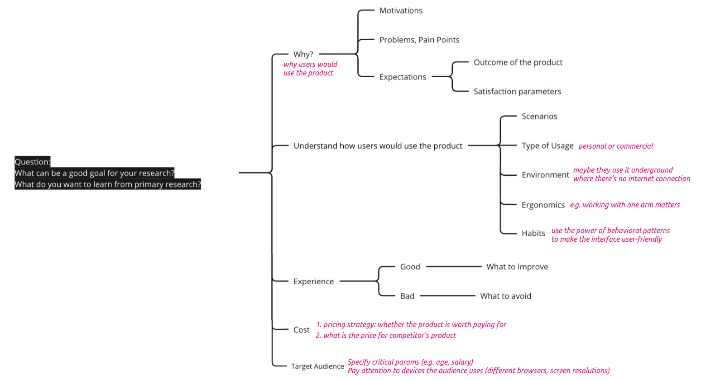
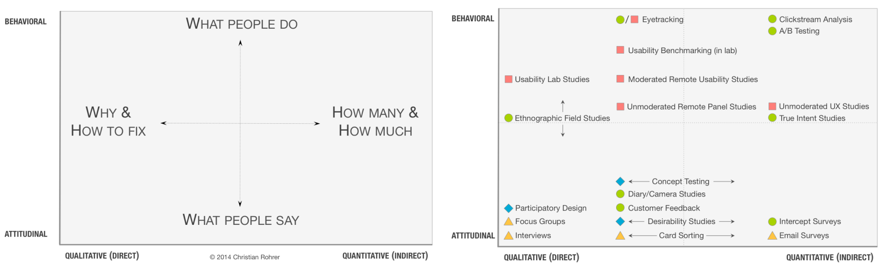

# Human Computer Interaction

*Author: Daria Shutina*

[toc]

## 23-09-15

### Competitors and analogs

- **direct competitors** - similar products or services to the same audience. you have the same market and even the same location.

  Example: apple and samsung - both manufacture smartphones and tablets for the same consumers.

- **indirect competitors** - offer products or services that are related or may serve as alternatives but do not necessarily target the same exact customer base.

  Example: apple and amazon - amazon offers a wider range of electronics. While they don't offer the same products, they compete for consumers.

- **analogs** - operate in different industries but share certain characteristics.

  Example: amazon and airbnb - selling items vs. providing accommodation, but both have catalogs, user reviews, online transactions. Analyzing one can provide insights into the other's business strategies.

### Data requirements, draft models 

To visualize data, we can create a mindmap (like an ER-model), with objects, its attributes and relations between them. When designing interfaces, it helps not to forget anything and better understand the logic. 

Besides ER-models, it is a good practice to think about app layers, serialization processes, responses from HTTP requests.  

### Market analysis

How to predict the amount of users before development? One way is to analyze statistics for competitors' products:

- [statista.de](https://de.statista.com/) - wide range of statistical data, from various fields
- [similarWeb](https://www.similarweb.com/) - website traffic and ranking, audience behavior
- [sensorTower](https://sensortower.com/) - provides data and insights on mobile apps' performance: download statistics, revenue estimates, user engagement metrics. 
- [Google Trends](https://trends.google.com/trends/) - allows to explore how frequently certain terms are searched for on Google

#### TAM SAM SOM

Basically, the aim of evaluating market size is to calculate the possible income. TAM, SAM and SOM are the main levels of market size analysis.

#### Top-Down

A top-down analysis looks at larger, macro-economic trends within a market to narrow-down and determines what percentage a company could capture.

1. Analyze the international market as a whole
2. Analyze national economies
3. Analyze each sub-sector of the national market
4. Analyze all potential competitors within those sub-sectors

**Example**

A brand new Italian Pizza restaurant opens up in a neighborhood. 

The total average annual revenue from all restaurants (not just pizzerias) in the entire city is `$500m`. It is the **TAM**.

Out of this `$500m`, Italian restaurants get roughly 25% of the market revenue, which is `$125m`. It is the **SAM**. 

Now, there are 200 different Italian restaurants within the city. So, the **average SOM** is `$625.000`. However, this new Italian pizzeria is located in a bustling neighborhood, therefore the owner predicts that the restaurant could potentially earn around 3x the average SOM, at around `$1.875.000`.

#### Bottom-up

A bottom-up analysis starts with the core business figures (number of clients, amount of product sold, average price point) and uses this data to make assumptions about the larger market as a whole.

## 23-09-18

### Design experiment

### Primary research

- Attitudinal vs. Behavioral: Surveys and observation 

- Qualitative vs. Quantitative: Direct (interviews) and indirect (surveys) interaction with people 

- Context of Use: Natural, prepared/moderated (e.g. laboratory testing), without usage of products, hybrid

#### Methodologies

You need to know at least one tool from each quadrant, since it is about different types of behaviour and different insights that you get from testing your product. 

#### Advice on user interviews

User interviews are aimed on qualitative research. 

Participants can be split into several user segments (target users, users of competitor services, non-users, former users). A good research study involves 8-12 participants: 3-4 for each user segment. 

User interview template: [Notion](https://www.notion.so/User-Interview-Template-b39e51b7479848c98e9e47efddbfde56)

1. **It is more a conversation, not an interview.** There are emotions and feedback, it is better to avoid the scheme "interviewer asks, interviewee answers". 
2. **Don't be pushy.** The interviewer's expertise makes them dominant by default. Pretend that you have as little information as possible and you don't understand anything. It helps to pass the expertise to interviewee, thus making their opinion important.  
3. **Ask open-ended questions.** Avoid closed questions that can only give a yes/no answer. Focus on the why, how, when. As an interviewer, you speak with a person in dynamic,,not simply waiting for answers. It is a good practice to ask for examples and details ("why" question for gaining clarity).

#### Advice of surveys

Surveys and polls are examples of quantitative research.

1. If there are questions to filter out the audience, ask them first. Create a branch based on the response.
2. Use close-ended questions if you expect a lot of responses. Open-ended questions are ok, when there are as many responses as you are ready to read
3. Use multiple choice and the “other” option. 
4. In case or errors, leave contacts of support. 
5. Boring polls are not interesting to complete. Add specifics (pictures, maybe emojis), small description in the beginning. Offer something for those who finish the survey (bonuses, discounts)

## 23-09-22

### Field observation

 **Field observation** is about collecting real-world data by physically visiting and observing the environment, users, situations relevant to the product development process. Instead of spending months trying to adapt your ideas and skills, you can immerse yourself into the process and **quicker understand what is required**. 

Although it is a time-consuming activity, it is necessary to leave your house and **put yourself to the user's comfort zone**. By observing users in their natural environment, you can uncover their needs, behaviors, pain points, and preferences. For example, delivery drivers hack the space to place timing sheets[^timingsheets], simply putting them near the window. So a good idea would be, for example, to create a holder for this stuff. 

First of all, field observation is about **collecting data**. Try to take a recording or how a person interacts with a product/environment itself. It will make it easier to catch important things of people's environment later on the analysis phase. 

Finally, **make a transcript / follow-ups**. Having a transcript[^transcript] allows you to go back and refer to previous conversations. And doing a follow-up at the end of the day involves reviewing the transcript to extract insights. 

### Usability testing 

**Usability testing** involves observing real users as they interact with the real product (not sketches/prototypes). 

It is usually a **1-to-1 meeting** with a participant, but could be a group session as well. The participant **explores the finished interface/prototype** and identifies some bugs, minor and major issues, because you test your product with real devices.

The process of usability testing, again, **includes recording**. It can be a screen recording of using the app or simulation of the environment being recorded (e.g. testing car facilities but without actually driving it). 

In comparative testing, it is important to hide which option is yours and which is competitor. Thus, you will get a fair feedback. 

#### U-testing checklist

Guide: [nngroup.com](https://www.nngroup.com/articles/usability-checklist/)

### Guerrilla testing

**Guerrilla testing** is a form of informal and quick usability testing. Conducting small user tests with random lookalike users can quickly reveal valuable insights and allow faster design iterations. 

**No interview is needed.** Approach a stranger, ask if they'd like to participate, give them a few tasks to do, observe their interactions, and ask about their experience.

Keep in mind that guerrilla testing **should not replace formal user testing**. The person may not be a real user (so if they have a negative feedback, it should not influence the research results). 

## 23-09-25

### Data-driven design

**Data-driven design** is an approach when you collect data from users, then analyze it to improve your product. 

Examples of highly data-driven products are Amazon and Booking. They have complex interfaces with lots of functionality, because of many improvements. 

#### Statistics analysis

Collecting "in a background" data abouts users and their actions (e.g. how many times the user click the button) is the cheapest way to find problems. Although this type of data does not give ideas how to fix the problem, since you do not get feedback from users themselves. 

##### Tools

- [Google Analytics](https://analytics.google.com/analytics/web/provision/?authuser=0#/provision) - shows data about users: how many in total, where they come from, how many stay on the website, on which pages they spend more time. For example, if users leave the same page all the time, maybe the page is broken.
- [Firebase](https://firebase.google.com/?gad=1&gclid=CjwKCAjw38SoBhB6EiwA8EQVLon4TH955bbYShyQWvoPcuWdEKe_b2MVDCYbs9awwZK3t674taedUBoCcD0QAvD_BwE&gclsrc=aw.ds) - as Google Analytics, but for mobile apps.  
- [Amplitude](https://amplitude.com/get-started?utm_source=google-ads&utm_medium=cpc&utm_campaign=Search_EMEA_Brand_DE_EN_tier1&utm_content=151439491353&utm_term=amplitude&gad=1&gclid=CjwKCAjw38SoBhB6EiwA8EQVLlW9u7LpVMw1LJdI0_36TjE2zbDRnkkRQ1kLVdAOszisUDqMZIw66hoC01sQAvD_BwE) - you can track events on the websites: movement of cursor, typing, clicking. Provides low-level events. 
- [Mixpanel](https://mixpanel.com/contact-us/ps-sem-demo-request-emea?utm_source=google&utm_medium=cpc&utm_campaign=EMEA-DACH-Brand-Search-EN-Exact-Desktop&utm_content=Mixpanel-Exact&utm_ad=655263090681&utm_term=mixpanel&matchtype=e&campaign_id=19984354506&ad_id=655263090681&gclid=CjwKCAjw38SoBhB6EiwA8EQVLl2vXkP_5ZKZ-FZ8T9FLBHyLmG8adaa7qWZcBNJo8PKP2emZtRRRlRoCZrIQAvD_BwE&gad=1) - as an Amplitude, but need some setting up. Here you can get a detailed event flow (e.g., what user does next after the page is loaded: purchase item or keep scrolling?)
- [Piwik (now Matomo)](https://matomo.org/get/matomo-analytics-de-2ad/?mtm_source=google&mtm_medium=paid-ads&mtm_campaign=GE_Search_Brand&mtm_content=659826190929&mtm_kwd=piwik%20matomo&mtm_cid=20195538461&mtm_group=google-ads&mtm_placement=&gclid=CjwKCAjw38SoBhB6EiwA8EQVLjmN_OpGN8srzrV12MI6S47JsZEByN60oz4KOR6x0HaJN33EWhAkQhoCj3cQAvD_BwE) - open-source, but you need to host and maintain it yourself.
- Play Market and App Store provide some basic analytics, but it is not very insightful. There is data about where users come from, how many installs were done. 
- [Google Tag Manager](https://tagmanager.google.com/#/home) - integrates with various analytics and marketing platforms.

##### Link map and click map

There are such features and **link map** and **click map**. Link map is a ranking of links depending on how many times each link was clicked. Thanks to click map, you can understand if users frequently missclick buttons or think that something is a button while it is actually not. 

Click map example:

##### Scrolling map

**Scrolling map** tracks and visualizes how far users scroll down a webpage. Applicable for websites mostly. 

##### Funnels

When you think about the product, you get different phases:

The idea is you always lose users on each phase. The example of a possible scenario:

##### A/B testing

You want to test a hypothesis, so you create different versions of the product, then analyze data received from users. 

Big tech companies are stuck in the continuous A/B testing of small components and screens. For example, Amazon website is different depending on the country. 

##### KPI analysis 

**KPI** is a measurable metric used to assess the performance and success of the product.  

#### Creative methodologies

Use **mind-maps** to visualize and share you ideas. It helps to order things and achieve better results. 

**Individual brainstorm** sessions should be fast, so if you fell you start to slow down, it is time to finish. Also, brainstorm is a process of evaluation, so do not criticize ideas. And do not go too into details, it is still a fast process. 

In the **collaborative brainstorm**, each participant need different time to process things, so they start on the individual brainstorm, then they create a common mind map of all idea. Then goes a group brainstorm, sorting and prioritization of ideas. 

## 23-09-29

### Design references

**Design references** are products that already exist. They are used as inspiring examples. We do not steal ideas. We look at *several* references and, thanks to them, develop and improve our own idea. 

When you collect references, use a mood board. A **mood board** is a place to organize and work out your ideas. It is a collaborative space.

**Take a picture of the product** (for clarity)  and **leave comments**: what you like/dislike about particular elements, what is important or redundant, what makes you feel comfortable/awkward, etc. Use mood boards to **highlight your emotions** from the references.

**Group pictures** by some parameters (design concepts, structure, content, features & controls, visual style). Parameters can be found in the picture above. 

[Miro](https://miro.com/app/dashboard/) is an example of a mood board. How to work with Miro:

- Create a frame (`F`). Thus, references will be grouped by some parameter. 
- Put a picture of the product and create a link to the product (`Alt+Ctrl+K`). Always put the link. 
- Put a sticker on the picture (`N`). If you work in a team, sign the sticker. Use a drawing marker to highlight something you mentioned in the sticker. Oh, yeah, and lock the sticker so that other users cannot move your work. 

#### Examples of references

- a cool visual part: https://www.siteinspire.com/
- controls, “features”, motion and interaction: 
  - https://www.hoverstat.es/
  - https://littlebigdetails.com/ -- shows small details which have a big value 
  - https://collectui.com/ -- sorted by the interface type (sign-in window, main screen, etc)
  - https://mobbin.com/browse/web/apps
- design concepts, content:
  - https://ru.pinterest.com/
  - https://www.behance.net/

## 23-10-06

### Goals vs Tasks

A goal is an expectation of an end condition, whereas tasks are intermediate steps that help someone to reach a goal. The User’s goals remain constant, while the way of achieving it (tasks) may vary. 

E.g. John's goal is to get to his office the fastest possible.  Intermediary tasks that he has to perform are toothbrushing, dressing up, taking his briefcase, opening the garage, stopping on red light.

### Emotional Design

### Value proposition

**Value proposition** is what you propose to the customer. Sometimes it can be found on the website, i.e. in a form of slogan "cheapest flights!" or "healthy food!"

**Customer profile** consists of gains, customer jobs and pains. **Gains** describe outcomes customers want to achieve or benefits they are looking for. **Customer jobs** describe what customers are trying to get done in their work and in their lives. **Pains** describe bad outcomes, risks and obstacles related to customer jobs.

**Value map** consists of **gain creators** (describe how your products and services achieve customer gains), **pain relievers** (describe how your products and services relieve customer pains) and a list of **products and services** (value proposition is built around them).

You achieve good results when your value map meets your customer profile = when your products and services produce pain relievers or gain creators that match gains and pains important for the customer. 

### UX strategy

Usually, you need to answer two questions:

- **Why are you doing that?** What problem are you solving, who has this problem, why are you better than someone who solves this problem. Methods like primary research (surveys, interviews), competitor analysis, field observations, usability testing are used here.
- **What are you doing?** How does the system work, how is it related to the environment. It is about the solution itself. 

UX strategy is a comprehensive plan that outlines how a product or service will meet the needs of its users. It's a roadmap that guides the design and development process.

Components of a UX strategy might include:

1. **User Research:** Understanding the target audience through methods like interviews, surveys, [personas](###Personas).
2. **Competitor Analysis:** Analyzing competitors to understand their strengths, weaknesses, and how to make your product "one-of-a-kind".
3. **UX Principles and Guidelines:** Establish guidelines and principles that will be maintained during the whole process. They help keep the focus on the crucial tasks and ideas. 
4. **Prototyping and Iterative Design:** Create prototypes and refine the product based on user feedback.
5. **Metrics and Measurement:** Define KPIs to track and measure the product success.
6. **Implementation Plan:** Outlining the development process, considering resources and timelines.
7. **Accessibility and Inclusivity:** Ensuring that the design is accessible to all users, including those with disabilities, and that all user needs are satisfied. 
8. **UX Testing and Validation**: usability testing, A/B testing, etc.
9. **Feedback and Further Improvement**: Establishing mechanisms to collect user feedback continuously and integrating it into the design process for ongoing improvements.

## 23-10-09

### Design Methodologies

- Human Centered Design:

  Organizes the interface according to the human logic and needs. Service offers a solution to the users to satisfy their goals.

  - Suppose a customer is looking for a snack. Organizing crisps in the "snacks" section meets user expectations, making it easier for a customer to find and buy them.
  - In Spotify, recommendations are based on what music you are listening to.
  - Ebay is mostly a HCD app.

- Activity Centered Design:

  Organizes the interface according to the activity flow that users perform within a system or environment. 

  Works well if you do not know your target audience. So you better focus on the activity, not the user. 

  - Suppose a customer wants to chill and buy beer & snacks. Snacks are placed near beer.
  - In Spotify, music is sorted into sections rock, pop, meditations, podcasts, etc. 
  - Google Translator and Google Calendar are purely ACD apps.

### Personas

**Persona** is approximate representation of a user. In simple words, it is a collective image for group of users. Personas are discovered based on field observations, interviews and research.

Characteristics of a good persona:

- Name, photo (real or stock), demographics, place of residence, occupation, life style, environment, quote to make them live.
- Outlook on life, attitudes, motivations, gains, existing experience, skills. Everything what explains who they are and what they feel. 
- Daily activities, behavioral characteristics, environment.
- The final image is realistic, not idealized.
- It helps you understand users' behaviours, needs, pain points.

Do not make personas boring. [Here]() is a good example:

[^timingsheets]: Timing sheet shows a list of stops per route and arrival times.
[^transcript]: Transcript is a verbatim representation of a conversation. 
