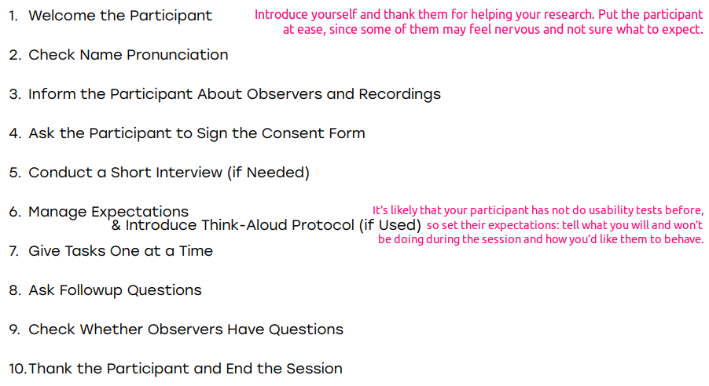

# Human Computer Interaction

*Author: Daria Shutina*

[toc]

## 23-09-15

### Competitors and analogs

- **direct competitors** - similar products or services to the same audience. you have the same market and even the same location.

  Example: apple and samsung - both manufacture smartphones and tablets for the same consumers.

- **indirect competitors** - offer products or services that are related or may serve as alternatives but do not necessarily target the same exact customer base.

  Example: apple and amazon - amazon offers a wider range of electronics. While they don't offer the same products, they compete for consumers.

- **analogs** - operate in different industries but share certain characteristics.

  Example: amazon and airbnb - selling items vs. providing accommodation, but both have catalogs, user reviews, online transactions. Analyzing one can provide insights into the other's business strategies.

### Data requirements, draft models 

To visualize data, we can create a mindmap (like an ER-model), with objects, its attributes and relations between them. When designing interfaces, it helps not to forget anything and better understand the logic. 

Besides ER-models, it is a good practice to think about app layers, serialization processes, responses from HTTP requests.  

### Market analysis

How to predict the amount of users before development? One way is to analyze statistics for competitors' products:

- [statista.de](https://de.statista.com/) - wide range of statistical data, from various fields
- [similarWeb](https://www.similarweb.com/) - website traffic and ranking, audience behavior
- [sensorTower](https://sensortower.com/) - provides data and insights on mobile apps' performance: download statistics, revenue estimates, user engagement metrics. 
- [Google Trends](https://trends.google.com/trends/) - allows to explore how frequently certain terms are searched for on Google

#### TAM SAM SOM

Basically, the aim of evaluating market size is to calculate the possible income. TAM, SAM and SOM are the main levels of market size analysis.

#### Top-Down

A top-down analysis looks at larger, macro-economic trends within a market to narrow-down and determines what percentage a company could capture.

1. Analyze the international market as a whole
2. Analyze national economies
3. Analyze each sub-sector of the national market
4. Analyze all potential competitors within those sub-sectors

**Example**

A brand new Italian Pizza restaurant opens up in a neighborhood. 

The total average annual revenue from all restaurants (not just pizzerias) in the entire city is `$500m`. It is the **TAM**.

Out of this `$500m`, Italian restaurants get roughly 25% of the market revenue, which is `$125m`. It is the **SAM**. 

Now, there are 200 different Italian restaurants within the city. So, the **average SOM** is `$625.000`. However, this new Italian pizzeria is located in a bustling neighborhood, therefore the owner predicts that the restaurant could potentially earn around 3x the average SOM, at around `$1.875.000`.

#### Bottom-up

A bottom-up analysis starts with the core business figures (number of clients, amount of product sold, average price point) and uses this data to make assumptions about the larger market as a whole.

## 23-09-18

### Design experiment

### Primary research

- Attitudinal vs. Behavioral: Surveys and observation 

- Qualitative vs. Quantitative: Direct (interviews) and indirect (surveys) interaction with people 

- Context of Use: Natural, prepared/moderated (e.g. laboratory testing), without usage of products, hybrid

#### Methodologies

You need to know at least one tool from each quadrant, since it is about different types of behaviour and different insights that you get from testing your product. 

#### Advice on user interviews

User interviews are aimed on qualitative research. 

Participants can be split into several user segments (target users, users of competitor services, non-users, former users). A good research study involves 8-12 participants: 3-4 for each user segment. 

User interview template: [Notion](https://www.notion.so/User-Interview-Template-b39e51b7479848c98e9e47efddbfde56)

1. **It is more a conversation, not an interview.** There are emotions and feedback, it is better to avoid the scheme "interviewer asks, interviewee answers". 
2. **Don't be pushy.** The interviewer's expertise makes them dominant by default. Pretend that you have as little information as possible and you don't understand anything. It helps to pass the expertise to interviewee, thus making their opinion important.  
3. **Ask open-ended questions.** Avoid closed questions that can only give a yes/no answer. Focus on the why, how, when. As an interviewer, you speak with a person in dynamic,,not simply waiting for answers. It is a good practice to ask for examples and details ("why" question for gaining clarity).

#### Advice of surveys

Surveys and polls are examples of quantitative research.

1. If there are questions to filter out the audience, ask them first. Create a branch based on the response.
2. Use close-ended questions if you expect a lot of responses. Open-ended questions are ok, when there are as many responses as you are ready to read
3. Use multiple choice and the “other” option. 
4. In case or errors, leave contacts of support. 
5. Boring polls are not interesting to complete. Add specifics (pictures, maybe emojis), small description in the beginning. Offer something for those who finish the survey (bonuses, discounts)

## 23-09-22

### Field observation

 **Field observation** is about collecting real-world data by physically visiting and observing the environment, users, situations relevant to the product development process. Instead of spending months trying to adapt your ideas and skills, you can immerse yourself into the process and **quicker understand what is required**. 

Although it is a time-consuming activity, it is necessary to leave your house and **put yourself to the user's comfort zone**. By observing users in their natural environment, you can uncover their needs, behaviors, pain points, and preferences. For example, delivery drivers hack the space to place timing sheets[^timingsheets], simply putting them near the window. So a good idea would be, for example, to create a holder for this stuff. 

First of all, field observation is about **collecting data**. Try to take a recording or how a person interacts with a product/environment itself. It will make it easier to catch important things of people's environment later on the analysis phase. 

Finally, **make a transcript / follow-ups**. Having a transcript[^transcript] allows you to go back and refer to previous conversations. And doing a follow-up at the end of the day involves reviewing the transcript to extract insights. 

### Usability testing 

**Usability testing** involves observing real users as they interact with the real product (not sketches/prototypes). 

It is usually a **1-to-1 meeting** with a participant, but could be a group session as well. The participant **explores the finished interface/prototype** and identifies some bugs, minor and major issues, because you test your product with real devices.

The process of usability testing, again, **includes recording**. It can be a screen recording of using the app or simulation of the environment being recorded (e.g. testing car facilities but without actually driving it). 

In comparative testing, it is important to hide which option is yours and which is competitor. Thus, you will get a fair feedback. 

#### U-testing checklist

Guide: [nngroup.com](https://www.nngroup.com/articles/usability-checklist/)

### Guerrilla testing

**Guerrilla testing** is a form of informal and quick usability testing. Conducting small user tests with random lookalike users can quickly reveal valuable insights and allow faster design iterations. 

**No interview is needed.** Approach a stranger, ask if they'd like to participate, give them a few tasks to do, observe their interactions, and ask about their experience.

Keep in mind that guerrilla testing **should not replace formal user testing**. The person may not be a real user (so if they have a negative feedback, it should not influence the research results). 

### Nielsen analysis

[^timingsheets]: Timing sheet shows a list of stops per route and arrival times.
[^transcript]: Transcript is a verbatim representation of a conversation. 
