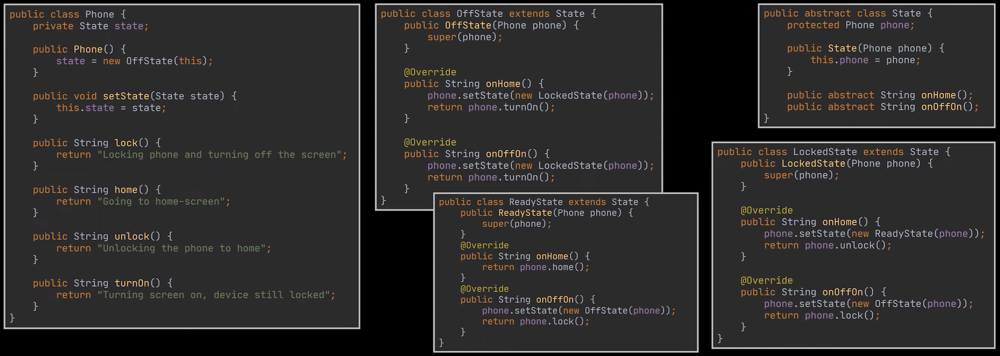

### Design patterns

*Author: Daria Shutina*

*Source: [YT Design Patterns](https://www.youtube.com/playlist?list=PLlsmxlJgn1HJpa28yHzkBmUY-Ty71ZUGc)*


[TOC]

#### Creational patterns

*Provide more flexibility in how the objects are actually created.*


##### Singleton

Guarantees that only one instance of the class exists.


Simple implementation:

```java
// `instance` field is static, since `getInstance` method needs to be static
public class Singleton {
    private static Singleton instance;
    private String data;

    private Singleton(String data) {
        this.data = data;
    }

    public static Singleton getInstance(String data) {
        if (instance == null) {
            instance = new Singleton(data);
        }
        return instance;
    }
}


class Main {
    public static void main(String[] args) {
        Singleton singleton = Singleton.getInstance("aboba");
    }
}
```


Thread-safe implementation:

```java
public class Singleton {
    private static volatile Singleton instance;
    private String data;

    private Singleton(String data) {
        this.data = data;
    }

    public static Singleton getInstance(String data) {
        // use `result` variable, since `instance` is volatile
        // thus, we read directly from the main memory only once
        Singleton result = instance;
        if (result == null) {
            synchronized (Singleton.class) {
                if (instance == null) {
                    instance = new Singleton(data);
                }
            }
        }
        return result;
    }
}
```


##### Factory

Separates the product's construction code from the code that uses this product. 

It relies heavily on inheritance. 

```java
// Product interface
interface Product {
    void use();
}


// Concrete products
class ConcreteProductA implements Product {
    @Override
    public void use() {
        System.out.println("Using ConcreteProductA");
    }
}

class ConcreteProductB implements Product {
    @Override
    public void use() {
        System.out.println("Using ConcreteProductB");
    }
}


// "Factory" class
class Creator {
    public static Product createProduct(String type) {
        if (type.equalsIgnoreCase("A")) {
            return new ConcreteProductA();
        } else if (type.equalsIgnoreCase("B")) {
            return new ConcreteProductB();
        }
        throw new IllegalArgumentException("Invalid product type: " + type);
    }
}


// the products are used here
public class Main {
    public static void main(String[] args) {
        Product productA = ProductFactory.createProduct("A");
        productA.use();  // Output: Using ConcreteProductA

        Product productB = ProductFactory.createProduct("B");
        productB.use();  // Output: Using ConcreteProductB
    }
}
```


##### Abstract factory

Allows to produce a group of related objects without specifying their concrete classes. 

```java
// Abstract Product A
interface ProductA {
    void use();
}

// Concrete Product A1
class ConcreteProductA1 implements ProductA {
    @Override
    public void use() {
        System.out.println("Using ConcreteProductA1");
    }
}

// Concrete Product A2
class ConcreteProductA2 implements ProductA {
    @Override
    public void use() {
        System.out.println("Using ConcreteProductA2");
    }
}


// Abstract Product B
interface ProductB {
    void interact(ProductA productA);
}

// Concrete Product B1
class ConcreteProductB1 implements ProductB {
    @Override
    public void interact(ProductA productA) {
        System.out.println("Interacting with ConcreteProductA1");
        productA.use();
    }
}

// Concrete Product B2
class ConcreteProductB2 implements ProductB {
    @Override
    public void interact(ProductA productA) {
        System.out.println("Interacting with ConcreteProductA2");
        productA.use();
    }
}


// Abstract Factory
interface AbstractFactory {
    ProductA createProductA();
    ProductB createProductB();
}

// Concrete Factory 1
class ConcreteFactory1 implements AbstractFactory {
    @Override
    public ProductA createProductA() {
        return new ConcreteProductA1();
    }

    @Override
    public ProductB createProductB() {
        return new ConcreteProductB1();
    }
}

// Concrete Factory 2
class ConcreteFactory2 implements AbstractFactory {
    @Override
    public ProductA createProductA() {
        return new ConcreteProductA2();
    }

    @Override
    public ProductB createProductB() {
        return new ConcreteProductB2();
    }
}


// Client code
public class Main {
    public static void main(String[] args) {
        AbstractFactory factory1 = new ConcreteFactory1();
        ProductA productA1 = factory1.createProductA();
        ProductB productB1 = factory1.createProductB();
        productB1.interact(productA1);
        // Output:
        // Interacting with ConcreteProductA1
        // Using ConcreteProductA1

        AbstractFactory factory2 = new ConcreteFactory2();
        ProductA productA2 = factory2.createProductA();
        ProductB productB2 = factory2.createProductB();
        productB2.interact(productA2);
        // Output:
        // Interacting with ConcreteProductA2
        // Using ConcreteProductA2
    }
}

```

A real-world example is when there are two independent factories that can produce laptops and phones. Here, `productA = laptop` and `productB = phone`, but products at the first factory differ from product at the second factory. 


##### Builder

Allows to produce <u>different</u> types and representations of an object using the <u>same construction process</u>. We extract the object creation code out of its class and move it to separate objects called *builders*.

- the builder has the same fields as the class
- the builder has setter-methods for every field and a `build()` method responsible for creating the class instance
- no-argument constructor is used for creating the builder


This is the basic idea:

```java
public class Car {
    private final String brand;
    private final String color;
    private final String model;

    // constructor should be package-private of protected
    Car(String brand, String color, String model) {
        this.brand = brand;
        this.color = color;
        this.model = model;
    }
}


public class CarBuilder {
    private String brand;
    private String color;
    private String model;

    public CarBuilder brand(String brand) {
        this.brand = brand;
        return this;
    }

    public CarBuilder color(String color) {
        this.color = color;
        return this;
    }

    public CarBuilder model(String model) {
        this.model = model;
        return this;
    }

    public Car build() {
        return new Car(brand, color, model);
    }
}


class Main {
    public static void main(String[] args) {
        CarBuilder builder = new CarBuilder()
                .brand("Mitsubishi").color("red").model("b612");
        Car car = builder.build();
    }
}
```


Sometimes the same creation code is used to create several objects (for example, creating many `Bugatti` cars and many `Lamborgini` cars). In this case, we can use a **Director** -- a class which defines specific configurations depending on the case. 

```java
public class Director {
    public void buildBugatti(CarBuilder builder) {
        builder.brand("Bugatti")
                .color("Blue")
                .model("bugatti model");
    }

    public void buildLamborghini(CarBuilder builder) {
        builder.brand("Lamborghini")
                .color("Yellow")
                .model("lambo model");
    }
}
```

Using a director is optional. Still, its advantage is that it completely hides the details of the product construction from the client code:

```java
public static void main(String[] args) {
    Director director = new Director();
    CarBuilder builder = new CarBuilder();
    
    director.buildBugatti(builder);
    
    Car car = builder.build();
}
```


##### Prototype

Every class that supports cloning is called a *prototype*.

The idea of the Prototype pattern is to delegate the object cloning process to the actual objects that are being cloned. 

- the class should have a copy constructor and a `clone()` method overriden from the parent class
- the `clone()` method invokes the copy constructor
- the copy constructor both copies values of the class's fields and invokes the parent's copy constructor 


```java
public abstract class Vehicle {
    private final String color;
    private final String brand;

    protected Vehicle(String color, String brand) {
        this.color = color;
        this.brand = brand;
    }

    // copy constructor — should be protected
    protected Vehicle(Vehicle other) {
        this.color = other.color;
        this.brand = other.brand;
    }

    public abstract Vehicle clone();
}
```

```java
public class Car extends Vehicle {
    private final String model;

    public Car(String color, String brand, String model) {
        super(color, brand);
        this.model = model;
    }

    protected Car(Car other) {
        super(other);
        this.model = other.model;
    }

    @Override
    public Car clone() {
        return new Car(this);
    }
}
```

```java
public class Bus extends Vehicle {
    private final int amountOfPlaces;

    Bus(String color, String model, int amountOfPlaces) {
        super(color, model);
        this.amountOfPlaces = amountOfPlaces;
    }

    Bus(Bus other) {
        super(other);
        this.amountOfPlaces = other.amountOfPlaces;;
    }

    @Override
    public Vehicle clone() {
        return new Bus(this);
    }
}
```


###### Shallow vs Deep copy

Imagine, we have fields of a reference type. For example, we use a class `Engine` as a field for a `Car` class:

```java
public class Car extends Vehicle {
    private final String model;
    private final Egnine engine;

    // constructor

    protected Car(Car other) {
        super(other);
        this.model = other.model;
        this.engine = other.engine; // <------ shallow copy
        //          = other.engine.clone(); <------ deep copy
    }

    @Override
    public Car clone() {
        return new Car(this);
    }
}
```


- Shallow copy = we simply assign a value from the `other`'s field

  ```java
  public class Car extends Vehicle {
      private final Egnine engine;
      ...
      
      protected Car(Car other) {
          super(car);
          // assign values to other `Car` fields
          this.engine = other.engine;
      }
  }
  ```

- Deep copy = we use `clone()` to get a copy of the `other`'s field

  ```java
  public class Car extends Vehicle {
      private final Egnine engine;
      ...
      
      protected Car(Car other) {
          super(car);
          // assign values to other `Car` fields
          this.engine = other.engine.clone();
      }
  }
  ```


#### Behavioral patterns

*Are about communication and assignment of responsibilities between objects.*


##### The Chain of Responsibility

Transforms particular behaviors into stand-alone objects called *handlers*. 

The basic idea is to delegate tasks to a proper handler. Each handler must either process a request or pass it along the chain. 

A chain of handlers can be implemented as a linked list (using the `next` field). The client may trigger any handler in the chain, not only the first one. 

Also, the Chain of Responsibility pattern allows to insert, remove or reorder handlers <u>dynamically</u>. 


**Example**

Basically, the `Handler` class has a `next` field, an abstract `handle()` method:

```java
public abstract class Handler {
    private Handler next;

    public Handler setNextHandler(Handler next) {
        this.next = next;
        return next;
    }

    protected boolean handleNext(String username, String password) {
        if (next == null)
            return true;
        return next.handle(username, password);
    }
    
    public abstract boolean handle(String username, String password);
}
```

Imagine we have a verification process. There are a few steps to check before the user is logged in: 

1. Validate username
2. Validate password
3. Check role 

For each step, we create a handler: 

```java
public class ValidUserHandler extends Handler {
    private final Database database;

    public ValidUserHandler(Database database) {
        this.database = database;
    }

    @Override
    public boolean handle(String username, String password) {
        if (!database.isValidUsername(username)) {
            System.out.println("The user '" + username + "' does not exist");
            return false;
        }
        return handleNext(username, password);
    }
}


public class ValidPasswordHandler extends Handler {
    private final Database database;

    public ValidPasswordHandler(Database database) {
        this.database = database;
    }

    @Override
    public boolean handle(String username, String password) {
        if (!database.isValidPassword(username, password)) {
            System.out.println("Wrong password for user '" + username + "'");
        }
        return handleNext(username, password);
    }
}


public class RoleCheckHandler extends Handler {
    private final String adminUsername;

    public RoleCheckHandler(String adminUsername) {
        this.adminUsername = adminUsername;
    }

    @Override
    public boolean handle(String username, String password) {
        if (adminUsername.equals(username)) {
            System.out.println("Loading Admin Page...");
        } else {
            System.out.println("Loading Default page...");
        }
        return handleNext(username, password);
    }
}
```

Finally, lets create a chain of handlers:

```java
class Main {
    public static void main(String[] args) {
        Database database = new Database();
        Handler handler = new ValidUserHandler(database)
                .setNextHandler(new ValidPasswordHandler(database))
                .setNextHandler(new RoleCheckHandler("admin_username"));

        handler.handle("abobaUser", "abobaPwd");
    }
}
```

Instead of invoking `handle()` method explicitly, a class `AuthService` can be created:

```java
public class AuthService {
    private final Handler handler;

    public AuthService(Handler handler) {
        this.handler = handler;
    }
    
    public boolean logIn(String username, String password) {
        if (handler.handle(username, password)) {
            System.out.println("Authorization was successful");
            return true;
        }
        return false;
    }
}


class Main {
    public static void main(String[] args) {
        Database database = Database.getInstance();
        Handler handler = // create a chain of handlers 

        AuthService service = new AuthService(handler);
        service.logIn("abobaUser", "abobaPwd");
    }
}
```

 


##### Command

The idea is to turn a request (= a command) into a stand-alone object that contains everything about that request. 

Thus, encapsulation principle is achieved. Every class has its own responsibility: it does not know about the inside structure of the command, it just executes the command. 

The Command pattern opens a lot of interesting uses: 

- passing commands as method arguments
- storing them inside other objects 
- switching commands at runtime
- serializing commands, making it easy to write them to and read them from a file 

 


**Example**

Basically, there is an interface `Command` which has a method `execute()`:

```java
public interface Command {
    void execute();
}
```

There can be several concrete commands that implement `Command`. There is an `Invoker` (responsible for initiating requests, i.e. the user) and a `Reciever` (who invokes the command execution).

In the example below, there is a command to turn on (or turn off) the lights. There are classes for different rooms, each of them extends the `Room` class. 

```java
public class SwitchLightsCommand implements Command {
    private final Light light;

    public SwitchLightsCommand(Light light) {
        this.light = light;
    }

    @Override
    public void execute() {
        light.switchLights();
    }
}


public class Room {
    Command command;

    public Room() {}

    public void setCommand(Command command) {
        this.command = command;
    }

    public void executeCommand() {
        command.execute();
    }
}


class Main {
    public static void main(String[] args) {
        Room livingRoom = new LivingRoom();
        livingRoom.setCommand(
            new SwitchLightsCommand(new Light())
        );
        
        livingRoom.executeCommand();
    }
}
```


##### Template method

The Template Method pattern defines the skeleton of an algorithm in the superclass, and lets subclasses override some needed steps of the algorithm without changing its structure. 


Simply, the idea is to break down the algorithm into a series of methods, then put a series of calls to these methods (called *steps*) inside a single "template method". The steps can be abstract, or have some default implementation inside the parent class.


##### Mediator

Defines an object that encapsulates how a set of objects interact with one another. It restricts direct communications between objects and forces them to collaborate via a mediator, hence reducing the dependencies between them (a real example, a dispatcher and pilots). 


##### Memento

 Delegates creating the snapshots to the actual owner of that state. Thus, the Single Responsibility principle is not violated. 

- The implementation of the Memento pattern relies on the nested classes (see `TextArea` below)
- The <u>full</u> copies of the object are done
- The Caretaker class (in the example, `Editor`) <u>delegates the creation</u> of the object's state snapshot to the object itself

```java
class TextArea {
    private String text;
    
    public void set(String text) {
    	this.text = text;
    }
    
    public Memento takeSnapshot() {
    	return new Memento(this.text);
    }
    
    public void restore(Memento memento) {
    	this.text = memento.getSavedText();
    }
    
    public static class Memento {
        private final String text;

        // avaiable only for `TextArea`
        private Memento(String textToSave) {
        	text = textToSave;
        }
        
        private String getSavedText() {
        	return text;
        }
	}
}


class Editor {
    private Deque<Memento> history;
    private TextArea textArea;
    
    public Editor() {
        history = new LinkedList<>();
        textArea = new TextArea();
    }
    
    public void write(String text) {
        textArea.set(text);
        history.add(textArea.takeSnapshot());
    }
    
    public void undo() {
        textArea.restore(history.pop());
    }
}
```


##### Observer

Allows to change or <u>take action on a set of objects</u> when the state of <u>another object changes</u>. This can be done even if the set of objects is unknown or changes dynamically. 


The Observer pattern comes in handy, when there are different types of notifications (i.e., by email or in the app). A `Publisher` (i.e., the shop) sends emails or push notifications to `Subscribers` (i.e., customers). 

If there is only one way of notifying subscribers, please, **do not use the pattern**.


So, in the example below, the store sends notifications about new items. It can do it both by email and in the app:

```java
public class NotificationService {
    private final List<Subscriber> customers;

    public NotificationService() {
        customers = new LinkedList<>();
    }

    public void subscribe(Subscriber subscriber) {
        customers.add(subscriber);
    }

    public void unsubscribe(Subscriber subscriber) {
        customers.remove(subscriber);
    }

    public void notifySubscribers() {
        customers.forEach(Subscriber::update);
    }
}


public class Store {
    private final NotificationService notificationService;

    public Store() {
        notificationService = new NotificationService();
    }

    public void newItemPromotion() {
        notificationService.notifySubscribers();
    }
    
    public NotificationService getNotificationService() {
        return notificationService;
    }
}
```


The subscribers are:

```java
public abstract class Subscriber {
    abstract public void update();
}


public class EmailSubscriber extends Subscriber {
    private final String email;

    public EmailSubscriber(String email) {
        this.email = email;
    }

    public void update() {
        // Actually send an email
    }
}


public class PushNotificationSubscriber extends Subscriber {
    private final String username;

    public PushNotificationSubscriber(String username) {
        this.username = username;
    }

    @Override
    public void update() {
        // Actually send a push notification
    }
}
```


```java
public class Main {
    public static void main(String[] args) {
        Store store = new Store();
        store.getNotificationService()
                .subscribe(new EmailSubscriber("aboba@gmail.com"))
                .subscribe(new EmailSubscriber("abober@mail.ru"))
                .subscribe(new PushNotificationSubscriber("aboba2003"));

        store.newItemPromotion();
    }
}
```

```sh
Sending email to aboba@gmail.com
Sending email to abober@mail.ru
Sending push notification to aboba2003
```


##### Strategy


##### State

The pattern allows an object alter its behavior when its internal state changes. 


For example, we have a phone which has three states: `OffState` (phone screen is off), `LockedState` (phone screen is on and locked) and `ReadyState` (phone is unlocked, we see home-screen). In reality, states are changed using Power and Home buttons.




###### Difference with Strategy pattern

States can be dependent and you can easily jump from one state to another. State pattern is about doing different things based on the current state (i.e., different results depending of the phone state). 

Strategies are completely independent and unaware of each other. Strategy pattern is about having different implementations that accomplish the same thing (i.e.,). 


#### Structural patterns

*Deal with inheritance and composition to provide extra functionality.*


##### Adapter

Allows objects with incompatible interfaces to collaborate with one another. It creates a middle-layer class that serves as a translator. 

Architecturally, the adapter class is implemented using both inheritance and composition. It extends (or implements) the object with basic functionality and wraps the object which third-party functionality. 

For example, we have an app with restaurant reviews which data is transferred in the XML format. We want to use a third-party service which works with data in JSON format. For this, we need an adapter which converts XML to JSON. 

```java
public interface IRestoApp {
	void displaysMenus(XmlData xmlData);
}

public class RestoApp implements IRestoApp {
    // constructor
    
    @Override
    public void displaysMenus(XmlData xmlData) {
        // Display menus using XML data
    }
}

// some third-party service
public class FancyUIService {
    // constructor 
    
	public void displayMenus(JsonData jsonData) {
		// Display menus using JSON data
	}
}
```

```java
public class FancyUIServiceAdapter implements IRestoApp {
    private final FancyUIService fancyUIService;
    
    public FancyUIServiceAdapter() {
        fancyUIService = new FancyUIService();
    }
    
    @Override 
    public void displayMenus(XmlData xmlData) {
        JsonData jsonData = convertXmlToJson(xmlData);
        fancyUIService.displayMenus(jsonData);
    }
}
```

```java
public class Main {
	public static void main(String[] args) {
		FancyUIServiceAdapter adapter = new FancyUIServiceAdapter();
		XmlData data = new XmlData();
		
		adapter.displayMenus(data);
	}
}
```


##### Bridge

The pattern splits a large class into two separate hierarchies which can be developed independently. 

Two hierarchies are called **abstractions** and **implementations**. Abstraction is a high-level control layer. It delegates the work to the implementation layer. 


The Client works only with abstractions and does not care about the implementation details. Still, it is his/her responsibility to link the abstraction with the implementation:

```java
public static void main(String[] args) {
	// link abstraction with implementation
	AmericanRestaurant restaurant = new AmericanRestaurant(new PepperoniPizza());
	
	restaurant.deliver();
}
```


##### Composite

Applicable only if objects can form a tree. For example, an Amazon box may contain a product or a smaller Amazon box. 

The pattern composes objects into tree elements and then works with these elements as if they were individual objects.  


All elements share a **common interface** allowing the Client to treat Leaves and Composites uniformly (regarding the Amazon example, the common interface may have a `calculatePrice` method which will be overwritten in Leaves and Composites). 


##### Decorator

The pattern lets you attach new behaviors to an object by placing the object inside a special wrapper.

For example, we can send notifications by mail using the `MailNotifier` class:

```java
public inteface INotifier {
    void send(String msg);
    String getUsername();
}

public class MailNotifier implements INotifier {
	private final String username;
	private final DatabaseService databaseService;
	
	public MailNotifier(String username) {
        this.username = username;
        databaseService = new DatabaseService();
    }
	
	public void send(String msg) {
		String mail = databaseService.getMailFromUsername(username);
		System.out.println ("Sending " + msg + " by Mail to " + mail);
	}
    
    public String getUsername() { return username; }
}
```

Now we want to add more types of notifications. For each type, we have a separate class -- `WhatsAppNotifier`, `FacebookNotifier`, etc. -- which implements `INotifier` interface. 

Now we want to create a class which combines *two* types of notifiers (i.e., `WhatsAppFacebookNotifier`). Of course, we can do it. But what if the amount of possible combinations is much larger? 

Instead, we can use decorators -- a separate decorator for each type of notifications.

```java
// wrapper for the initial notifier (Mail, in our example)
public abstract class BaseNotifierDecorator implements INotifier {
	private final INotifier wrapped;
	protected final DatabaseService databaseService;
	
	BaseNotifierDecorator(INotifier wrapped) {
		this.wrapped = wrapped;
		databaseService = new DatabaseService();
	} 
    
    @Override
    public void send(String msg) { wrapped.send(msg); }
    
    @Override
    public String getUsername() { return wrapped.getUsername(); }
}


// wrapper for WhatApp notifier
public class WhatsAppDecorator extends BaseNotifierDecorator {
    public WhatsAppDecorator(INotifier wrapped) {
        super(wrapped);
    }
    
    @Override
    public void send(String msg) {
        super.send(msg);
        String phoneNumber = databaseService.getPhoneNbrFromUsername(getUsername());
        System.out.println("Sending " + msg + " by WhatsApp to " + phoneNumber);
    }
}


// wrapper for Facebook notifier
public class FacebookDecorator extends BaseNotifierDecorator {
    public FacebookDecorator(INotifier wrapped) {
        super(wrapped);
    }
    
    @Override
    public void send(String msg) {
        super.send(msg);
        String fbName = databaseService.getFbNameFromUsername(getUsername());
        System.out.println("Sending " + msg + " by Facebook to " + fbName);
    }
}
```

In this example, we consider Mail as a compulsory and initial type of notifications:

```java
public static void main(String[] args) {
	INotifier notifier = new FacebookDecorator(
		new WhatsAppDecorator(
			new MailNotifier("username")
		)
	);
    
    notifier.send("To be or not to be? That is the question.");
}
```

When the `FacebookDecorator` class is instantiated, it invokes the constructor of `BaseNotifierDecorator` with the `wrapped` field equal to the provided argument -- `new WhatsAppDecorator(...)`. The same is with instantiating `WhatsAppDecorator`. 

Here is where all the magic happens.


##### Facade

The idea is to provide a simplified interface to the client. The client uses the facade instead of calling the subsystem objects directly. 


The code might become too dependent on the facade: the class grows too big and becomes a God object. Additional facades are added in such cases to prevent polluting the facade with unrelated features. 


##### Flyweight

The Flyweight pattern lets you fit more objects into the available RAM by **sharing common parts** of state between multiple objects, instead of storing all of the data in each object individually. 

For example, we run a book shop, and there is a `Book` class describing properties of the book:

```java
public record Book (
	private final String name;
    private final String author;
    private final String type;
    private final String distributor;
    private final double price;
) {}
```

Suppose, three fields `author`, `type` and `distributor` are repeating for a lot of times. Lets create a flyweight class `BookType`:

```java
public record BookType(
	String autor,
    String type,
    String distributor
) {}
```

The Flyweight factory returns flyweight possibilities that we have:

```java
public class BookTypeFactory {
	private static final Map<String, BookType> bookTypes = new HashMap<>();
    
    public static BookType getBookType(String autor, String type, String distributor) {
        if (!bookTypes.contains(type)) {
            bookTypes.put(type, new BookType(author, type, distributor));
        }
        return bookTypes.get(type);
    }
}
```

The class is flyweight meaning that, for particular books, it is invariant, context-independent, shareable and immutable at runtime. In turn, attributes inside the class may vary at runtime. 

Now the book store works like this:

```java
pubic class BookStore {
	private final List<Book> books = new ArrayList<>();
    
    public void storeBook(String name, String author, String type,
                         String distirbutor, double price) {
        BookType bookType = BookTypeFactory.getBookType(autor, type, distributor);
        books.add(bew Book(name, price, bookType));
    }
}
```


##### Proxy

The pattern provides a substitute for another object and controls access to that object. It can be a "proxy server" that denies access to banned websites, or a cashing mechanism that remembers which videos you have already downloaded and refuses downloading them again. 


The Proxy must implement the same interface of the original object. Thus, the Client can use Proxy at the same places where the Server is used. 


