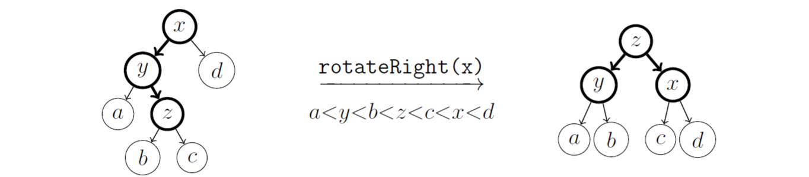

Daria Shutina, CS, $2^{nd}$ year

------


# Algorithms and Data Structures 

[TOC]


### 22-09-07 :  Dynamic programming 


#### *Task 1*: Getting POSUDA from a STUDENT


From a word S we want to get a word T by inserting, removing or replacing characters. 

`d[i][j]`  ==  min amount of operations to change `S[1..i]` into `T[1..j]`


**Base:**

`d[0][j] = j` (just insert letters into S and get T)

`d[i][0] = i`


**Transition:**
$$
d[i][j] = min
\begin{equation*}
 \begin{cases}
   d[i - 1][j] + 1   \texttt{\small (insert a char.)}\\
   d[i][j - 1] + 1   \texttt{\small (remove a char.)}\\
   d[i - 1][j - 1] + 1   \texttt{\small (replace a char.)}\\
 \end{cases}
\end{equation*} \\
$$


#### Approaches to compute dynamically 

1) Recursion + Memorization *aka* Lazy DP 

   ```c++
   int f(i, j) {
       if (dp[i][j] is computed) // <------- that is where memorization is used 
           return dp[i][j];
       return f(i - 1, j) + 1;
       ...
   }
   ```

   

2)  Using a for-cycle

   ```c++
   for i = 1..n {
       for j = 1..m // provided that dp[1..i-1][1..j-1] is computed correctly
       {
           dp[i][j] = min(dp[i][j], dp[i - 1][j] + 1);
           dp[i][j] = min(dp[i][j], dp[i][j - 1] + 1);
           ...
       }
   }
   ```


#### DP on (sub)sets :  TSP

TSP -- travelling Salesman Problem -- find a path visiting all vertexes only once. 

Weight of the path should be minimal. 


`d[S, v]` -- min weight of a path which ends in `v` and visits vertices that are in subset `S` once. 

Answer is in `d[{1,...,n}, v]`


**Base:**

- \forall v :       S = {v}        d[S, v] = 0        d[S, u] = +inf for u \neq v
- d[S, v] = +inf for v \notin S


**Transition:**
$$
d[S, v] = \underset{u \in S}{min} \ \{ \ d[S/\{v\}, u] + w_{uv} \ \}
$$


**Time:** $O(2^n n^2)$

**Memory:** $O(2^n n)$


```
// Base cases 
for (v = 0..n-1) {
    S = 1 << v;            // S = {v}
    for (u = 0..n-1) {
        if (v == u)
            d[S][u] = 0;
        else 
            d[S][u] = +inf;
    }
}

// переход 
for ( S = 0 .. (1<<n)-1 ) {
    for (v = 0..n-1) 
    {
        if (S >> v mod 2 == 0) {     // check if v \notin S
            d[S][v] = +inf;
            continue;
        }
        for (uv \in E) {      // looking at edges between v and other vertices
            d[S][v] = min(d[S][v], d[S - (1 << v)][u] + weight[u][v])   //  S\{v}
        }
    }
}
```


#### Coloring a graph 

The goal is to minimize amount of different colors. The graph is *undirected*.

V = {0,...,n-1} -- all vertices.   S \in V


`d[S]` == min # of colors used to color subgraph on vertices from S

Answer is in `d[V]`


**Base:**

- `d[\varnothing] = 0`
- `d[i] = 1 \forall i = 0..n-1`


**Transition:** 
$$
d[S] = \underset{T \subset S}{\min} \ \{ \ d[T] + 1 \ \} \ \ \textnormal{ \small (T is an independent set. '+1' for coloing it)}
$$


```
for (S = 0..2^n-1) {
    for (t = S..1)
}
```


## 22-09-21


### Трюки с масками

#### reverse

16-битные числа.

Рассмотрим число $n$. 

- откусим у него последний бит ( `n >> 1` ). В начале числа появился ведущий ноль, так как кол-во битов фиксированное
- полученную штуку перевернем ( `rev[n >> 1]` )
- уберем ведущий ноль, который теперь оказался в конце числа ( `rev[n >> 1] >> 1 `)
- в начало результата добавим чиселко, которое мы откусили в первом пункте  ( `| ((n & 1) << 15)` )

```c++
for n = 1..(1 << 16) - 1 :
    rev[n] = (rev[n >> 1] >> 1) | ((n & 1) << 15);
```


#### Младший бит

```c++
n & -(n - 1)
```


#### Старший бит

Предподсчитаем старший бит для чисел от 0 до (1 << 16)-1

```c++
msb = 0;
for (int m = 1; m < (1 << n); ++m) {
    if (m == (1 << (msb + 1)))  // случай, если старший бит устарел 
        ++msb;                  // (например, к числу 11..1 прибавили 1)
    ....
}
```


#### bitset

`bitset<N> b` 

- фиксированной длины

- занимает $\frac{N}{w}$ байт, где $w = 8$ -- машинное слово

  


### Meet in the middle

#### Пример на рюкзаке 

Решение за $O(2^{\frac{n}{2}}n)$


1. $O(2^{n/2})$ :       Выписываем всевозможные наборы из $A$.  $a \in A$. 

2. $O(2^{n/2} \frac{n}{2})$ :   Отсортируем пары { $weight_a, cost_a$ } по возрастанию весов 

3. $O(2^{n/2})$ :       Посчитаем максимумы $cost_a$ на префиксах: `maxC[i+1] = std::max(maxC[i], cost[i+1])`
4. Перебираем всевозможные наборы из $B$


### BST 

```c++
struct Node {
    Node* left;
    Node* right;
    Node* parent;
    int x;
    auto it;       // указатель на место в списке
}

using pNode = Node*;
```


#### find, next

```c++
bool find(Node* v, int x) {    // O(n)
    if (v == nullptr) 
        return nullptr;
    if (!v->left && !v->right)
        return false;
    if (v->x == x)
        return true;
    if (v->x < x)
        find(c->right, x);
    find(v->left, x);
}

Node* next(Node* v) {    // O(n)
    if (v->right) {
        v = v->right;
        while (v->left)     
            v = v->left;   
    }
    return v;
}
```


#### add

Доходим до момента когда у вершинки нет левого ребёнка

```c++
Node* add(Node* v, int x) {    // O(n)

    if (!v->left && !v->right)
        return new Node(x);
    else if (x < v->x)
        v->left = add(v->left, x);
    else if (x > v->x)
        v->right = add(v->right, x);
}
```


#### delete

Находим вершинку $u$, у которой $u\rightarrow x > v\rightarrow x.$  У $u$ нет левого ребенка. 

Перевешиваем $u$ на место $v$, меняем значение указателей, потом удаляем $v$.

```c++
void del(Node* v) {     // O(n)
    Node* u = next(v);
    
    u->x = v->x;
    // u->parent->left = v->right;  мб не надо, непонятно 
    u->parent = v->parent;
    u->left = v->left;
    u->right = v->right;
    
    v = u;
}
```


#### print

```c++
void print(Node*v) {  // O(n)
    if (!v->right && !v.left) 
        return;
    print(v->left);     // выведется в отсорт.порядке: 
    std::cout << v->x;  // сначала все <x, потом x, потом >x
    print(v->right);
}
```


**Если равные ключи:** 

1.  x ---> pair(x, id);
2. Считать количество x в структурке
3. <x => идёт в v->left;   ≥x => идёт в v->right


### AVL-дерево /todo про теорему

Сбалансированное BST. Придумано в 1962 году совестким математиками Адельсоном-Вельским (AV) и Ландисом (L). 


***Условие:*** $|h(v.l) - h(v.r)| \leqslant 1,  \ \forall v$


***Th.:*** глубина AVL-дерева $O(\log n)$

***Док-во:***

$S_h$ -- min число вершин высоты $h$ (здесь $h$ = кол-во вершин для данной высоты)

$S_0 = 0$,  $S_1 = 1$,  $S_2 = 2$,  $S_3 = 4$  и т.д.


Докажем, что $S_h = S_{h - 1} + S_{h - 2} + 1$

Вершина имеет высоту $h$, тогда когда максимальное из высот детей равно $h-1$


Получается, высота растет экспоненциально. 


Рассмотрим дерево на $n$ вершинах. $h$ -- высота.

$n \geqslant S_n \geqslant c \cdot \phi^h$

$\log_{\phi} n \geqslant \log_{\phi} c + h$

$h \leqslant \log_{\phi} n - \log_{\phi} c = O(\log n) $


#### rotate

##### 1. Добавление в $v.l.l$ или в $v.r.r$

Пусть $h(v.l) = h(v.r) + 2$ -- добавили в левого внука; левое поддерево выше, чем правое

Точно знаем, что левое поддерево непустое. 


##### 2. Добавление в $v.l.r$ или в $v.r.l$

Нужно сделать два маленьких вращения: сначала поддерево с корнем $v.l$ влево, потом дерево с корнем $v$ вправо. 




##### Код

```c++
add (Node* v, int x) {    // O(logn)
    if (!v)
        return new Node(x)
    if (v.x <= x)
        v.r = add(v.r, x)
    else 
        v.l = add(v.l, x)
    rebalance(v)  // O(1): просто перевешиваем указатели
    return v
}
```

Чтобы `rebalance()` работал за $O(1)$, в нодах будем хранить дополнительное поле `height`. 


## 22-09-28


### RBST 

Randomized Binary Search Tree


$\texttt{Def 1:}$    $BST$ может быть $RBST$, если любой ключ может быть корнем с одинаковой вероятностью. 

$\texttt{Def 2:}$    $RBST$ -- это $BST$, полученное потем добавления всех ключей в изначально пустое дерево в случайной порядке. 


#### *Th. (эквивалентность определений)*

Определения эквивалентны 

*Док-во:* в случайной перестановке любой элемент будет корнем с вер-тью $\frac{1}{n}$  $\Leftrightarrow$  любой элемент может быть корнем с одинаковой вер-тью. То же самое верно для поддеревьев.  


#### *Th. (матожидание для глубины)* \todo

$RBST$ построено по ключам $\{ x_1,.., x_n \}$. $v_i$ -- узел ключа $x_i$. Тогда $\textnormal{E}[d(v_i)] = O(\log n)$

*Док-во:*

Выберем элемент из массива. $x_i$ стал корнем с вероятностью $\frac{1}{n}$. 


### Декартово дерево

aka *Treap* aka *Cartesian tree*  =  $\{ \ (x_1,y_1),.., (x_n, y_n) \ \}$.

- дерево поиска по координатам $x$
- бинарная куча по коорднатам $y$
- координаты $y$ выбираются рандомно


#### *Th. (связь между Treap и RBST)*

Treap является RBST по координатам $x$

*Док-во:*

Корень = $(x_i, y_i)$б где $y_i = \min y$. Кооринаты $y$ рандомные $\Rightarrow$ любая вершина может стать корнем с одинаковой вер-тью $\frac{1}{n}$. Аналогично в поддеревьях. 


#### Merge

Мержим деревья $a$ и $b$. Требование: $\forall x \in a \ \leqslant \ \forall y \in b$.


 

```c++
Node* merge(Node* a, Node* b) {
    if (!a)
        return b
    if (!b)
        return a
    if (a.y <= b.y) {
        a.r = merge(a.r, b)
            return a
    }
    b.l = merge(a, b.l)
    return b
}
```


#### Split

```c++
pair<Node*, Node*> split(Node* t, int x) {   // O(logn)
    if (!t)
        return (nullptr, nullptr)
    if (t.x <= x) {
        (a, b) = split(t.r, x)
        t.r = a
        return (t, b)
    }
    if (t.x >  x) {
        (a, b) = split(t.l, x)
        t.l = b
        return (a, t)
    }
}
```


## 22-10-05


### Улучшения BST

#### 1. Массовые операции

##### (a) getSum(x1, x2)

Дано множество пар $<x, y>$. 

$\texttt{getSum(x1, x2)}$ = $\sum \limits_{x \in [x1, x2]} y$


*Решение 1:* 

Храним $RBST$. Ключ -- $x$, доп. информация -- сумма $y$ в поддереве. 

$\texttt{split}$($t$, $x_1$) $\ \rightarrow \ $ $t_{<x_1}$; $t_{\geqslant x_1}$

$\texttt{split}$($t_{\geqslant x_1}, x_2$) $\ \rightarrow \ $ $t_{[x_1, x_2)}$; $t_{\geqslant x_2}$

answer = $t_{[x_1, x_2)}.\texttt{sum}$

$t_3$ = $\texttt{merge}$($t_{[x_1, x_2)}$, $t_{\geqslant x_2}$)

$t$ = $\texttt{merge}$($t_{<x_1}$, $t_3$)


*Решение 2:*

```c++
getSum(t, qx1, qx2, cx1, cx2) 
{
    if ([qx1, qx2) && [cx1, cx2) == 0) { // нет пересечения 
         return 0;
    }
    
    if ([cx1, cx2) && [qx1, qx2) == [cx1, cx2)) { // [cx1, cx2) внутри [qx1, qx2)
        return t->sum;
    }
   
    return getSum(t->l, qx1, qx2, cx1, t->x) + getSum(t->r, qx1, qx2, t->x, cx2);
}
                                     
int main() {
    getSum(root, qx1, qx2, -inf, +inf);
}
```

Работает за $O(\log n)$: на каждом уровне будет посещено не больше 4 вершин, потому что разветвляемся максимум от двух вершин. Тогда время работы = $4 \cdot \texttt{height} = 4 \log n$.


##### (b) assignValue(x1, x2, y)

$\texttt{split}$($t$, $x_1$) $\ \rightarrow \ $ $t_{<x_1}$; $t_{\geqslant x_1}$

$\texttt{split}$($t_{\geqslant x_1}, x_2$) $\ \rightarrow \ $ $t_{[x_1, x_2)}$; $t_{\geqslant x_2}$

Лениво меняем значения в поддереве  $t_{[x_1, x_2)}$ с помощью $\texttt{push}$:

```c++
Node::push() 
{
    if (toAssign == -inf) {
        return;
    }
    if (l) {
        l->toAssign = toAssign
        l->y = toAssign
    }
    if (r) {
        r->toAssign = toAssign
        l->y = toAssign
    }
    toAssign = -inf;
}
```

Значения в поддереве с корнем $t_{[x_1, x_2)}$ меняются во время первого $\texttt{merge}$. 


#### 2. Дерево поиска по неявному ключу \todo

##### (a) get_kth_element(k)


(b) 


## 22-10-19

### Динамическое дерево отрезков 

#### Способ 1: меняем `vector` на мапу

Возьмём обычное ДО, заменим `vector<int> ST`, в котором значения дерева, на `unordered_map<ll, int> ST`. 

За $q$ запросов создадим $\leqslant \min (q \log n, n)$.

Платим временем, потому что мапа нкуда не спешит. 


#### Способ 2: не массив, а указатели

Храним ДО не на массиве, а на указателях. Создаём вершины, только когда они нужны. Вершины можно создавать в запросах $get$. 

Вершины нет $\Rightarrow$ значение = 0


#### Спосок 3: сжатие координат

Требуем, чтобы задача была в оффлайне. 

$q$ запросов. Сортируем $2q$ чисел, присваиваем им координаты $0, 1, 2, ..$


### Двумерные (многомерные) запросы

Задача 1: 

Дан массив длины $n$. Запросы вида `get(l, r, d, u)` -- найти #чисел на $[l, r)$ : их величины $\in [d, u)$


Задача 2: 

Дано $n$ точек на плоскости. Заросы `get(l, r, d, u)` -- #точек в множестве $\{ \ i \ : \ x_i \in [l, r), \ y_i \in [d, u) \ \}$


 ***Утверждение:*** задача 1 и задача 2 -- это одно и то же.

***Док-во:***

$1 \Rightarrow 2:$   $a[i] \ \rightarrow \ (i, a[i])$

$2 \Rightarrow 1:$   сделаем сжатие точек по $x_i$. Получаем координаты $\{ x_i \} = \{0, 1, 2, ...\}$ -- это индексы для массива


### Дерево mergeSort

Дерево отрезков сортированным массивов


Построение за $O(n \log n)$ с помощью `mergeSort` (обычное ДО за $O(n)$). 

Задача 1:  Время = $\underset{O(\log n)}{\# кусков} \cdot \underset{2 \textnormal{ } бинпоиска}{T(ответ \textnormal{ } в \textnormal{ } куске)} = O(\log^2 n)$ 


## 22-10-26

### Sparse table

Разреженная таблица -- структура данных, позволяющая отвечать на запросы минимума на отрезке за $O(1)$ с препроцессингом за $ O(n \log ⁡n) $ времени и памяти.

По сути, считаем минимумы на каждом отрезке длины $2^{k}$.

$dp[i][k] = \min \{ \ a_i, a_{i+1},..., a_{i + 2^k - 1} \ \}$

```c++
for i = 0..n:
    dp[i][0] = parent[i]

for k = 1..logn:
    for v = 0..n:
        dp[v][k] = min(dp[v][k - 1], dp[v + 2^{k-1}][k-1])
```


Запрос $\texttt{get(l, r)}$:

Находим степень $j$ такую, что $2^j \leqslant r - l$. Тогда минимум на $[l , r]$ = $\texttt{min(dp[l][j], dp[x][j])}$  ($\texttt{x} = r - 2^j$).


Чтобы запрос работал за $O(1)$, преподсчитаем степени двойки. Типа $\texttt{k = log[r - l]}$. 


### LCA & Двоичные подъемы

#### isAncestor

Запускаем дфс от корня и запоминаем время входа/выхода. Тогда 

```c++
isAncector(a, b) {
    if (tin[a] <= tin[b] && tout[a] >= tout[b])
    return true;
    return false;
}
```

*Док-во корректности:* 

Рассмотрим вершинку . Вершинки, у которых $\texttt{tin} \geqslant \texttt{tin[a]}$ , находятся в более правых ветках и у детей . Вершинки, у которых $\texttt{tout} \leqslant \texttt{tout[a]}$ , находятся в более левых ветках и у детей . В пересечении только дети $a$.


#### LCA

```c++
lca(v, u) {
	if (isAncestor(v, u)) {
		return v
	}
	for (int k = logn; k >= 0; --k) {
		tmp = up[v][k]
		if (!isAncestor(tmp, u)) {      // если не прыгнули слишком высоко,
			v = tmp                    // то меняем v
		}
	}	
    return up[v][0]
}
```


### LA (level ancestor)

Запрос `LA(v, k)` – подняться в дереве от вершины `v` на `k` шагов вверх.

Уже умеем решать за $<n \log n, \log n>$ двоичными подъёмами. 


#### Offline

Пройдем дфсом и будем запоминать пройденный путь. Для вершины сохранен путь от корня, можно за $O(1)$ узнать предка на $k$-ом уровне. 


#### Алгоритм Вишкина

Работает за $<n, \log n>$. 

Выпишем высоты Эйлерова обхода второго типа. Получим массив `height`. 

Для запроса `LA(v, k)` знаем индекс `j` : `height[j] = v`. Найдем индес `max i`  :  `i <= j && height[i] = height[j] - k`. 


## 22-11-02

### RMQ $\pm$ 1

$\forall i \ : \ |a_i - a_{i+1}| = 1$


### ФКБ

Хотим `RMQ` за <n, 1>. 


$\texttt{RMQ} \ \underset{1}{\rightarrow} \ \texttt{LCA} \ \underset{2}{\rightarrow} \ \texttt{RMQ} \pm 1 $


1. $\texttt{RMQ} \ \underset{}{\rightarrow} \ \texttt{LCA}$ 

   Строим декартач по массиву за $O(n)$.   $\texttt{a[i]} \rightarrow \texttt{<i, a[i]>}$

   По индексам это BST (?) (*aka* приоритет), по элементам -- бин куча. 

   Как построить за $O(n)$? Проходимся последовательно по массиву. В дереве будем всегда двигаться по самому правому пути (запоминать его конец). Если значение текущего элемента меньше, чем начало пути, то добавляем новую ветку справа от всех веток начала пути (теперь начало самого правого пути поменялось).

   

   

   *LCA* для вершинок $v$ и $u$ = $\min$ на отрезке $[v.key, u.key]$ 

   *Док-во:*

   - $LCA \in $ отрезку

   

   - $\forall i, \ i \in [l, r) \ : \ (i, a[i]) \in subtree(lca) \ \Rightarrow \ lca.value \leqslant a[i]$

     $\Rightarrow$ $lca$ = $\min$ на отрезке 

   

   

   

2. $\texttt{LCA} \ \underset{}{\rightarrow} \ \texttt{RMQ} \pm 1 $

   **(1)** Эйлеров обход второго типа (выписываем вершину и высоту)

   

Получаем массив $\texttt{h}$, в котором разница между элементами $= \pm 1$. 

Выбираем в нем любое из вхождений вершинок, мин число между ними $= lca$ этих вершинок.


**(2)** В $\texttt{h}$ любой отрезок однозначно кодируется как $(x, \pm 1, ..., \pm 1)$, где $x$ -- число в начале отрезка. 

Хотим для любого отрезка $[l, r)$ быстро узнавать тип и быстро находить минимум. 


$k = \frac{\log n}{2}$. Строим sparse table. 

Всего есть $2^0 + 2^1 + ... + 2^{k} \leqslant 2^{k+1} = O(\sqrt{n})$ различных отрезков.

Переберем все отрезки и найдем в них минимумы.  

```c++
for (mask = 0..2^{k+1})
    for (l = 0..k)
        for (r = 0..k)
        	precalc[type][l][r] = min elem in [l, r];
```

 


## 22-11-09

### MST

Minimal Spanning Tree 


### Th. (лемма о разрезе)

$V$ -- множество вершин, $E$ -- множество ребер в исходном графе. 

$V = A \ \sqcup \ B$ -- разрез графа

$T \subset E \ : \ T \textnormal{\ не \ пересекает \ разрез \ } \ ({\small \nexists e \in T \ : \ e=(ab), a \in A, b \in B})$

Тогда $\exist MST \ T_0 \ : \ T \subset T_0$


*Док-во:*

$e$ -- ребро минимального веса из разреза ( ${\small e = (ab), a \in A, b \in B \ \and \ \forall e' = (a'b'), a' \in A, b' \in B \ : \ weight(e') \geqslant weight(e)}$ )

Тогда $e$ -- безопасное ребро для $T$, т. е. $\exist \ MST \  T_1 \ : \ T \cup \{e\} \subset T_1$


Рассмотрим $T_0$.

1. $e \in T_0 \ \Rightarrow \ T_1 := T_0$

2. $e \notin T_0$. Тогда в $T_0$ есть как минимум одно ребро $e'=(a'b')$, пересекающее разрез (иначе $T_0$ не связное, противоречие). 

   $T_1 := T_0 / \{ e' \} \cup \{ e \}$

   $\left . \begin{array}{r} weight(T_1) = weight(T_0) - weight(e') + weight(e) \\ weight(e') \geqslant weight(e) \end{array} \right \} \ \Rightarrow \ weight(T_1) \leqslant weight(T_0)$

   $T_1$ -- дерево ($|T_1| = |T_0| - 1 + 1 = n - 1$)

   Путь между $a'$ и $b'$ все ёщё существует и равен $a' \rightsquigarrow a \underset{e}{\rightarrow} b \rightsquigarrow b'$. Если после замены нет пути из $a'$ в $a$, то изначально $T_0$ не был связный, противоречие.  

3. *Утв. 1*: $T_1 - MST$  ( для (1) очев, для (2) следует из того, что размер = $n-1$ и $T_1$ связное )

   

   *Утв. 2*: $T \cup \{ e\} \subset T_1$

   Для (1) очев, для (2):

   $e \in T_1$ 

   В $T$ не было ребер из разреза по условию $\Rightarrow \ e' \notin T \ \Rightarrow \ T \subset T_0 / \{ e'\} \ \Rightarrow \  T \subset T_1$

   


***Смысл леммы:*** 

Если есть какое-то множество ребер, которое можно дополнить до $MST$, то можно просто брать ребро минимального веса, соединяющее две компоненты. 


### Алгоритм Прима

Строим граф $T$ с нуля. Изначально в $Т$ находится одна вершинка.

Для вершинки $u$ перебираем рёбра. Выбираем такое $(u, v)$, что:
- $w( (u,v) ) = \min$ 
- $v \notin T$

Делаем так до тех пор, пока в $T$ не будут включены все вершинки

Работает за $O(V^2 + E)$ на массиве, $O(E \log V)$ на бин куче, $O(V \log V + E)$ на Фиб. куче. 

```c++
int main() {
    vector<vector<int>> g;
    vector<bool> used(n, false);
    vector<int> dist(n, INF), parent(n, -1);
    dist[0] = 0;  // стартуем из 0
    repeat(n) {
        int v = -1;
        for (int j = 0; j < n; ++j)
            if (!used[j] && (v == -1 || dist[j] < dist[v]))
                v = j;
        if (dist[v] == INF) {
            cout << "No MST!\n";
            return 0;
        }
        used[v] = true;
        for (int u = 0; u < n; ++u)
            if (g[v][u] < dist[u]) {
                dist[u] = g[v][u];  // в `dist` поддерживаем минимальное ребро от компоненты до вершинки 
                parent[u] = v;
            }
    }
}
```


### Алгоритм Краскала

Построение MST в связном графе 

Строим мст с нуля. Сначала это пустой граф $T$. Сортируем рёбра по возрастанию, получаем массив `Edges`. 

Добавляем ребро, если оно лежит между вершинкой $\in T$ и вершинкой $\notin T$.

```c++
std::vector<int> parent(n, -1);
std::vector<int> rank(n, 0);  // ну типа высота дерева

int find_set(int v) {
    if (parent[v] == v) {
        return v;
    }
    return parent[v] = find_set(parent[v]);
}

void union_set(int a, int b) {
    int v_a = find_set(a);
    int v_b = find_set(b);
    if (v_a == v_b) {
        return;
    }
    if (rank[v_a] < rank[v_b]) {
        std::swap(v_a, v_b);
    }
    parent[v_b] = v_a;
    if (rank[v_a] == rank[v_b]) {
        ++rank[v_a];
    }
}

int kraskal(std::set<std::pair<int, std::pair<int, int>>> &Edges) {
    int cost = 0;
    for (const auto &edge : Edges) {
        int w = edge.first, u = edge.second.first, v = edge.second.second;
        if (find_set(u) != find_set(v)) {
            union_set(u, v);
            cost += w;
        }
    }
    return cost;
}
```

`find_set()` за $O(\log n)$, потому что высота дерева (aka rank) не больше $\log n$.

`union_set()` можно заставить работать за $O(1)$.


#### Корректность алгоритма

Рассмотрим разрез графа: $A \subset V$ && $B = V / A$. 

Изначально $T = \{ \varnothing \}$. Будем набирать рёбра  в $T$. 

$e$ -- ребро минимального веса, соединяющее $a \in A$ и $b \in B$. Рёбра меньшего веса находятся либо в $A$, либо в $B$ $\Rightarrow$ их нет смысла брать. Остальные рёбра между $A$ и $B$ имеют больший вес. Значит $e$ -- безопасное ребро, его можно добавить в $T$.

Если полученное $T$ -- не дерево (т.е. не связно), то граф изначально был несвязный, противоречие. 

$\left . \begin{array}{r} T - дерево \\ T \subseteq MST \end{array} \right \} \ \Longrightarrow \ T = MST$


## 22-11-18

### DSU

DSU -- Система Непересекающихся Множеств

Умеет:

- `init(n)`  --  создать $n$ множеств из одного элемента 
- `get(a)`  --  узнать уникальный идентификатор множества, в котором лежит $a$
- `join(a, b)`  --  объединить множества, в которых лежат $а$ и $b$


#### DSU на списках

```c++
vector<set> sets;
vector<int> id;

void init(int n) {   // O(n)
    for (int i = 1..n) {
        id[i] = i;
        sets[i].insert(i);
    }
}

int get(int a) {  // O(1)
    return id[a];
}

void join(int a, int b) {   // O(n)
    if (sets[a].size() < sets[b].size()) 
        std::swap(a, b);
    for (int x : sets[b]) {
        id[x] = id[a];
        sets[b].erase(x);
        sets[a].insert(x);
    }
}
```


##### Th. (cуммарное время работы join) 

Суммарное время работы всех `join` не больше $n \log n$. 


*Док-во:*

На каждом `join` кол-во множестве уменьшится вдвое $\Rightarrow$ соединять множества можно не больше $\log n$ раз $\Rightarrow$ все `join` работают за $O(n \log n)$. 


#### DSU на деревьях 

Базовая реализация: 

```c++
vector<int> p;

void init(int n) {
    for (int i = 1..n) {
        p[i] = i;
    }
}

int get(int a) {
    return p[a] == a ? a : get(p[a]);
}

int join(int a, int b) {
    pa = get(a);
    pb = get(b);
    p[pb] = pa;
}
```


##### Оптимизации

1. Сжатие путей -- перевешивание вершинок корню

   ```c++
   int get(int a) {
       if (p[a] == a)
           return a;
       return p[a] = get(p[a]);
   }
   ```

   

2. Сохранение рангов для перевешивания меньшего дерева к большему.

   Ранг вершины – глубина поддерева, если бы не было сжатия путей.

   ```c++
   vector<int> rank;
   
   void init(int n) {
       for (int i = 1..n) {
           p[i] = i;
           rank[i] = 0;
       }
   }
   
   join(a, b) { // O(logn)
       pa = get(a);
       pb = get(b);
       if (rank[pa] < rank[pb])
       	std::swap(pa, pb);
       p[pb] = pa;
       if (rank[pa] == rank[pb])
       rank[pa]++;
   }
   ```


##### Th. (про размер поддерева)

Если у $v$ ранг $k$, то её поддерево размера $\geqslant 2^k$


*Док-во:*

База: $k=0$. Размер дерева $=1$.

Переход: 

Чтобы получить дерево ранга $k+1$, нужны для дерева ранга $k$. Подвешиваем дерево с корнем $u$ к дереву с корнем $v$.

$\textnormal{\small Новый \ размер \ дерева \ с \ корнем \ } v = \underbrace{\textnormal{\small старый \ размер \ дерева \ с \ корнем \ } v}_{\geqslant 2^k ({по \ предп. \ инд.})} + \underbrace{ \textnormal{\small размер \ дерева \ с \ корнем \ } u}_{\geqslant 2^k (по \ предп. инд.)} \geqslant 2^{k+1}$


##### Th. (время работы join и get)

`join` и `get` работают за $O(\log n)$. 


*Док-во:*

Работа `join` зависит от `get`. `get` работает за `rank(root)` $\leqslant O(\log n)$. 
