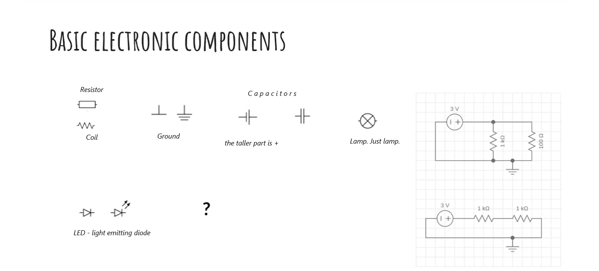
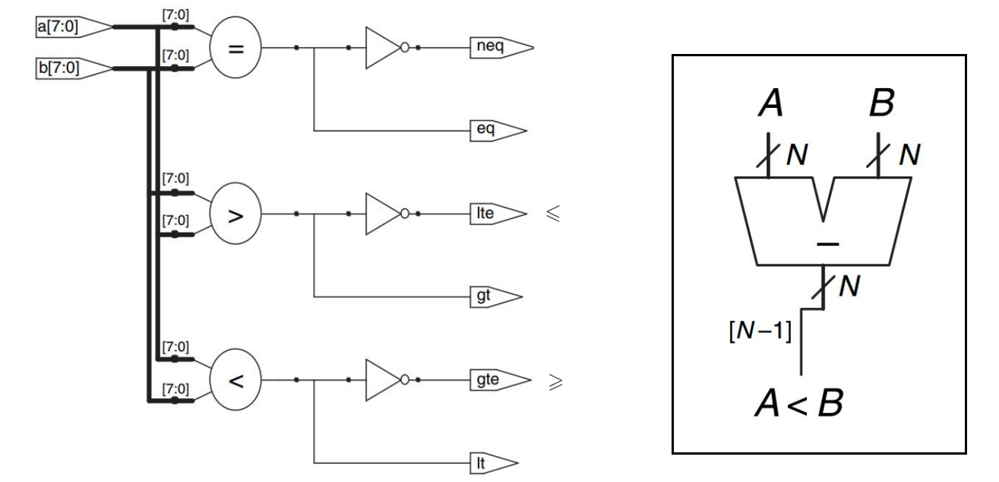
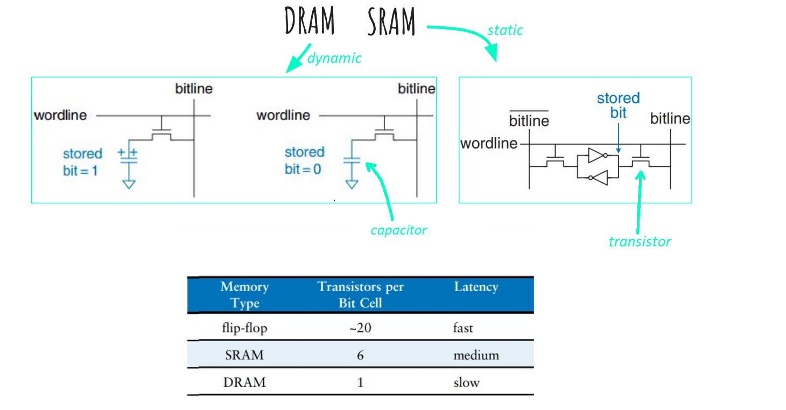
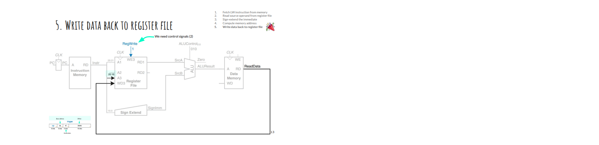

Daria Shutina, CS, $2^{nd}$ year

------


# Computer Artichecture


[TOC]


## Organization stuff 

chaika.konstantin.v@gmail.com 

- start subject with [JUB-Arch] prefix
- in subject line: name, surname, theme 


## 22-09-05

### Ohm's law

`R * I = U`, where `R` - resistance (Om), `I` - current (A), `U` - Voltage (V)




### Logic gate symbols 


## 22-09-12

### Architecture Types


***Von Neumann Architecture:***

- Data and commands are stored in the same memory 
- Commands and data are visually indistinguishable in memory 


***Harvard Architecture:***

- Data is stored separately from commands
- You can handle both data and commands in parallel


### I/O -- input/output


### Machine word /TODO

CPU -- Central Processing Unit -- центральный процессор. 

https://habr.com/ru/company/selectel/blog/542074/


### RISC vs CISC


**RISC:**

- фиксированная длина инструкции 
- инструкция целиком выполняется за один такт. Не нужно тратить энергию на сохранение промежуточных состояний


**CISC:** 

- инструкции могут быть разной длины. Прежде чем выполнить команду, нужно за неограниченное время разобраться, что делает команда. 
- 


### Multiplexer

Схема, у которой один/несколько гейтов на вход и только один на выход. 


### Clock 

Clock (CLK) -- защёлка. Какая-то штука, которая как-то генерируется и синхронизирует все гейты.

`=0` => значение на выходе не меняется

`=1` => значение меняется 


## 22-09-19


### Half adder 

Полусумматор, на входе не подается бит переноса 
$$
S = A \oplus B
$$


### Adder 

На вход подается бит переноса. Бит переносится, если в числе две единицы либо есть единица и старый бит переноса. 
$$
S = A \oplus B \\

C_{out} = A \& B \ + \ A \& C_{in} \ + \ B \& C_{in}
$$


### Two's complement 

*aka* обратный код 

Фиксированное число битов. Первый бит показывает, какой знак у числа.


***Как перевести положительное число в отрицательное?***

1. Инвертировать все биты 

2. Добавить единицу 

   

Путь такой, потому что иначе у нуля появился бы знак.


#### Пример

$n = 8$

$10_{10} = 00001010 \ \rightarrow \ 11110101 \ \rightarrow \ 11110110 = -10_{10}$

$-10 + 10 = \ + \begin{array}{l} 11110110 \\ 00001010 \end{array} \ = 1 \underbrace{00000000}_8 \texttt{ mod } (1 \ll n) = 0$


### Subtractor

Вычитает из одного чиселка другое. Будем реализовывать вычитатель через сумматор: сначала найдем two's complement для В (инвертируем все биты + добавим 1), потом сложим.
$$
S = A \ + \ \overline{B} + 1
$$


`/ N` значит, что на входе N-разрядное число 


### Comparator blocks 


#### Сокращения




#### Операторы `<`, `>`

Можно вычесть из одного чиселка другое и посмотреть на старший бит -- знак результата 


### ALU (arithmetic-logic unit)

Черные линии -- данные, синии -- управляющие сигналы:


Значение в верхней перевернутой трапеции: 

-   $F_2$ = 0   $\Rightarrow$   через трапецию проходит значение $B$ 
-   $F_2$ = 1   $\Rightarrow$   через трапецию проходит значение $\overline{B}$ 


*Zero extend*: на вход подается $(n-1)$-ый бит, добиваем его нулями

*SLT*: вычитаем B из A, отправляем старший бит в *zero extend*. 


### Counter 

Счетчик 


### Memory array

#### Addresses

##### One-ported array

*Wordline* -- линия машинных слов. 

Есть шина адреса (2 проводочка). С помощью декодера выбираем, на какой вордлайн попадем. Сами вордлайны <u>не пересекаются</u>. 


$\texttt{Data}_2 = 0, \ \texttt{Data}_1 = 1, \ \texttt{Data}_0 = 1$

На картинке линия однопортовая, потому что есть только один вход для адреса. 


##### Multi-ported array

RD == read data, WD == write data 

*WE3* -- Write Enable -- управляющий сигнал 


В *RD1* будет выстроено слово по адресу *A1*, в *RD2* -- по адресу $A2$. 

В *WD3* будет что-то записано по адресу *A3*, если *WE3* == 1. 


### дз момент

- A memory can have more than one address bus and more than one data bus at the same time
- The maximum number of words stored in memory is determined by the bit depth of the address bus
- The address bus capacity and the data bus capacity can be different 


### Memory types 

#### DRAM & SRAM

Capacitor -- конденсатор 




## 22-09-26


### Big endian / Little endian 

Это про прямой и обратный порядок байтов

***Big-endian:*** в начале младший байт, в конце старший 

***Little endian:*** в начале старший байт, в конце младший 


### MIPS

*MIPS* (32-битная структура) -- система команд и микропроцессорных архитектур, разработанных в соответствии с концепцией проектирования процессоров RISC (то есть для процессоров с упрощенным набором команд). Позднее появились его 64-битные версии. 


#### MIPS: register set /todo

Регистр -- это, по сути, адрес в памяти. 

Есть 32 регистра. Один из них всегда используется <u>для нуля</u>, остальные для любых нужных инструкций, но есть договоренность, для чего какой регистр используется. 


Обозначения: 

● `$r2` - регистр 

● `(73)` - чиселко

● `-5($r2`) -- смещаемся влево (`-`) или вправо (`+`) от адреса, в котором хранится регистр `$r2`


#### Типы инструкций

*Immediates* -- constants which values are immediately available from the instruction and do not require a register or memory access


##### `R-type`

инструкция для триады регистров ( `R : $x, $y, $h` ). Имеет размер 32 бита.


`$s0` = 16 -- destination,  `$s1` = 17, `$s2` = 18 (см. таблицу выше)


##### `I-type` 

инструкция для пары регистров ( `I: $x, $y` ). I == immediate 

Значение доступно сразу после выполнения команды (поэтому immediate). Имеет размер 16 битов.


В `rt` записывается результат

Если `op = 8`, под капотом операция записывается на ALU. 

`i` в конце операции означает, что это команда и что она выполняется над каким-то адресом.


числа 32-битные, но для `I-type` у чисел 16 битов. `immediate` знаковое, поэтому есть механизм знакового расширения: если страший разряд = 1 -- добиваем единицами в начале; если старший разряд = 0 -- добиваем нулями.


`lw` == `load word` -- загружает слово из памяти

`sw` == `save word` -- сохраняет слово в памяти

- хотим взять значение в `$s1 = 17` и записать в адрес `4($t1)` -- адрес регистра `$t1` + смещение на 4 байта


##### `J-type` 

Имеет размер 26 битов. J == (jump) 


#### Примеры


#### Shift operations  /todo 

**sll** -- shift left logical -- сдвигает все биты на один влево

**srl** -- shift right logical -- сдвигает все биты на один вправо. Старший бит становится равным нулю

**sra** -- shift right arithmetic


#### if-statement


### Function call 

Когда вызывается функция, на стек кладется указатель на начало её исполнения. Формируется stack frame. 


### Call stack

#### Calling convention

Соглашение о порядке, в котором переменные/стек-фреймы кладутся на стек. 

**Пролог функции** -- стек-фрейм появляется на стеке; **эпилог функции** -- стек-фрейм убирается со стека.


### Automatic variables

 **Automatic variable** -- a local variable which is allocated and deallocated automatically when a program flow enters and leaves the variable's scope. 


Можно вручную резервизовать место на стеке, сдвигая указатель на начало стека. Так гарантируем, что на стеке будет место для новых переменных, например. 


Сначала делаем `-=M`, потом `+=M`, потому что стек заполняется от наибольшего адреса к наименьшему. 


## 22-10-04

### Реализация Load Word

1. Fetch LW instruction from memory

2. Read source operand from register file

3. Sign-extend the immediate

4. Compute memory address

5. Write data back to register file

   





Control unit 

Первые 6 битов -- код операции. 


### Single-cycle problems

- The single-cycle MIPS processor uses separate command and data memory.
- The clock signal period must be long enough for the slowest command to execute. The slowest command is `lw`.
- Several adders (especially fast) make the circuit more expensive.


## 22-10-10

### FSM (main controller)


#### Fetch


## 22-10-24

### System Verilog 

Язык, используемый для описания и моделирования электронных систем. Расширение `.sv` 

```verilog
module f(input logic a, b, c, output logic y);
    assign y = a & b & c | ~a & b;
endmodule
```

`module`  --  ключевое слово, обозначающее компоненту. 


```shell
iverilog -g2012 aboba.sv
./a.out
```

Скомпилировать и запустить файлик 


#### Example: the appropriate scheme for a code 


### Формат числа 

`[width]'[base][value]`

`[base]`  может быть `b`, `h`, `d`

Запись `[n:m]` означает взять биты с `m` по `n` включительно. 


### Элементарные операции

```verilog
module gates(input logic [3:0] a, b,
             output logic [3:0] y1, y2, y3, y4, y5);
    assign y1 = a & b;  // AND
    assign y2 = a | b;  // OR 
    assign y3 = a ^ b;  // XOR 
    assign y4 = ~(a & b); // NAND
    assign y5 = ~(a | b); // NOR
endmodule
```


### А что если проводочков больше, чем один? 

```verilog
module invert(input logic [3:0]a, output logic [3:0]y);
    assign y = ~a;
endmodule
```

Если размерности входа/выхода не сойдутся, будет ошибка на уровне компиляции


```verilog
module and8(input logic [7:0]a, output logic [7:0]y);
    assign y = &a;  // <=> a1 & a2 & ... & a8
endmodule
```


### halfadder

Полусумматор 

```verilog
// halfadder.sv

module halfadder(input logic a, b,
                 output logic s, cout);
    assign s = a ^ b;  // XOR 
    assign cout = a & b;
endmodule 
```


```verilog
// test.sv

module test;
    
    // объявление переменных 
    reg a;
    reg b;
    wire s;
    wire cout;
    integer i;
    
    // создание функции и привязка переменных к ее аргументам 
    // `ha0` -- имя функции 
    halfadder ha0(.a (a), .b (b), .s(s), .cout (cout));
    
    initial begin 
        a <= 0;
        b <= 0;
        $monitor ("%0h", a)  // <=> print
        for (i = 0; i < 50; i = i+1) begin
            #10 a <= $random; 
            b <= $random;
        end
    end
endmodule 
```

`#10` означает "подожди 10 мс". Если убрать, то значения не успевают перезаписываться.


### Sequential logic 

#### always_ff

```verilog
always_ff @(posedge clk)
    q <= d;
```

`ff` от `flip-flop`,  `posedge` от `positive edge`. 

Значение `q` поменяется, только когда `clk`  меняется с нуля на единицу. 

Есть ключевое слово `negedge`, работает наоборот. 


#### always_latch

```verilog
always_latch
    if (clk) q <= d;
```

блок выполняется всегда, если защелка закрыта. 


#### always_comb

Можно задать таблицу истинности

```verilog
module test(input logic [3:0] a, output logic [3:0] y);
    always_comb
    casez(a)
        4'b01??: y <= 4'b1000;
        4'b1010: y <= 4'b1001;
        default: y <= 4'b1111;
    endcase
endmodule 
```


### enum

```verilog
typedef enum logic [2:0] {s0, s1, s2, s3 = {111}} statetype;
statetype aboba;
```

`s0 = 000`,  `s1 = 001`,  `s2 = 010`,  `s3 = 111`.

`statetype`  -- имя enum-класса.

`aboba` -- число из трёх битов, принимающее значение из `statetype`:  `s0`, `s1`, `s2` или `s3`. 


### Блокирующее и неблокирующее присваивание 

`=`  ---  блокирующее

```verilog
q = a ^ b
p = q | b
```

Операции выполняются последовательно. Сначала изменится `q`, потом оно используется в строке 2. 


`<=`  ---  неблокирующее 

```verilog
q <= a ^ b
p <= q | b
```

Операции выполняются одновременно. Сначала выполнятся выражения справа, потом произойдет переписывание значения. 

В строке 2 используется старое значение `q`. 


## 22-11-03

### AT&T syntax

`$label` -- подставление значения переменной `label` (?)

`$1` -- чиселко 1

`%eax` -- название регистра, начинается с `%`

`mov, call, int, jmp`  --  команды 

`mov $5, %eax` <=>  в регистр `eax` запишется значение `5`


https://faculty.nps.edu/cseagle/assembly/sys_call.html


#### EXIT_SUCCESS, но в асселблере

```assembly
mov $1, %eax
xor %ebx, %ebx  ; чистим регистр 
int $0x80
ret
```


#### Пишем hello world

```assembly
.data
    msg1:
        .ascii "Computer Architecture Course\n/Autumn semester\\"
        
    msg1len:
        .long . - msg1

.text

.globl main
main:
    mov $4, %eax
    mov $1, %ebx
    mov $msg1, %ecx
    mov msg1len, %edx
    int $0x80
    
    mov $1, %eax
    xor %ebx, %ebx
    int $0x80
    ret


helloprinter:   ; функция 
    mov $4, %eax
    mov $1, $ebx
    mov $aboba, %ecx
    mov len, %edx
    int $0x80
    ret
```

`.data` и `.text`  --  отдельные блоки с данными 

`aboba:` -- метка; используется, чтобы обратиться по адресу, где сохранена строка

`int $0x80`  --  запускает записанную функцию 


Вместо строк 12-16 можно написать `call helloprinter`

```assembly
.data
    msg1: 
        .ascii "Computer Architecture Course\n/Autumn semester\\\n"
    len:
        .long . - msg1
    
.text

    


.globl main
main:
    call printer
    mov $1, %eax
    xor %ebx, %ebx
    int $0x80
    ret
    
printer:
    mov $4, %eax
    mov $1, %ebx
    mov $msg1, %ecx
    mov len, %edx
    int $0x80
    ret
```


#### циклы

```assembly
.globl main
main:
    xor %esi, %esi
    mov $0, %esi
    loop:
        cmp $123, %esi
        je end
        call printer
        add $1, %esi
        jmp loop
    end:
    mov $1, %eax
    xor %ebx, %ebx
    int $0x80
    ret
```

Начинаем с нуля, прыгаем в начало `loop`, пока значение в `esi`  меньше 123. 


## 22-11-07 \todo

### API & ABI

API -- Application Programming Interface -- всякие функции и переменные, хранящиеся в библиотеке. 

API используется разработчиком. 

ABI -- Application Binary Interface -- "скомпилированный" API. Хранит информацию о месте функции в памяти; какие аргументы функция принимает и возвращает; как чистится память после использования. Еще отвечает за padding и endiannes. 

ABI используется компилятором. То, как будет выглядить ABI, зависит от платформы. 


### Совместимость API

Совместимость API не гарантирует переносимость (если изменилась версия ядра, не факт, что будет работать).

Если изменился API, придется переписывать код. Если изменился ABI, нужно перекомпилировать код.  


## 22-11-21

### A typical memory hierarchy

```shell
┌───────────────────────────────────┐
│              Processor            │
│  ┌────────────┐   ┌────────────┐  │      ┌─────────────────┐      ┌────────────────┐
│  │            │   │            │  │      │                 │      │                │
│  │    CPU     ◄───►   Cache    │  ◄──────►   Main memory   ◄──────►   Hard drive   │
│  │            │   │            │  │      │                 │      │                │
│  └────────────┘   └────────────┘  │      └─────────────────┘      └────────────────┘
└───────────────────────────────────┘
```

Жесткий диск *aka* винчестер -- усройство, на котором хранится информация об операционной системе, драйверах файлах настроек и остальных элементах управления компьютером. Ещё на нём хранится вся информация, созданная пользователем. 

Взаимодействие между CPU и main memory происходит через cache. 


### Temporal and spatial locality

Временна́я локальность: использованная информация когда-нибудь будет использоваться снова. 

Пространственная локальность: с большой вероятностью будет использоваться информация из той же области. 


### Как устроен кэш

В кэше хранятся данные, расположенные по каким-то адресам, причем поддерживается пространственная локальность. Один сохраненный адрес называется *cache block* или *cache line*. 

Cache hit -- нужный адрес сохранен в кэше. 

Cache miss -- нужный адрес не сохранен в кэше. Вероятность получить cache miss равна $10\%$.

- compulsory misses -- промахи, которых не избежать. Например, когда к адресу обращаются в первый раз. 
- capacity misses -- размер кэша слишком маленький, чтобы хранить все использующиеся данные.  
- conflict misses -- в сете переписывается вхождение, которое еще нужно 

CPU сначала обращается в кэшу и проверяет, подгружен ли кусок памяти, нужный для запроса, в кэш. Если не лежит, CPU обращается к основной памяти и загружает нужный кусок в кэш. 


### Типы устройства кэша 

Кэш представляется в виде двумерного массива. Строки называются сетами (sets), столбцы -- каналами (ways). 

Зачение одной ячейки -- тупл вида `<valid bit, tag, data>`. Valid bit -- бит, показывающий, являются ли сохраненные данные валидными. Тег -- часть адреса (об этом подробнее ниже). 

| Тип устройства                  |                                    | Кол-во каналов | Кол-во сетов   |
| :------------------------------ | :--------------------------------- | :------------- | :------------- |
| Direct mapped cache             | Кэш прямого отображения            | 1              | B = cache size |
| Multi-way set assosiative cache | Мульти-канальный ассоциативный кэш | 1 < N < B      | B/N            |
| Fully assosiative cache         | Полностью ассоциативный кэш        | B              | 1              |


#### 1. Direct mapped cache 

Кэш прямого отображения. 


Рассмотрим, как устроен адрес. 

Последние два бита -- это смещение байта относительно начала в машинном слове. 

Следующие $i$ битов -- номер сета в кэше. $i = \log(\texttt{cache size})$. В одном сете лежит один адрес. 

Остальные биты -- тег.


Из картинки видно, что распределение адресов между сетами кэша перемешанное, а не упорядоченное. Так сделано для того, чтобы не приходилось перезаписывать один и тот же сет. 

Допустим, адреса распределяются в порядке увеличения/уменьшения сетов. В сет $s$ мы записываем адрес $s$. Нужно записывать в кэш еще и рядом лежащие адреса, потому что есть пространственная локальность $\Rightarrow$ выкинем адрес $a$ и запишем его соседа. Втф. Поэтому при увеличении адресов номера сетов идут не по порядку. 


##### Реализация


Хотим обратиться по какому-то адресу.  Из адреса определяем сет, в котором адрес должен жить. Дальше сравниваем тег адреса, по которому хотим обратиться, с тегом, сохраненном в рассматриваемом сете. Если они равны и $\texttt{valid bit} = 1$, возвращаем сохраненные данные. 

**Если такого тега нет**, переписываем значение в сете. Тут выбора нет, потому что биекция между адресом и сетом. 


##### Какие минусы?

Грустно, если часто обращаемся к адресам, у которых совпадают сеты. 


#### 2. Multi-way set associative cache 

$N$-канальный наборно ассоциативный кэш. Отличается от предыдущего тем, что каждый сет теперь состоит из $N$ блоков (каналов). $N$ -- степень ассоциативности. 

Двух-канальный ассоциативный кэш:


Хотим обратиться по какому-то адресу.  Из адреса определяем сет, в котором адрес должен жить. Потом сравниваем тег адреса, к которому хотим обратиться, с каждым из тегов в сете. 

**Если такого тега нет**, то наименее часто использовавшееся вхождение (LRU) заменяется на новые данные. 


#### 3. Fully associative cache 

Полностью ассоциативный кэш. 

Используется один сет, у которого $B$ блоков (каналов). 

8-канальный полностью ассоциативный кэш:


Хотим обратиться по какому-то адресу.  Из адреса определяем тег, по тегу находим нужное вхождение в сете. 

**Если такого тега нет**, то заменяется наименее часто использовавшееся вхождение (LRU).


#### Пример: 4-канальный кэш с двумя сетами 


Теперь в адресе будем хранить смещение внутри строки кэша (block offset). 

Сет устроен таким образом: сначала valid bit, потом тег, потом данные по адресам с таким тегом. 


Особенность этой схемы в том, что теперь в одном сете хранятся данные из подряд идущих адресов. Таким образом решена проблема 

[кэша прямого отображения](####1. Direct mapped cache), и больше не нужно перемешивать сеты между адресами. 


### LRU replacement 

Способ замены данных в кэшах с несколькими каналами. 

Нужно знать, сколько раз обращались к каждому адресу. Добавим поле $U$ в каждое из вхождений. Когда обращаемся <u>к сету</u>, значение $U$ увеличивается у каждого вхождения. 


**Pseudo-LRU:** если каналов слишком много, то не выгодно поддерживать актуальные поля $U$ для каждого вхождения. Вместо этого поделим таблицу кэша пополам и будем запоминать, какая из половин последний раз менялась. 


### Изменение данных по адресу и обновшение кэша

Второй способ лучше, потому что меньше обращений к основной памяти $\Rightarrow$ меньше времени в общем. 


#### 1. Write-through

При изменении данных в кэше сразу менять их в основной памяти 


#### 2. Write-back

Введем дополнительный dirty bit ($D$). Данные переписаны $\Rightarrow D = 1$, иначе $D = 0$.

Данные переписываются в основной памяти, только когда из кэша убирается адрес с $D = 1$.


## 22-11-28

### Virtual memory

Виртуальная память -- метод управления памятью, когда вторичная память (SSD/HDD) используется как основная память (RAM). 

Виртуальная память поделена на страницы (virtual pages), обычно размер страницы $\texttt{4 KB}$. Виртуальная страница размещается в физической памяти (DRAM) или на диске. Физическая память тоже поделена на страницы такого же размера. 

Каждой виртуальной странице присваивается уникальный номер (VPN). Один из способов придумать номер -- взять начало адреса в физической памяти. А еще каждой виртуальной странице сопоставляется номер страницы в физической памяти (PPN). 

 Отказ страницы (page fault) -- виртуальная страница указывает на невалидную страницу физической памяти. Чтобы это избежать, каждой виртуальной странице в начале сопоставляется любая возможная физическая. 


#### Translation

Для биекции между виртуальными и физическими страницами используется page table. Вхождения в таблице -- туплы вида `<valid bit, PPN, VPN>`. 

`valid bit = 1` $\Rightarrow$ адрес в основной памяти 

`valid bit = 0` $\Rightarrow$ адрес на диске 


Таблица хранится в основной памяти. Получается, мы два раза обращаемся к основной памяти: сначала ищем вхождение в таблице, потом достаем значение по адресу. Для оптимизации по времени используется буфер ассоциативной трансляции (TLB)


##### Translation Lookaside Buffer (TLB)

Кэширует наиболее часто запрашиваемые вхождения из page table. СТруктура как у [полностью ассоциативного кэша](####3. Fully associative cache).

 


#### Изменение данных по адресу в физической памяти

Изменения происходят в TLB (но это не точно). Используются [`write-back`](####2. Write-back) и [pseudo-LRU](###LRU replacement).


#### Multilevel page tables 

Page table теперь представляется как набор страниц. Ну типа таблицу нарезали на страницы. Нарезанную таблицу можно и на диске хранить, по мере необходимости подгружая страницы в основную память. 

Виртуальный адрес теперь имеет вид `<page table number> ++ <page table offset> ++ <page offset>`. 

`page table number` -- номер страницы в нарезанной таблице. 

`page table offset` -- номер виртуальной страницы, определяющий вхождение в page table (тут узнаем адрес в). 

