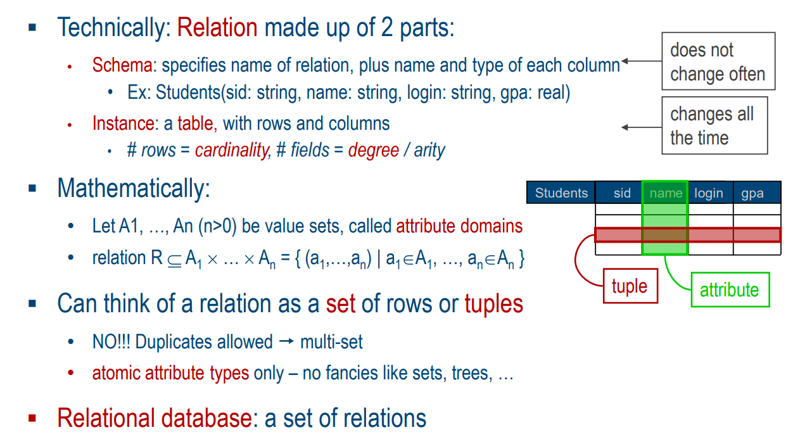

Daria Shutina, CS, $2^{nd}$ year

------


# Databases and Web Services


[TOC]


## Organization stuff

Peter Baumann 

p.baumann@jacobs-university.de

room 88, Research 1


Course material :  https://peter-baumann.org//Courses/Databases+WebServices/

System for uploading homework: https://aaarkid.co/hw1/

Drawing schemes: [lucidchart](https://lucid.app/lucidchart/f141fb32-f686-4f46-82bd-3bfaf757b425/edit?invitationId=inv_6e1114c3-ae7b-4a2d-a3ac-02d99c44d55f&page=R0FTb33QwXt5#)

SQL code testing: https://www.db-fiddle.com/

Whereby meeting room: https://whereby.com/dbws-helpdesk


## 22-09-06

### ISA Hierarchies 

ISA means 'is a'

`A ISA B` can be read "A inherits from B". All A entities have the same attributes like B entities 


### ER-model

Entity-Relationship Model

- a scheme with *entities* and *relationships* 
- each entity has *attributes*


To create a unique relationship or avoid a recursion, give it a name 

(ex: `work_in` between `employee` and `department`)


#### Aggregations

*Aggregation* -- a relationship involving entity sets and a relationship set.

It allows to treat a relationship set as an entity set.


#### Constraints (ограничения)

Some controversies in a scheme. They can be:

- overlap (can an entity have both attributes?)
- covering (can an entity have other attributes?)


*Key constraints* (multiplicities) are on relationship sets;

*Participation constraints* are on entity sets. 


#### Key constraints: multiplicity clarifications 

`1:1`  == "must contain exactly one"

`1:n` == "must contain at least one"

`m:n` == "must contain between m and n"


##### Example

```c++
 -------------           ----------            -------------
|  employee   | ------- | works_in | -------  | departments |
 -------------           ----------            -------------
      1:n                                           1:1
```

`1:n` means that one employee can work in 1 to n departments (yes, it is just an interval) 

`1:1` means in one department the employee has only one position 


##### Notation variants


## 22-09-13

#### UML

Unified Modeling Language -- a graphical language that is used to visualize and construct schemes.


##### Class Model


### Relation Model

- data is organized in tables
- query results are tables
- a query describes structure of result (what rows/columns we want to see in the end), not algorithm how this result is achieved
-  DBMS -- Database Management Systems -- is responsible for efficient evaluation: it is allowed to re-order operations and ensure that the answer does not change


#### What's a relation

*Relational database* is a set of relations 




### SQL :  DML & DDL

**DML** -- Data Manipulation Language -- commands that are used to change data, such as: INSERT, SELECT, UPDATE, and DELETE.


**DDL** -- Data Definition Language -- commands that are used to define a structure of a table; create, change or delete tables. They are CREATE, ALTER and DROP. 


### Integrity constraints (IC)

**IC** -- condition that must be true for any instance of the database 

- are *specified* when a schema is defined 
- are *checked* when a schema is modified 


**Legal instance** -- a relation that satisfies all ICs


A set of fields is a **key** for a relation if :

-  no two tuples can have same values in all key fields (uniquness)
- any subset of that set is not a key (a min set of fields was chosen)


#### `UNIQUE(x, y)` 

means "There can be only one relation between x and y"


#### `PRIMARY KEY` 

a constraint that uniquely identifies each record in a table. A `PRIMARY KEY` constraint automatically has a `UNIQUE` constraint.


#### referential integrity

a set of fields in one table that refers to a tuple in another table. 


##### `FOREIGN KEY` 

```sql
CREATE TABLE Enrolled
( sid CHAR(20), cid CHAR(20), grade CHAR(2),
PRIMARY KEY (sid,cid),
FOREIGN KEY (sid) REFERENCES Students )
```


First tuples in a table `Students` are created, then a tuple in `Enrolled` is created and connected to a tuple in `Students`. 


- What if a `Enrolled` tuple with non-existent sid in  `Students` is inserted? 

  *- A query will be rejected* 

- What if a `Students` tuple is deleted? 

  *- Delete all `Enrolled` tuples that refer to it or disallow deletion of a `Students` tuple* 


##### `CASCADE`

 delete all tuples that refer to a deleted tuple


```sql
CREATE TABLE Enrolled
(sid CHAR(20),
 cid CHAR(20),
 grade CHAR(2),
 PRIMARY KEY (sid,cid),
 FOREIGN KEY (sid) REFERENCES Students
     ON DELETE CASCADE
     ON UPDATE SET DEFAULT )
```

When we a call a `DELETE` command in `Enrolled` table, the command `CASCADE` will also be called.

`SET DAFULT` can be `NO ACTION`  (delete/update is rejected)


#### General constraints

```sql
CREATE TABLE Reserves
(   sname CHAR(10),
    bid INTEGER,
    day DATE,
    PRIMARY KEY (bid,day),
    CONSTRAINT noInterlakeRes
    CHECK ('Interlake' <> ( SELECT B.bname
                            FROM Boats B
                            WHERE B.bid=bid) )
)
```

If inserting a line was rejected, the error message wil be written into `CONSTRAINT`. 


### ER-model ➝ Relational Model

We can create tables for entities and for relationships (`works_in` from the first example). 

Relations between relationships and entities are created via `FOREIGN KEY`. 


`eid` and `did_` are abstracts that are created to connect tables. We create them in order to be able to have 'one-to-many' relation. 


### ISA Hierarchies ➝ Relational Model 


***Alt 1.***  *Separate relation per entity set:*

Can create `FOREIGN KEYS` in tables so that entities will be connected ('refs' in the pic). Adding/retrieving a tuple leads to updating several tables. 


***Alt 2.** Derived entities restore information about based entities:*

No separate table for a based class. Thus, we can't add/retrieve entities of a subclass. Oops. 


***Alt 3.*** *All in one table:*

We can add/retrieve both superclasses and subclasses. But there are lots of redundant boxes => unreasonable usage of data space. 


 

## 22-09-20


### Databases APIs

***API*** -- application programming interface


### INTERSECT


The upper option is more compact, while the lower one is more understandable and logical. 


### EXCEPT

```sql
SELECT S.sname
FROM Sailors S
WHERE NOT EXISTS
    ( (SELECT B.bid
    FROM Boats B)
    EXCEPT
        ( SELECT R.bid
        FROM Reserves R
        WHERE R.sid=S.sid ) )
```

`NOT EXISTS`  checks if smth exists in a table, then return `True` or `False`


### DISTINCT

`SELECT DISTINCT RATING` shows ratings that do not repeat. 


### NESTED QUERIES

Nested query -- a query that has another query inside. 

```sql
SECET S.name
FROM Saylors S, (SELECT R.sid
                 FROM Reserves R
                 WHERE R.bid = 103) as X
WHERE S.xid = X.sid
```


### GROUP BY

```sql
SELECT MIN( S.age )
FROM Sailors S
GROUP BY S.rating
```

Want to find put the age of the youngest sailor for each rating level


#### Detailed look

```sql
SELECT [DISTINCT] target-list
FROM relation-list
WHERE qualification
GROUP BY grouping-list
HAVING group-qualification
```

- target-list contains attribute names and aggregate terms (ex: MIN(S.age))
- grouping-list is a list of attributes for grouping
- group-qualification: group selection criterion


#### Example


### Aggregate functions 

Aggregate functions perform a calculation on a set of values and return a single value. Examples are COUNT, MIN, MAX, SUM and others. 


### ANY

`ANY` compares a value to each value in a list or results from a query.

```sql
SELECT *
FROM Sailors S
WHERE S.rating > ANY (SELECT S2.rating
                      FROM Sailors S2
                      WHERE S2.sname = „Horatio‟)
```

We want to get `S.rating` which is bigger than any rating connected to `Horatio`   (больше хотя бы одного из выбранных рейтингов). 


### ALL

`ALL` operator is used to select all tuples of SELECT STATEMENT.

```sql
SELECT ProductName 
FROM Products
WHERE ProductID > ALL (SELECT ProductId
                       FROM OrderDetails
                       WHERE Quantity = 6 OR Quantity = 2);
```

We want to choose all `ProductID`s that are bigger than all ratings with the condition `Quantity = 6 OR Quantity = 2` (больше всех выбранных рейтингов).


### EVERY


"Age of the youngest sailor with age $\geqslant$ 18, for each rating with at least two such sailors and with every sailor under 60"

Разбиваем по рейтингам, в группе должно быть минимум 2 человека + у каждого из них возраст $< 60$. Нужен минимальный возраст $\geqslant 18$ в такой группе. 

```sql
SELECT S.rating, MIN (S.age) AS minage
FROM Sailors S
GROUP BY S.rating
HAVING COUNT (*) > 1 AND EVERY (S.age <=60)
```


## 22-09-27


### Check constraints

```sql
CREATE TABLE Reserves
( sname CHAR(10),
bid INTEGER,
day DATE,
PRIMARY KEY (bid,day),
CONSTRAINT noInterlakeRes
CHECK (`Interlake‟ <> ( SELECT B.bname
FROM Boats B
WHERE B.bid=bid) )
)
```

`CONSTRAINT ... CHECK` gives a chance to give a name to an IC. 


### Assertions

```SQL
CREATE TABLE Sailors
( sid INTEGER,
sname CHAR(10),
rating INTEGER,
age REAL,
PRIMARY KEY (sid),
CHECK
( (SELECT COUNT (S.sid) FROM Sailors S)
+ (SELECT COUNT (B.bid) FROM Boats B) < 100 )
)
```

The problem is that `CHECK` is only inside Sailors. If we insert more boats, we do not check the amount. 


The right solution is to use `CHECK ASSERTION`:

```SQL
CREATE ASSERTION smallClub
CHECK
( (SELECT COUNT (S.sid) FROM Sailors S)
+ (SELECT COUNT (B.bid) FROM Boats B) < 100
)
```


### Triggers

Trigger -- a procedure that starts automatically if specified changes occur to the database. Need an extension Transact-SQL. 

```sql
CREATE TRIGGER youngSailorUpdate
	AFTER INSERT ON Sailors
REFERENCING NEW TABLE NewSailors
FOR EACH STATEMENT
    INSERT
        INTO YoungSailors( sid, name, age, rating )
        SELECT sid, name, age, rating
        FROM NewSailors N
        WHERE N.age <= 18
```

In `NewSailors` there are only new tuples. Instead of looking through the whole table, we just check age in newly created tuples and add them into `YoungSailors` if needed. 


### Relational algebra

#### 1. Selection 

$R_1 = \sigma_C(R_2)$,  where $C$ is a condition on attributes, $R_2$ is an initial table, $R_1$ is a set of tuples that satisfy the condition. It is not about comparing two attributes.  

Selection is commutative: $\sigma_{c_1}(\sigma_{c_2}(x)) = \sigma_{c_2}(\sigma_{c_1}(x))$


#### 2. Projection

$R_1 = \pi_{\textnormal{attr}(R_2)}$, where $\textnormal{attr}$ are some columns from a table. The result does not have dublicate tuples. 

Projection is not commutative: $\pi_{name}(\pi_{login}(x)) \neq \pi_{login}(\pi_{name}(x))$


#### 3. Cartesian product

$R_3 = R_1 \times R_2$ -- pair each tuple $t_1 \in R_1$ with each tuple $t_2 \in R_2$. 

If there is the same attibute $A$ in both $R_1$ and $R_2$, write $R_1.A$, $R_2.A$. 


#### 4. Natural join

$T = R \bowtie S$ -- connects two relations (using primary key, for example).


### Relational calculus

Results after applying an operation are represented as sets. 

$\texttt{Query} Q = \{ T \ | \ T \in R, p(T) \}$, where $R$ is a table, $p(T)$ is the result of an operation over $T$


1. Selection

   "sailors with rating above 8"

   $Q = \{ S | S \in \texttt{Sailors} \ \&\& \ \texttt{S.rating} > 8 \}$

   

2. Projection

   "names of sailors who have reserved boat #103"

   $Q = \{ \texttt{S.name} \ | \ \exists S \in \texttt{Sailors}, \ \exists R \in \texttt{Reserves} \ : \ \texttt{S.sid} = \texttt{R.sid} = 103 \}$

   

3. Cartesian product

   $Q = \{ (r_{11},..,r_{1n}, r_{21},.., r_{2n}) \ : \ (r_{11},..,r_{1n}) \in R_1 \ \&\& \ (r_{21},.., r_{2n}) \in R_2\}$

   

4. Natural join

   $Q = \{ (r_{11},..,r_{1n}, r_{21},.., r_{2n}) \ : \ (r_{11},..,r_{1n}) \in R_1 \ \&\& \ (r_{21},.., r_{2n}) \in R_2\} \ \&\& \ (r_{1i} == r_{2i})$


## 22-10-04

```html
<form get = http:...>
<a>entry</a>
    <input type = GET, hidden = "Danik lucshiy">
</form>
```


## 22-10-11

### Components of Data-Intensive Systems

- Presentation (interface,  adapting to different display devices)
- Application logic 
- Data management (One or more standard database management systems)


### Single-Tier Architectures

- All functionality combined into a single tier
- User access through a terminal 
- Easy maintenance and administration
- No interface 
- Heavy load on central system


### Three-Tier Architectures

1. ***Presentation tier*** -- Client Program (Web Browser)

   - primary interface for the user 

   - adapting to different siaplay devices

     *Technologies:* HTML, CSS, Javascript, Ajax, Cookies

     

2. ***Middle tier*** -- Application Server (about Application logic)

   - Functionality (app logic, gets input from and generates output for the presentation tier, connects to databases)

   ​	  		*Technologies:* JSP, Servlets, CGI

   

3. ***Data management tier*** -- Database system 

 					*Technologies:* Tables, XML, JSON


#### Advantages of 3-tier architectures 

- Modularity (tiers are created independently)
- Scalability 
- Thin clients (a client has only presentation, no logic)
- Integrated data access (Several database systems handled transparently at middle tier)
- Easier software development (easy to maintain application logic  thanks to modularity)


### Where to keep Application state?


#### 1. Client-side State: Cookies

`Cookie = (Name, Value) pair` -- information is stored on the client's computer in the form of a cookie

Text is passed to the application with every HTTP request. Cookies can be disabled by the user and wrongfully perceived as "dangerous", therefore will scare away potential site visitors if asked to enable cookies. 

It is a simple way to persist non-essential data on client even when browser has closed


#### 2.1. Hidden state: hidden fields

`<input type="hidden‟ name="user‟ value="username‟/>`

Information is hidden within dynamically created web pages. Hidden fields are used. Users will not see information unless they view HTML source, but hidden fields should be exactly in every page. 

 State information passed inside of each web page, so cookies are not important anymore. Disabling cookies does not change anything. 


#### 2.2. Hidden State: KVP Information \todo

`http://server.com/index.htm?user=jeffd&preference=pepsi`

Information stored in URL GET request. Limited to URL size.


### HTTP: Requests

#### GET

Passes a request as a URL link $\Rightarrow$ a message size is limited by a URL size. Data is visible in a URL. 

*Example:*  "shopping basket with id 5873"

```http
GET /shoppingBasket/5873
```


#### POST

Passes a request as an http message body $\Rightarrow$ no limits in a message size. Data is not visible. 

*Example:*  "add article #961 to shopping basket #5873"

```http
POST /shoppingBasket/5873
articleNr=961 
```


### HTTP: SOAP

SOAP -- *Simple Object Access Protocol* -- defines message standards and acts as message envelope. 


##### Example

Searching for “boston”, “university”. 

```http
<?xml version='1.0' encoding='UTF-8'?>
<soap11:Envelope xmlns="urn:GoogleSearch“
    xmlns:soap11="http://schemas.xmlsoap.org/soap/envelope/">     // soap11 is a namespace 
    <soap11:Body>
        <doGoogleSearch>
            <key>00000000000000000000000000000000</key>
            <q>boston university</q>
            <start>0</start>
            <maxResults>10</maxResults>
            <filter>true</filter>
            <restrict></restrict>
            <safeSearch>false</safeSearch>
            <lr></lr>
            <ie>latin1</ie>
            <oe>latin1</oe>
        </doGoogleSearch>
    </soap11:Body>
</soap11:Envelope> 
```


## 22-10-25

### Query processing

Query is given to parser in a form of a string. Then it is represented via relational algebra and executed. 


#### Logical query plan

*Logical query tree* is a parsed query translated to relational algebra. 

$\times$ -- cross product -- tables from which data is got

$\sigma$ -- selection from a table based on a condition

$\pi$ -- what is selected

$\bowtie$ -- conditions that need data from more than one table 


##### Example


#### Physical query plan


## 22-11-22

### NoSQL

#### BASE

Basically Available Soft-state Eventual Consistency

Used instead of ACID

Availability is <u>more important</u> than consistency. 


#### CAP Th.

2 of 3 points are guaranteed 

- Consistency: all nodes have the same data anytime 
- Availability: system allows operations all the time 
- Partition-tolerance: system continues to work in spite of network partitions 


### XML

A markup language for transferring data 

Example:

```xml
?xml version="1.0" encoding="ISO-8859-1"?>
<catalog>
    <cd country="USA">
        <title>Empire Burlesque</title>
        <artist>Bob Dylan</artist>
        <price>10.90</price>
    </cd>
    <cd country="UK">
        <title>Hide your heart</title>
        <artist>Bonnie Tyler</artist>
        <price>9.90</price>
    </cd>
    <cd country="USA">
        <title>Greatest Hits</title>
        <artist>Dolly Parton</artist>
        <price>9.90</price>
    </cd>
</catalog>
```


#### Pattern expressions

- absolute path: 

  `/catalog/cd/tite |  /catalog/cd/artist`  --  returns all titles and artists  (the source xml for the example is above)

- relative path:

  `//title | //artist`  --  get all titles and all artists 

- with condition:

  `/catalog/cd[ price=10.90 ] ` --  all CDs in catalog with price 10.90

- for labels(?):

  `//cd/@country`  --  returns all cd countries 


#### XQuery

XQuery – retrieving information from XML data

XPath – absolute or relative path in XML document 


Example:

1. "all book titles published after 1995"

   ```xml
   FOR $x IN document("bib.xml")/bib/book
   WHERE $x/year > 1995
   RETURN $x/title
   ```

   

2. Aggregate functions

   ```xml
   FOR $p IN distinct(document("bib.xml")//publisher)
   LET $b = document("bib.xml")/book[publisher = $p]
   WHERE count($b) > 100
   RETURN $p
   ```

   

3. Qualifiers (some, any, every)

   ```xml
   FOR $b IN //book
   WHERE EVERY $p IN $b//para SATISFIES contains($p, "sailing")
   RETURN $b/title
   ```


### SPARQL

Tuple looks like "$x_1 \ \ \ ... \ \ \ x_n .$"


#### FOAF

FOAF is a special vocabulary for describing people. it has different fields like `name`, `mbox`, `img`, etc. 

Source: http://xmlns.com/foaf/0.1/


**Example:**

SQL query:

```sql
SELECT name, email
FROM Person
```


RDF query:

```SPARQL
SELECT ?name ?email
WHERE {
    ?person rdf:type foaf:Person.
    ?person foaf:name ?name.
    ?person foaf:mbox ?email.
} 
```


#### Example

A tuple from a saved data: 

```txt
<http://example.org/book/book1>
<http://purl.org/dc/elements/1.1/title>
"SPARQL Tutorial" . 
```

 

XQuery:

```
SELECT ?title
WHERE
{
    <http://example.org/book/book1>
    <http://purl.org/dc/elements/1.1/title>
    ?title .
} 
```

We get `title "SPARQL Tutorial" . `


## 22-11-29

### Decision support systems (DSS)

A decision support system is a computer program application used to improve a company's decision-making capabilities. It analyzes data and comes up with the best possible options available.


