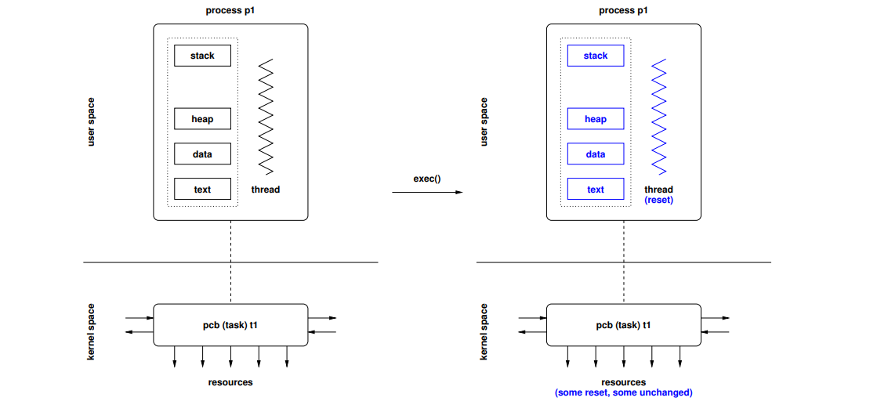

Daria Shutina, CS, $2^{nd}$ year

------


# Operating Systems


[TOC]


## Organization stuff

Dr. Jürgen Schönwälder

Course material: https://cnds.jacobs-university.de/courses/os-2022/


## 22-09-01


`echo $?` -- find out what the last returning code was 


`ltrace` shows parameters of invoked functions and system calls (returning codes)

`strace` is used to monitor interactions between a program and a kernel 


`gcc -static --pedantic -Wall -Wextra -02 hello.c -o a`

adding `static` means copying a file with a library 


## 22-09-06


### User and Kernel spaces

Memory is divided into two distinct areas:

- **user space** -- normal user processes. They have access only to a limited part of memory, and have access to the kernel space only via *system calls*. 

   The kernel manage processes from messing with each other and the machine. 

- **kernel space** -- here the code of the kernel is stored and executed. The kernel processes have access to all memory. 


### System and User modes


***Library call*** -- actions in a program

***System call*** -- actions with a kernel 


***In user mode***, the processor executes instructions of user space processes. The physical memory is usually used. Direct access to hardware is protected. Access to other processes is restricted. 

***In system mode***, the processor executes instructions of a kernel. The physical memory and hardware components are used directly. It is possible to manipulate other processes directly. 


### Concurrency and Parallelism

***Concurrency*** is when an application is <u>making progress</u> on more the one task at the same time. 

***Parallelism*** is when an application is <u>executing several tasks</u> at the same time.


### Operating System Architectures


***Monolithic***: no structure, only mess. All services have the same privilege level. Hard to debug => non-reliable. Time and space efficient. 

***Layered***: each new layer add functionality and asks for "permissions" => time-consuming 

***Modular Kernel***: the kernel is divided to several modules. A simpler version of "Monolithic Architecture"

***Microkernel***: the kernel is separated from other stuff. It helps to save the whole operating system in case of inevitable failures => robust

***Virtualization***: small software layer is running on top of the hardware (virtualizes the hardware). The goal is to run several operating systems concurrently on a single computer. 


### Shell tool 'dmesg'

```c++
sudo dmesg
```

`dmesg` allows to read messages from kernel ring buffer. The command needs administration rights. 


## 22-09-08

```c

int main() {
    int c;
    while ((c = getc(stdin)) != EOF) {
        if (putc(c, stdout) == EOF) {
            error("putc");
        }
    }
}
```


```
int (*f_ptr) (void) = f;
```

Pointer to a function `f`. 


### Shell tool 'time'

```shell
> time ./a < in.txt > out.txt
```

`time` shows real time and time spent on user and system calls. 

`<` is "read from a file `in.txt`".

`>` is "write output into `out.txt`".


### 	Computer architecture


The central processing unit (CPU) is connected to the main memory and other devices using the system bus. The system bus consists of the data bus, an address bus, and a control bus. Data is carried over the data bus to/from the address carried over the address bus. The control bus signals the direction of the data transfer. 


### Locality 

**Spatial Locality :** Spatial Locality means that all those instructions have high chances of execution. They are stored nearby to the recently executed instruction 

**Temporal Locality :** Temporal Locality means that a instruction which is recently executed have high chances of execution again. So the instruction is kept in cache memory. 


### Memory segments 


### Stack frame 


### Shell tool 'objdump'

shows manipulations with the stack 

```shell
gcc main.c -o a
objdump a | less 
```

```shell
....
00000000000011a9 <main>:
    11a9:       f3 0f 1e fa             endbr64
    11ad:       55                      push   %rbp
    11ae:       48 89 e5                mov    %rsp,%rbp
    11b1:       48 83 ec 20             sub    $0x20,%rsp
    11b5:       48 8d 35 4c 0e 00 00    lea    0xe4c(%rip),%rsi        # 2008 <_IO_stdin_used+0x8>
    11bc:       48 8d 3d 4d 0e 00 00    lea    0xe4d(%rip),%rdi        # 2010 <_IO_stdin_used+0x10>
    11c3:       e8 d8 fe ff ff          callq  10a0 <fopen@plt>
....
```

`%rbp` is the beginning and the end of a stack frame. `retq` goes after `%rbp` when a function is done. 

`%rsp` points to the beginning of a stack frame. 


`/main` command helps to find info about `main` function


### Stack smashing attacks

In C/C++ it is a programmer's responsibility to ensure that buffers are never overrun or underrun and that pointers point to valid memory areas. 


## 22-09-13


### Interrupts


An *interrupt vector* is a vector of interrupt pointers 


### Processes

A sequence of machine instructions -- **control flow** -- determines the behavior of the running program and characterizes the process. 

 The **internal state** of the running program defined by the content of the registers of the processors, the stack, the heap, and the data segments.

The **external state** of the process defined by the state of other resources used by the running program (e.g., open files, open network connections, running timers, state of devices).

Processes <u>do not share</u> the memory with other processes. 


`ps aux` shows processes that are currently running on the system. 

`top`  


#### Process states


#### PID 

Each process get a **process id** (pid). Also there is a hash table with pid's in order to find the necessary id faster. 


#### PCB

A **process control block** (PCB) is a <u>data structure</u> used by computer operating systems to store all the information about a process. When a process is created (initialized or installed), the operating system creates a corresponding PCB.


#### Lists for PCBs

PCBs are often organized in doubly-linked lists or tables and can be queued easily and efficiently using pointer operations. 


#### Process creation

Processes and sub-processes are represented in a tree-like structure. A child process is able to obtain its resources directly from the operating system or from the resources of the parent process. 


**fork() system call** create a process by duplicating the parent and resources and then executes independently. 

`fork()` return values: 

- `<0 ` :  error while creating a child process
- `=0`  returns in a child process
- `>0`  returns in a parent process. The returned number is a PID of the child process. 


**exec() system call** runs an executable file and does not create a new process. The machine code, data, heap, and stack of the process are replaced by the new program.


#### Process termination

 `exit()` is used to terminate a process. It is a library call that invokes **_exit() system call**. By first invoking a library call, the program returns control to a library function to carry out cleanup operations before terminating the process. 

Termination returns a numeric status code. 


The **wait() system call** suspends execution until a child terminates (or a signal arrives)


## 22-09-15


### fork(): how it works

`fork()` lives in `<unistd.h>`


1. A new PCB is allocated in the kernel and linked to the other PCBs. 

2. A new unused PID is assigned.

3. The memory image and the status of the parent are cloned and linked to the new PCB. 

4. Most of the resources assigned to the parent are copied to the new PCB, in many cases by cloning resources, but in some cases by sharing resources. 

   For example, data segment is read-only, so it is not copied. 

5. Both processes finally return from the `fork()`. The parent returns the PID of the child, the child returns `0`.


After the fork() has been executed, both processes proceed independently (except for any shared resources they might still have).


There is no exact order between child processes, so we can get race-condition. 


#### Example 

```c
int work(const char *msg) {
	printf("%s ", msg);
    exit(EXIT_SUCCESS);
}

int main(int argc, char* argv[]) {
	int stat, status = EXIT_SUCCESS;
    pid_t pids[argc];
    
    for (int i = 1; i < argc; ++i) {
        pids[i] = fork();
        if (pids[i] < 0) {
            printf("fork() failed for pids[%d]\n", i);
            status = EXIT_FAILURE;
            continue;
        }
        if (pids[i] == 0) {
            work(argv[i]);
        }
    }
    
    for (int i = 1; i < argc; ++i) {
		if (waitpid(pids[i], &stat, 0) == -1) {
            printf("waitpid() failed for pids[%d]\n", i);
            status = EXIT_FAILURE;
        }
    }
    
    return status;
}
```


### exec(): how it works 



The exec() system calls load a new process image. This means that the running program is replaced by another program. All memory segments are loaded from an executable file (text and data) or reset (heap and stack), and the thread of control is reset to start from the entry point.


### Threads

Compared to a process, a thread can share memory with other threads and takes less time to terminate. 

-  individual control flows, typically within a process  (a single process consists of muptiple threads)
- every thread has its own private stack (ex. for function calls)
- multiple threads share the same address space and other resources (fast communication between them)


#### Creation mechanism 

1. new PCB is allocated in the kernel and linked to the other PCBs.
2. A new unused PID is assigned to the new PCB.
3. A new stack segment is added to the memory image of the calling process. 
4. Most of the resources assigned to the parent are shared with the new thread. 
5. The new thread is initialized to start executing at the function provided by the `pthread_create()` call.


Stacks are copied, because sometimes we want threads to run independently. 

All data in the memory image is accessible by all threads. This enables fast data exchange but can lead to race conditions.


#### Basic functions

```c
int pthread_create(pthread_t *thread, pthread_attr_t *attr,
				   void * (*start) (void *), void *arg);

```

`pthread_t *thread` is the parent thread 

`void * (*start) (void *)` is a pointer to a function `start` which gets `void*` and returns `void*`

`void *arg` is a single argument for a function `start`


```c
void pthread_exit(void *retval);
```

`void *retval` is a status of a thread 


```c
int pthread_cancel(pthread_t thread);
int pthread_join(pthread_t thread, void **retvalp);
```

The `pthread_join()` function waits for a thread to terminate, detaches the thread, then returns the thread's exit status.

`void **retvalp` is a status. If it is `NULL`, the threads exit status is not returned.


#### Example

```c
#include <stdlib.h>
#include <stdio.h>
#include <string.h>
#include <pthread.h>

static void* work(void *data)
{
    char *msg = (char *) data;
    (void) printf("%s ", msg);
    return NULL;
}

int main(int argc, char *argv[])
{
    int rc, status = EXIT_SUCCESS;
    pthread_t tids[argc];

    for (int i = 1; i < argc; i++) {
        rc = pthread_create(&tids[i], NULL, work, argv[i]);
        if (rc) {
            fprintf(stderr, "pthread_create() failed: %s\n", strerror(rc));
            status = EXIT_FAILURE;
        }
    }

    for (int i = 1; i < argc; i++) {
        if (tids[i]) {
            rc = pthread_join(tids[i], NULL);
            if (rc) {
                fprintf(stderr, "pthread_join() failed: %s\n", strerror(rc));
                status = EXIT_FAILURE;
            }
        }
    }

    (void) printf("\n");
    if (fflush(stdout) || ferror(stdout)) {
        perror("write failed");
        status = EXIT_FAILURE;
    }
    
    return status;
}
```


### Difference between Process and Thread /todo

https://www.geeksforgeeks.org/difference-between-process-and-thread/#:~:text=Process%20means%20any%20program%20is,a%20segment%20of%20a%20process.


## 22-09-20

### Context switch

A context switch is the process of storing the state of a process or thread, so that it can be restored and resume execution at a later point. 


Making a switch is not productive. You make a context switch when you make a system call or wait for another process.


 

### Processes and Threads in the Linux Kernel

Threads and processes are called tasks. There are 3 different type of tasks:

- idle tasks -- run in the background, managed by the root user (not always). 
- kernel tasks -- run in kernel space. 
- user tasks -- initiated by a user and run in user space. 

Tasks are in one of the states *running*, *interruptible*, *uninterruptible*, *stopped*, *zombie*, or *dead*. A **clone() system call** is used to create processes and threads. 


### Synchronization


#### Race-conditions 

*Race condition* -- a situation where the result produced by concurrent processes accessing and manipulating shared resources depends on the order of the execution of the processes.


#### Bounded-Buffer Problem


The problem is that both a producer and a consumer can write to `count` simultaneously. 


#### Critical-Section Problem

*Critical section* -- a code segment that can only be executed by one process at a time. The execution of critical sections by multiple processes is mutually exclusive (взаимоисключающее). 

Entry and exit sections must protect critical sections.

The critical-section problem is to design a protocol that the processes can use to cooperate. A solution must satisfy the following requirements:

1. Mutual Exclusion: No two processes may be simultaneously inside the same critical section.
2.  Progress: No process outside its critical sections may block other processes.
3. Bounded-Waiting: No process should have to wait forever to enter its critical section


The simplest solution is to **disable interrupts** during critical section, so nothing can interrupt the execution of the critical section. It is problematic on systems with multiple processors or cores and not usable if interrupts are needed in the critical section. 


Another solution is **Strict Alternation**. Two processes share a variable `turn`, which holds the values 0 and 1. It ensures mutual exclusion, but works only if  `turn = 0` is an atomic operation. 


The third solution is **Peterson's algorithm**. Two processes do sth together, then process`i` says "I'm interested to enter a critical section" (`interested[i] = 1`) .

Writing into `interested[i]` is done only by the process `i`.

```c
uncritical_section();
interested[i] = true;
turn = j;
while (interested[j] && turn == j) sleep(1);
criticial_section();
interested[i] = false;
uncritical_section();
```

Peterson’s algorithm satisfies mutual exclusion, progress and bounded-waiting requirements and it can be extended to handle N processes. It is, however, difficult to implement on dynamic systems, where processes can join and leave dynamically.


#### Spin-locks

Spinlocks don't cause preemption but wait in a loop ("spin") till the other core releases the lock. This prevents the thread from losing its [quantum](https://en.wikipedia.org/wiki/Preemption_(computing)#Time_slice) and continue as soon as the lock gets released.


### Shell tool 'xargs'

Reads streams of data from standard input, then generates and executes command lines. If no command is specified, xargs executes echo by default.


`-t` :  show commands that are applied to data input

`-n 2` :  read every 2 args from data input, write them in one line and then add `\n`

`-j 5` :  the max number of processes executed concurrently (5 is in the example). 

  

```shell
echo "hello hello.o" | xargs -n 1 ls -l 
```

$\Leftrightarrow$  `ls -l hello` then `ls -l hello.o`. Those commands will be executed separately bacause of `-n 1`


### Shell tool 'pstree'

shows a tree of processes


## 22-09-22


### Numeric semaphores 

A *semaphore* is a protected integer variable, which can only be manipulated by the atomic operations `up()` and `down()`. It is simply a variable that is shared between threads. 

```c++
down(s) { // V()  or  wait()
    s = s - 1;
    if (s < 0) queue_this_process_and_block();  // critical section has started. if s < 0, the process
}                                               // is waiting for the section to be released

up(s) {  // P()  or  signal()
    s = s + 1;
    if (s <= 0) dequeue_and_wakeup_process();  // critical section is over.if  processes 
}                                              // that were waiting for `s` can be executed
```

Operations are atomic. It can be achieved by using spin-locks. 


```c++
semaphore mutes = 1;
// uncritical section
down(&mutex);
// critical section 
up(&mutex);
// uncritical section
```


***Synchronization problem:***

Semaphores do not guarantee a definite order of process execution, so processes can exit a critical section in a different order. 

***The solution*** is to use a queue where processes that are waiting are added. 


#### Example 1: Bounded-Buffer with Semaphores


`empty` counts empty buffer space. If it is equal to 0, we should wait for consumers to buy an item. 

`full` counts used buffer space. 


What is we change the order of lines 4,5 in `producer`? A dead-lock happens. Let us imagine that we already have `N` producers and another producer `C` came. `mutex` is locked,  the buffer is full, so `C` is waiting for a mutex to be released. 

When a consumer comes, he see that the mutex is locked, so he starts waiting, too. Thus, we got a dead-lock. 


#### Example 2: Readers / Writers with Semaphores


When the first reader comes (`++readcount == 1`), the writer cannot modify a text, so `down(&writer)` is invoked in the line 4 in the `reader()` function.

There is a risk of getting starvation of writers ( when a process ready for a CPU can wait to run indefinitely because of low priority).


#### Example 3: Dining philosophies

Philosophers are sitting on a round table and either think or eat. A philosopher does not keep forks while thinking and needs 2 forks to eat. A philosopher picks up only one fork at a time. 


We can get a dead-lock if all philosophers get the right fork. 


The solution is use semaphores and check whether both left and right forks are free. In this case take forks and eat, otherwise do not take a fork. 


### Binary semaphores 

Only take the values 0 and 1.

```c
shared int c;
binary_semaphore mutex = 1, wait = 0, barrier = 1;

void down() {
    down(&barrier); 
    down(&mutex);
    c = c - 1; 
    if (c < 0) { 
        up(&mutex); 
        down(&wait); 
    } else 
    	up(&mutex);
    up(&barrier);
}

void up() {
    down(&mutex);
     c = c + 1;
     if (c <= 0) 
         up(&wait);
     up(&mutex);
}
```


### Synchronization in C

```c
#include <pthread.h>

typedef ... pthread_mutex_t;
typedef ... pthread_mutexattr_t;

int pthread_mutex_init(pthread_mutex_t *mutex, pthread_mutexattr_t *mutexattr);
int pthread_mutex_destroy(pthread_mutex_t *mutex);
int pthread_mutex_lock(pthread_mutex_t *mutex);
int pthread_mutex_trylock(pthread_mutex_t *mutex);
int pthread_mutex_timedlock(pthread_mutex_t *mutex, struct timespec *abstime);
int pthread_mutex_unlock(pthread_mutex_t *mutex);
```

`pthread_mutexattr_t` is used for a mutex attributes object. 

Дальше автор уснул


## 22-10-04


### Semaphore Pattern


#### Multiplex

A section may be executed concurrently with a certain fixed limit of N concurrent threads. 

```c
semaphore_t s = N;

thread() {
    /* do something */
    down(&s);
    /* multiplex section */
    up(&s);
    /* do something */
}
```


```c
typedef struct {
	unsigned counter;
	unsigned max;
	mutex_t mutex;
} counter_t;

void init(counter_t *c, unsigned max) {
	c->counter = 0;
	c->max = max;
	c->mutex = unlocked;
}
```


```c
void work(counter_t* c) {
	lock(mutex);
	c->counter++;
	while(c->counter > c->max) {
		wait(c->condvar, c->mutex);
	}
    unlock(c->mutex);
    // do smth 
    lock(c->mutex);   // critical section starts 
    c->counter--;
    signal(c->condvar);
    unlock(c->mutex);
}
```

`counter` is increased before `while`, there is a possibility to get an infinite loop. 

The correct solution: 

```c
void work(counter_t* c) {
	lock(mutex);
	while(c->counter >= c->max) {
		wait(c->condvar, c->mutex);
	}
	c->counter++;
    unlock(c->mutex);
    // do smth 
    lock(c->mutex);   // critical section starts 
    c->counter--;
    signal(c->condvar);
    unlock(c->mutex);
}
```


#### Signaling

A thread waits until some other thread signals a certain condition.


```c
waiting_thread() { 
	/* do something */ 
	down(&s); 
	/* do something */
} 

signaling_thread() {
	/* do something */
	up(&s);
	/* do something */
}
```


The sequence can be 

```c
down(&s); // thread 1
up(&s);   // thread 2
```

Thread 1 waits till `s` will be freed by Thread 2.


Another option is 

```c
up(&s);    // thread 1
down(&s);  // thread 2
```

Threads are executed independently. 


```c
typedef struct {
	int flag;
    condvar_t condvar;
    mutex_t mutex;
} counter_t;

void init(counter_t* c) {
	c->flag = false;
	c->mutex = unlocked;
}

void waiting_thread(counter_t* c) {
	lock(c->mutex);
	while (!c->flag) {
		wait(c->condvar, c->mutex);
	}
	unlock(c->mutex);
}

void signaling_thread(counter_t* c) {
	lock(c->mutex);
	c->flag = true;
	signal(condvar);
	unlock(c->mutex);
}
```

We cannot get rid of `flag`, otherwise we can get an infinite waiting. 


#### Rendezvous

Two threads wait until they both have reached a certain state (the rendezvous point) and afterwards they proceed independently again. 

This can be seen as using the signaling pattern twice.

```c
semaphore_t s1 = 0, s2 = 0;

thread_A() {
    /* do something */ 
    up(&s2); 
    down(&s1); 
    /* do something */
}

thread_B() {
	/* do something */
	up(&s1);
	down(&s2);
	/* do something */
}
```


#### Simple barrier

Generalization of the rendezvous pattern to N threads. A barrier requires that all threads reach the barrier before they can proceed. 

```c
shared int count = 0;
semaphore_t mutex = 1, turnstile = 0;

void thread() {
    /* do something */
    down(&mutex);
    count++;
    if (count == N) {
        for (int j = 0; j < N; j++) {
        up(&turnstile); /* let N threads pass through the turnstile */
        }
        count = 0;
    }
    up(&mutex);
    down(&turnstile); /* block until opened by the Nth thread */
    /* do something */
}
```


```c
typedef struct {
    int counter;
    mutex_t mutex;
    condvar_t condvar;
} barrier_t;

void init(barrier_t b, unsigned max) {
	b->counter = 0;
	b->max = max;
	b->mutex = unlocked;
}

void wait(barrier_t b) {
	lock(b->mutex);
    b->counter++;
    
    if (b->counter == b->max) {
        broadcast(b->condvar, b->mutex);
        b->counter = 0;
    } 
    else {
        while (b->counter != b->max) {
            wait(b->condvar, b->mutex);
        }
    }
    
	unlock(b->mutex);
}
```


## 22-10-06

### Deadlock conditions 

- Mutual exclusion: 

  Resources cannot be used simultaneously by several processes 

- Hold and wait: 

  Processes apply for a resource while holding another resource 

- No preemption: 

  Resources cannot be preempted, only the process itself can release resources 

- Circular wait:

  A circular list of processes exists where every process waits for the release of a resource held by the next process


### Resource-Allocation Graph \todo

A resource-allocation graph is a directed graph RAG = (V, E). 

$V = \{ \ R, T, P \ \}$, where $R$ is for resources, $T$ is for Types and $P$ is for processes. 

Edge $R_i \rightarrow P_j \ \in E_a$ -- resource $R_i$ is assigned to a process $P_j$.

Edge $P_i \rightarrow T_j \ \in E_r$ -- a process $P_i$ requesting a resource of type $T_j$.

Edge $P_i \rightarrow T_j \ \in E_c$ -- a process $P_i$ will request a resource of type $T_j$.


#### Example


$T_1 \rightarrow P_2$ means a resource of type $T_1$ is allocated to a process $P_1$. 

$P_3 \rightarrow T_2$ means a process $P_3$ is waiting for a resource of type $T_2$. 


There is a cycle $T_2 \rightarrow P_1 \rightarrow P_2 \rightarrow P_3$ $\Rightarrow$ there is a deadlock. 


### RAG Properties

- A cycle in the RAG is a necessary condition for a deadlock
-  If each resource type has exactly one instance, then a cycle is also a sufficient condition for a deadlock
- If resource types have multiple instances, then a cycle is not a sufficient condition for a deadlock


### Deadlock Strategies

#### Prevention

The system is designed such that deadlocks can never occur 


#### Avoidance 

The system assigns resources so that deadlocks are avoided 

A resource allocation state is *safe* if the system can allocate resources to each process and still avoid a deadlock. A resource allocation state is *unsafe* if the system cannot prevent processes from requesting resources such that a deadlock can occur. 

if the process is not able to get all resources it need, then the system rejects the process. 

##### 

$M$ is for a global maximum of resources for a definite process.

$N$ is for an amount of resources needed currently. 


##### Example 1: The Banker’s algorithm


Lets consider a system that has $m = 4$ different resource types and the total number of resource instances of each resource type is given by $t = (6, 8, 10, 12)$ (6 resources of type $T_1$, etc).

 We have $n = 5$ running processes. For every process, the maximum resource requests are given by the matrix $M$:
$$
M = \begin{bmatrix}
3 & 1 & 2 & 5 \\
3 & 2 & 5 & 7 \\
2 & 6 & 3 & 1 \\
5 & 4 & 9 & 2 \\
1 & 3 & 8 & 9
\end{bmatrix}
$$


Assume that allocation of resources can be described by a matrix $A$:
$$
A = \begin{bmatrix}
0 & 0 & 2 & 1 \\
1 & 0 & 1 & 2 \\
1 & 2 & 1 & 1 \\
3 & 4 & 0 & 0 \\
0 & 0 & 4 & 2 
\end{bmatrix}
$$


The amount of remained resources of diff types is equal to $a = (1, 2, 2, 6)$  ($a(1) = t(1) - \texttt{sum}(A_{1 \times 5}) = 1$, etc)

 

The amount of resources that are needed for every process is a matrix $N$:
$$
N = M - A =
\begin{bmatrix}
3 & 1 & 2 & 5 \\
3 & 2 & 5 & 7 \\
2 & 6 & 3 & 1 \\
5 & 4 & 9 & 2 \\
1 & 3 & 8 & 9
\end{bmatrix}
-
\begin{bmatrix}
0 & 0 & 2 & 1 \\
1 & 0 & 1 & 2 \\
1 & 2 & 1 & 1 \\
3 & 4 & 0 & 0 \\
0 & 0 & 4 & 2 
\end{bmatrix}
=
\begin{bmatrix}
3 & 1 & 0 & 4 \\
2 & 2 & 4 & 5 \\
1 & 4 & 2 & 0 \\
2 & 0 & 9 & 2 \\
1 & 3 & 4 & 7
\end{bmatrix}
$$
Because of $a$, there is no process that can be executed.


#### Detection and recovery 

The system detects deadlocks and recovers itself 


Idea:

- Assign resources without checking for unsafe states
- Periodically run an algorithm to detect deadlocks
- Once a deadlock has been detected, use an algorithm to recover from the deadlock
- Preempt resources until the deadlock cycle is broken


#### Ignorance

The system does not care about deadlocks and the user has to take corrective actions


## 22-10-11

### Wait-For Graph

A directed graph $(V, E)$. 

$P_i \in V$  stands for a process, $e = (P_i, P_j) \in E$ means process $i$ is waiting for a process $j$. 


A cycle in a wait-for graph indicates a deadlock.


### Sheduling 

A *scheduler* (or a scheduling discipline) is an algorithm that distributes resources to parties, which simultaneously and asynchronously request them. In other words, it decides which processes or threads are receiving resources in order to continue computations.

A *CPU scheduler* is a scheduler, which distributes CPU resources to processes (or threads) that are ready to execute. In comparison with CPU scheduler, the ordinary scheduler manages I/O devices needs, networck communication 


#### Types of a scheduler

- **Preemptive** -- able to  interrupt a running process or thread and assign the resources (e.g., CPU time) to another process. Hard to design. 
- **Non-preemptive** -- waits for the process or thread to yield resources once they have been assigned to the process or thread. Cannot guarantee fairness. 
- **Deterministic** -- knows the resource requests of the processes and threads and optimizes the resource assignment. Easy to analyze. 
- **Probabilistic** -- describes process and thread behavior using certain probability distributions and optimizes the overall system behavior based on these probabilistic assumptions. Must be analyzed using stochastic models (queuing models)


#### Metrics of a Schedule

Notation:


##### 1. A precedence graph

A deterministic schedule $S$ for processes $P_1, ..., P_n$, tasks $T_1, ..., T_m$ with execution times $c_1,..., c_m$. 

A precedence graph $G = (T, E)$ is a directed acyclic graph which defines dependencies between tasks. An edge $T_i \rightarrow T_j$ means task $i$ should end before $T_j$ starts. 


##### 2. Grantt diagrams \todo


For the left schedue: 

$\left . \begin{array}{} L = 6 \\ \overline{t} = \frac{1}{6} () \end{array} \right .$


## 22-10-13 

### Scheduling strategies

#### 1. FCFS  --  First-Come, First-Served 

Processors are assigned to processes on a first come first served basis

Easy to implement, but waiting time can be large. 


#### 2. LPTF  --  Longest Processing Time First

Processes with the longest execution time are first executed. Shorter processes are kept to fill “gaps” later. 

$L_L$ -- length of a LPTF schedule, $L_O$ -- length of an optimal scheduling

$L_L \leqslant (\frac{4}{3} - \frac{1}{3m}) \cdot L_O$


#### 3. SPTF  --  Shortest Processing Time First

Also known as Shortst Job First (SJF).

processes with the shortest execution time are first executed. 


#### 4. RR  --  Round Robin


## 22-10-18

### Strong and Weak Symbols

 Functions and initialized global variables are ***strong symbols***. Uninitialized global variables are ***weak symbols***.

Linker does not know types of variables. So there is no type safe linking in C.


**Link rules:**

- Multiple strong symbols with the same name are not allowed
- Given a strong symbol and multiple weak symbols with the same name, choose the strong symbol
- If there are multiple weak symbols with the same name, pick an arbitrary one


```c
int foo = 24;    /* strong */
int foo = 42;    /* error: already have a strong `foo` */
int foo, bar;    /* weak */
double foo, bar; /* weak */
/* type for `bar` is chosen randomly */
```


### Static libraries

A library is an *achieve* -- a single file with an index which consists of related relocatable object files. 

Linking of static libraries duplicates the object code.


The archive format allows to update a part of a code instead of recompiling the whole project:

```shell
ar -rs libfoo.a foo.o bar.o
```


### Shared libraries

Dynamic linking is used. Linking itself happens when an executable is loaded into memory. 

Benefits:

- Smaller executables since code is not copied
- Shared libraries can be updated without relinking all executables
-  Programs can load additional object code dynamically at runtime


## 22-10-19

### Main Memory

 Memory management and CPU scheduling can become most effective if they work hand in hand.

Memory management of an operating system

-  allocates and releases memory regions
-  decides which process is loaded into main memory
- controls and supervises main memory usage


#### UMA and NUMA models 

In *UMA models* all CPUs have access to the entire memory in the same way. This leads  to a high degree of contention on the memory system.

In *NUMA models*  every CPU can access only a part of the memory directly . It has to interact with some other CPU to access other memory. 


#### Logical vs. physical addresses 

*Logical* addresses are generated by CPU while a program is running. They do not physically exist and are used by CPUs as a reference to access the actual physical memory location. 

*Physical* addresses identify the physical location of a data element in memory. 


#### Translation of Memory Addresses

Most of the advanced computing systems have a *memory management unit* that maps logical address spaces into a physical address space and that provides some level of memory protection. 

Modern systems often randomize memory space mappings which makes it more difficult to hack program. 


#### Memory Partitioning \todo


#### Swapping priciple \todo


### Internal/external fragmentation

Internal fragmentation is a hole in a segment which size is not enough to take another process. 

External fragmentation is a hole which size is enough to take a new process. 


### Segmentation

Main memory is partitioned by the operating system into memory segments of variable length. 

Segments may be shared between processes, may grow or shrink; different segments can have different access rights. 


#### Example: executing 6 processes 


#### Positioning Strategies 

1. Best-fit: 

   Allocate the smallest hole that is big enough. There will be many small holes. 

2. Worst-fit: 

   Allocate the largest hole. 

3. First-fit:  

   Allocate the first hole from the top that is big enough.  Simple and relatively efficient due to limited search.

4. Next-fit:

   Allocate the next big enough hole from where the previous next fit search ended. 


#### Buddy systems

Segments and holes always have a size of $2^i$ bytes. Holes are maintained in $k$ lists such that the holes of size $2^i$ are in a list $i$. 

Two holes in list $i$ can be efficiently merged into a hole of size $2^{i+1}$ add added to a list $i+1$.

A hole in list $i$ can be efficiently split into two holes of size $2^{i-1}$ and added to a list $i-1$. 


Memory can be represented as a binary tree where $1024$ is the root, $512$ and $512$ are children, etc. Merging two holes 


## Paging

source: [GeeksForGeeks](https://www.geeksforgeeks.org/paging-in-operating-system/)


Paging is a memory management scheme that eliminates the need for contiguous allocation of physical memory. 

There are:

- logical addresses (generated by CPU)
- logical address space (if logical address's size = k, then logical address space's size = $2^k$)
- physical addresses (actual addresses in the physical memory)
- physical address space (the size is counted in the same way)


The mapping from virtual to physical addresses is done by the memory management unit (MMU) which is a hardware device and this mapping is known as paging.

The Physical Address Space is conceptually divided into a number of fixed-size blocks, called **frames**. The Logical address Space is also splitted into fixed-size blocks, called **pages**.

`Page Size = Frame Size`


### Address structure

Logical address is divided into

- **Page number (p):** Number of bits required to represent the page in Logical Address Space.
- **Page offset (d):** Number of bits required to represent particular word in a page. Equal to `<logical address size> - p`. 


Physical address is divided into :

- **Frame number (f):** Number of bits required to represent the frame of Physical Address Space.
- **Frame offset (d):** Number of bits required to represent particular word in a frame. Equal to `<physical address size> - f`. 


## 22-11-01

### Signals

Basic signals are a part of the standard C library:

- runtime exceptions
- created by external events
- explicitly created by the program


POSIX signals are more powerful and make code more portable:

- send signals between processes
- blocking signals 
- control of handling behavior 


#### C library signals \todo

```c
#include <signal.h>

typedef ... sig_atomic_t;
typedef void (*sighandler_t)(int);

sighandler_t signal(int signum, sighandler_t handler);
int raise(int signum);

#define SIGABRT ... /* abnormal termination */
#define SIGFPE ... /* floating-point exception */
#define SIGILL ... /* illegal instruction */
#define SIGINT ... /* interactive interrupt */
#define SIGSEGV ... /* segmentation violation */
#define SIGTERM ... /* termination request */
#define SIG_IGN ... /* handler to ignore the signal */
#define SIG_DFL ... /* default handler for the signal */
#define SIG_ERR ... /* handler returned on error situations */
```

A function `signal`  installs a new signal `signum` and returns the old signal.  The `signum` argument is given to a function `handler`. 


##### Example

```c
#include <stdlib.h>
#include <stdio.h>
#include <signal.h>
#include <unistd.h>
#include <errno.h>

static void sig_handler(int);

static void sig_install(void)
{
    if (signal(SIGINT, sig_handler) == SIG_ERR) {
	perror("signal");
	exit(EXIT_FAILURE);
    }
}

static void sig_handler(int signum)
{
    if (signum == SIGINT) {
        fprintf(stderr, "catc: sig_handler: Interrupt\n");
        sig_install();
    } else {
        fprintf(stderr, "catc: sig_handler: %d\n", signum);
    }
}

int main(void)
{
    char c;

    sig_install();
    while (! feof(stdin)) {
        while ((c = getc(stdin)) != EOF) {
            (void) putc(c, stdout);
        }
        if (ferror(stdin)) {
            if (errno == EINTR) {
                clearerr(stdin);
                continue;
            }
            break;
        }
    }
    if (ferror(stdin) || fflush(stdout) == EOF) {
        return EXIT_FAILURE;
    }
    return EXIT_SUCCESS;
}
```


#### POSIX signals

##### Signal delivery


Zombie processes -- processes that have completed their execution, but their entries are not removed from the process table.

Child processes deliver a `SIGCHLD ` signal to their parent process upon termination (but also when they are stopped or resumed). By default, the `SIGCHLD ` signal is ignored. The parent process picks up status codes from children via `wait()` system calls, otherwise terminated child processes turn into zombie processes

If a parent process explicitly sets the action of the `SIGCHLD ` to `SIG_IGN`, then child processes do not turn into zombie processes when they terminate. This is a subtle difference between the default behavior and explicitly requesting the default behavior.


##### Properties

1. Implementations can merge multiple identical signals
2. Signals do not carry any data / information except the signal number
3. Variables modified by signals should be signal atomic
4. `fork()` inherits signal functions
5. `exec()` resets signal functions (for security reasons and because the process gets a new memory image)


##### Example

```c
#include <signal.h>

typedef void (*sighandler_t)(int);
typedef ... sigset_t;
typedef ... siginfo_t;

#define SIG_DFL ...       /* default handler for the signal */
#define SIG_IGN ...       /* handler to ignore the signal */
#define SA_NOCLDSTOP ...  /* do not create SIGCHLD signals when a child is stopped */
#define SA_NOCLDWAIT ...  /* do not create SIGCHLD signals when a child terminates */
#define SA_ONSTACK ...    /* use an alternative stack */
#define SA_RESTART ...    /* restart interrupted system calls */

struct sigaction {
sighandler_t sa_handler;  /* handler function */
void (*sa_sigaction)(int, siginfo_t *, void *); /* handler function */
sigset_t sa_mask;        /* signals to block while executing handler */
int sa_flags;            /* flags to control behavior */
};

```


### File descriptors, open files

In Linux and Unix-like systems, almost all resources are stored in files. 

A **file descriptor** is a unique number for a file or other input/output resources (pipes, sockets). 

There are 3 standard file descriptors:

- `0` == `stdin`

- `1` == `stdout`

- `2` == `stderror` 


Every process has its own **file descriptor table** --  an array of file descriptors.


## 22-11-17

### Files on linux

Files are persistent containers for the storage of data.

Unix/Linux systems represent devices in the `/dev` file system. The `/dev` file system is a special file system exporting device information as it is known by the kernel. 

The `/proc` file system is commonly used to expose information that the kernel maintains about running processes.


### Directories

File system is represented as a tree. Files are leaves, directories are nodes. Name of leaves and nodes have to be unique. Absolute names are formed by concatenating directory and file names. 

Applications tend to interact with the file system a lot and hence file systems have to be fast. To achieve fast access to frequently used data, file systems often use data caches residing in main memory. 

On some file systems, files that were accidentally lost may be recovered. They may be located in special directories (e.g.  `lost+found` directory).


### Mounting

Mounting is the process by which an operating systems makes files and directories. It allows to build logical file system name spaces that span multiple devices. 

A mount point is a location in the [partition](https://en.wikipedia.org/wiki/Disk_partitioning) used as a root filesystem. When the mounting process is completed, the user can access files and directories on [the medium](https://en.wiktionary.org/wiki/storage_medium) from there. 

Unmounting is a process in which the operating systems cuts off all user access to files and directories on the mount point; writes remaining data to the storage device; refreshes [filesystem metadata](https://www.sciencedirect.com/topics/computer-science/file-system-metadata#:~:text=File%20system%20metadata%20includes%20the,in%20detail%20in%20Chapter%2030.) and and remove access to the device (thus making the storage device safe for removal). 


### File links 

A **hard link** is a directory entry that associates a name with a file system object. The association is established when the link is created and fixed afterwards.

A **soft link** or **symbolic link** is a directory entry storing a reference to a file system object in the form of an absolute or relative path. The reference is resolved at runtime.

Links make file system object accessible under several different names. A file system object is accessible as long as there is at least one hard link to it. File systems maintain an internal link count in order to keep track of how many hard links refer to a file system object. 

`rm` command deletes not a file but a link.  When no links point to a file, it is overwritten by the filesystem. You still can find it via a magic id (index of a file, command `ls -ila`). The file cannot be overwritten while it is used by another process (`rm` does not work). 

```shell
$ touch a.txt      # file `b.txt` is not created yet 
$ ln a.txt b.txt   # links `a.txt` to `b.txt`
$ ls -ali
total 8
4071905 drwxrwxr-x 2 deshyt deshyt 4096 ноя 17 16:47 .
3670035 drwxr-xr-x 5 deshyt deshyt 4096 ноя 17 16:30 ..
4071938 -rw-rw-r-- 2 deshyt deshyt    0 ноя 17 16:47 a.txt
4071938 -rw-rw-r-- 2 deshyt deshyt    0 ноя 17 16:47 b.txt
```


In `/etc/alternatives` links between shell commands and `bin` files are stored. 

```shell
$ update-alternatives --query c++  # shows the current link for `c++`
Name: c++
Link: /usr/bin/c++
Slaves:
 c++.1.gz /usr/share/man/man1/c++.1.gz
Status: auto
Best: /usr/bin/g++
Value: /usr/bin/g++

Alternative: /usr/bin/g++
Priority: 20
$ update-alternatives --remove c++ /usr/bin/aboba  # change the link
```


### Processes and Files 


The relationship of file descriptor tables and the open file table:

- Every process has its own file descriptor table.
- File descriptors can be copied (duplicated).
- File descriptors can refer to open files and other objects supporting I/O (pipes, sockets).
- When a new process is created, the parent’s file descriptor table is copied.
- Entries in the open file table keep track of the current position in the file and the file access mode. 
- It is possible to open a file several times with different access modes or to maintain different positions in the file.
- Entries in the open file table may be shared among processes.


