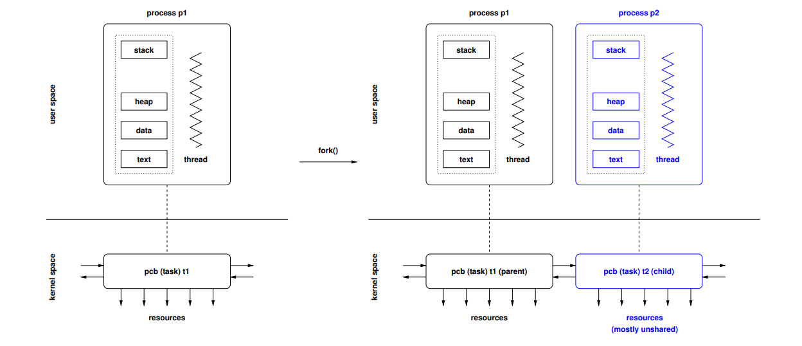
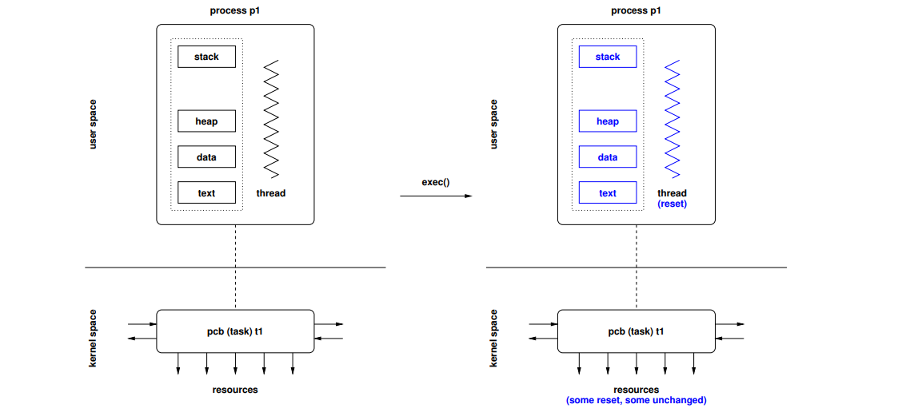
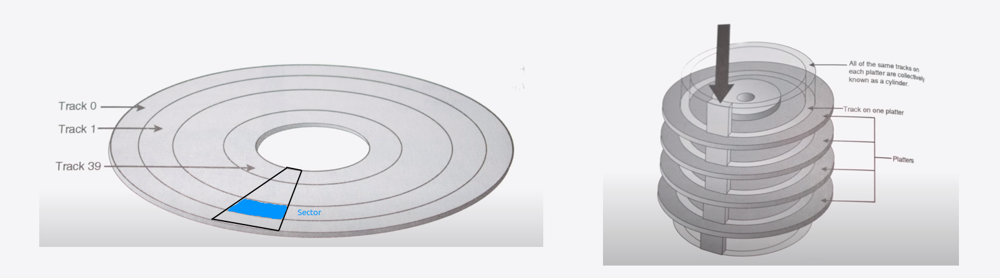

# Operating Systems

*Author: Daria Shutina*


[TOC]


## Organization stuff

Dr. Jürgen Schönwälder

Course material: https://cnds.jacobs-university.de/courses/os-2022/


## 22-09-01


`echo $?` -- find out what the last returning code was 


`ltrace` shows parameters of invoked functions and system calls (returning codes)

`strace` is used to monitor interactions between a program and a kernel 


`gcc -static --pedantic -Wall -Wextra -02 hello.c -o a`

adding `static` means copying a file with a library 


## 22-09-06


### User and Kernel spaces

Memory is divided into two distinct areas:

- **user space** -- normal user processes. They have access only to a limited part of memory, and have access to the kernel space only via *system calls*. 

   The kernel manage processes from messing with each other and the machine. 

- **kernel space** -- here the code of the kernel is stored and executed. The kernel processes have access to all memory. 


### System and User modes


***Library call*** -- actions in a program (allocating memory, `sleep()` and `assert() `functions). Library calls may return non-zero codes to indicate that an error occurred.

***System call*** -- actions with a kernel (open/close/read from/write to a file, `pause()` function). System calls often return `-1` to indicate that an error occurred.


***In user mode***, the processor executes instructions of user space processes. The physical memory is usually used. Direct access to hardware is protected. Access to other processes is restricted. 

***In system mode***, the processor executes instructions of a kernel. The physical memory and hardware components are used directly. It is possible to manipulate other processes directly. 


### Concurrency and Parallelism

***Concurrency*** is when an application is <u>making progress</u> on more the one task at the same time. 

***Parallelism*** is when an application is <u>executing several tasks</u> at the same time.


### Operating System Architectures


***Monolithic***: no structure, only mess. All services have the same privilege level. Hard to debug => non-reliable. Time and space efficient. 

***Layered***: each new layer add functionality and asks for "permissions" => time-consuming 

***Modular Kernel***: the kernel is divided to several modules. A simpler version of "Monolithic Architecture"

***Microkernel***: the kernel is separated from other stuff. It helps to save the whole operating system in case of inevitable failures => robust

***Virtualization***: small software layer is running on top of the hardware (virtualizes the hardware). The goal is to run several operating systems concurrently on a single computer. 


### Shell tool 'dmesg'

```c++
sudo dmesg
```

`dmesg` allows to read messages from kernel ring buffer. The command needs administration rights. 


## 22-09-08

```c

int main() {
    int c;
    while ((c = getc(stdin)) != EOF) {
        if (putc(c, stdout) == EOF) {
            error("putc");
        }
    }
}
```


```
int (*f_ptr) (void) = f;
```

Pointer to a function `f`. 


### Shell tool 'time'

```shell
> time ./a < in.txt > out.txt
```

`time` shows real time and time spent on user and system calls. 

`<` is "read from a file `in.txt`".

`>` is "write output into `out.txt`".


### 	Computer architecture


The central processing unit (CPU) is connected to the main memory and other devices using the system bus. The system bus consists of the data bus, an address bus, and a control bus. Data is carried over the data bus to/from the address carried over the address bus. The control bus signals the direction of the data transfer. 


### Locality 

**Spatial Locality :** Spatial Locality means that all those instructions have high chances of execution. They are stored nearby to the recently executed instruction 

**Temporal Locality :** Temporal Locality means that a instruction which is recently executed have high chances of execution again. So the instruction is kept in cache memory. 


### Memory segments 


### Stack frame 


### Shell tool 'objdump'

shows manipulations with the stack 

```shell
gcc main.c -o a
objdump a | less 
```

```shell
....
00000000000011a9 <main>:
    11a9:       f3 0f 1e fa             endbr64
    11ad:       55                      push   %rbp
    11ae:       48 89 e5                mov    %rsp,%rbp
    11b1:       48 83 ec 20             sub    $0x20,%rsp
    11b5:       48 8d 35 4c 0e 00 00    lea    0xe4c(%rip),%rsi        # 2008 <_IO_stdin_used+0x8>
    11bc:       48 8d 3d 4d 0e 00 00    lea    0xe4d(%rip),%rdi        # 2010 <_IO_stdin_used+0x10>
    11c3:       e8 d8 fe ff ff          callq  10a0 <fopen@plt>
....
```

`%rbp` is the beginning and the end of a stack frame. `retq` goes after `%rbp` when a function is done. 

`%rsp` points to the beginning of a stack frame. 


`/main` command helps to find info about `main` function


### Stack smashing attacks

In C/C++ it is a programmer's responsibility to ensure that buffers are never overrun or underrun and that pointers point to valid memory areas. 


## 22-09-13


### Interrupts


An *interrupt vector* is a vector of interrupt pointers 

A software interrupt generated by a terminal program on user request is asynchronous to a running process. The kernel handles asynchronous interrupts that may not be visible by any running processes.


### Processes

A sequence of machine instructions -- **control flow** -- determines the behavior of the running program and characterizes the process. 

 The **internal state** of the running program defined by the content of the registers of the processors, the stack, the heap, and the data segments.

The **external state** of the process defined by the state of other resources used by the running program (e.g., open files, open network connections, running timers, state of devices).

Processes <u>do not share</u> the memory with other processes. 


`ps aux` shows processes that are currently running on the system. 

`top`  


#### Process states


#### PID 

Each process get a **process id** (pid). Also there is a hash table with pid's in order to find the necessary id faster. 


#### PCB

A **process control block** (PCB) is a <u>data structure</u> used by computer operating systems to store all the information about a process. When a process is created (initialized or installed), the operating system creates a corresponding PCB.


#### Lists for PCBs

PCBs are often organized in doubly-linked lists or tables and can be queued easily and efficiently using pointer operations. 


#### Process creation

Processes and sub-processes are represented in a tree-like structure. A child process is able to obtain its resources directly from the operating system or from the resources of the parent process. 


**fork() system call** create a process by duplicating the parent and resources and then executes independently. 

`fork()` return values: 

- `<0 ` :  error while creating a child process
- `=0`  returns in a child process
- `>0`  returns in a parent process. The returned number is a PID of the child process. 


**exec() system call** is used to execute a new file <u>without creating a new process</u>.

When exec is called, the entire content of the process is replaced with a new program. The new program is loaded into the same process space, the process's `PID` is not changed (we do not create a new process), but the data, code, stack, heap, etc. of the process are replaced with those of newly loaded process. The new process is executed from the entry point.

If the currently running process contains more than one thread then all the threads will be terminated and the new process image will be loaded and then executed. There are no destructor functions that terminate threads of current process.


**wait() system call** suspends execution until a child terminates (or a signal arrives)


#### Process termination

 `exit()` is used to terminate a process. It is a library call that invokes **_exit() system call**. By first invoking a library call, the program returns control to a library function to carry out cleanup operations before terminating the process. 

Termination returns a numeric status code.


## 22-09-15


### fork(): how it works

`fork()` lives in `<unistd.h>`



1. A new PCB is allocated in the kernel and linked to the other PCBs. 

2. A new unused PID is assigned.

3. The memory image and the status of the parent are cloned and linked to the new PCB. 

4. Most of the resources assigned to the parent are copied to the new PCB, in many cases by cloning resources, but in some cases by sharing resources. 

   For example, data segment is read-only, so it is not copied. 

5. Both processes finally return from the `fork()`. The parent returns the PID of the child, the child returns `0`.


After the fork() has been executed, both processes proceed independently (except for any shared resources they might still have).


There is no exact order between child processes, so we can get race-condition. 


#### Example 

```c
int work(const char *msg) {
	printf("%s ", msg);
    exit(EXIT_SUCCESS);
}

int main(int argc, char* argv[]) {
	int stat, status = EXIT_SUCCESS;
    pid_t pids[argc];
    
    for (int i = 1; i < argc; ++i) {
        pids[i] = fork();
        if (pids[i] < 0) {
            printf("fork() failed for pids[%d]\n", i);
            status = EXIT_FAILURE;
            continue;
        }
        if (pids[i] == 0) {
            work(argv[i]);
        }
    }
    
    for (int i = 1; i < argc; ++i) {
		if (waitpid(pids[i], &stat, 0) == -1) {
            printf("waitpid() failed for pids[%d]\n", i);
            status = EXIT_FAILURE;
        }
    }
    
    return status;
}
```


### exec(): how it works 



The exec() system calls load a new process image. This means that the running program is replaced by another program. All memory segments are loaded from an executable file (text and data) or reset (heap and stack), and the thread of control is reset to start from the entry point.


### Threads

Compared to a process, a thread can share memory with other threads and takes less time to terminate. 

-  individual control flows, typically within a process  (a single process consists of muptiple threads)
- every thread has its own private stack (ex. for function calls)
- multiple threads share the same address space and other resources (fast communication between them)


#### Creation mechanism 

1. new PCB is allocated in the kernel and linked to the other PCBs.
2. A new unused PID is assigned to the new PCB.
3. A new stack segment is added to the memory image of the calling process. 
4. Most of the resources assigned to the parent are shared with the new thread. 
5. The new thread is initialized to start executing at the function provided by the `pthread_create()` call.


Stacks are copied, because sometimes we want threads to run independently. 

All data in the memory image is accessible by all threads. This enables fast data exchange but can lead to race conditions.


#### Basic functions

```c
int pthread_create(pthread_t *thread, pthread_attr_t *attr,
				   void * (*start) (void *), void *arg);

```

`pthread_t *thread` is the parent thread 

`void * (*start) (void *)` is a pointer to a function `start` which gets `void*` and returns `void*`

`void *arg` is a single argument for a function `start`


```c
void pthread_exit(void *retval);
```

`void *retval` is a status of a thread 


```c
int pthread_cancel(pthread_t thread);
int pthread_join(pthread_t thread, void **retvalp);
```

The `pthread_join()` function waits for a thread to terminate, detaches the thread, then returns the thread's exit status.

`void **retvalp` is a status. If it is `NULL`, the threads exit status is not returned.


#### Example

```c
#include <stdlib.h>
#include <stdio.h>
#include <string.h>
#include <pthread.h>

static void* work(void *data)
{
    char *msg = (char *) data;
    (void) printf("%s ", msg);
    return NULL;
}

int main(int argc, char *argv[])
{
    int rc, status = EXIT_SUCCESS;
    pthread_t tids[argc];

    for (int i = 1; i < argc; i++) {
        rc = pthread_create(&tids[i], NULL, work, argv[i]);
        if (rc) {
            fprintf(stderr, "pthread_create() failed: %s\n", strerror(rc));
            status = EXIT_FAILURE;
        }
    }

    for (int i = 1; i < argc; i++) {
        if (tids[i]) {
            rc = pthread_join(tids[i], NULL);
            if (rc) {
                fprintf(stderr, "pthread_join() failed: %s\n", strerror(rc));
                status = EXIT_FAILURE;
            }
        }
    }

    (void) printf("\n");
    if (fflush(stdout) || ferror(stdout)) {
        perror("write failed");
        status = EXIT_FAILURE;
    }
    
    return status;
}
```


### Difference between Process and Thread /todo

https://www.geeksforgeeks.org/difference-between-process-and-thread/#:~:text=Process%20means%20any%20program%20is,a%20segment%20of%20a%20process.


## 22-09-20

### Context switch

A context switch is the process of storing the state of a process or thread, so that it can be restored and resume execution at a later point. 


Making a switch is not productive. You make a context switch when you make a system call or wait for another process.


 

### Processes and Threads in the Linux Kernel

Threads and processes are called tasks. There are 3 different type of tasks:

- idle tasks -- run in the background, managed by the root user (not always). 
- kernel tasks -- run in kernel space. 
- user tasks -- initiated by a user and run in user space. 

Tasks are in one of the states *running*, *interruptible*, *uninterruptible*, *stopped*, *zombie*, or *dead*. A **clone() system call** is used to create processes and threads. 


### Synchronization


#### Race-conditions 

*Race condition* -- a situation where the result produced by concurrent processes accessing and manipulating shared resources depends on the order of the execution of the processes.


#### Bounded-Buffer Problem


The problem is that both a producer and a consumer can write to `count` simultaneously. 


#### Critical-Section Problem

*Critical section* -- a code segment that can only be executed by one process at a time. The execution of critical sections by multiple processes is mutually exclusive (взаимоисключающее). 

Entry and exit sections must protect critical sections.

The critical-section problem is to design a protocol that the processes can use to cooperate. A solution must satisfy the following requirements:

1. Mutual Exclusion: No two processes may be simultaneously inside the same critical section.
2.  Progress: No process outside its critical sections may block other processes.
3. Bounded-Waiting: No process should have to wait forever to enter its critical section


The simplest solution is to **disable interrupts** during critical section, so nothing can interrupt the execution of the critical section. It is problematic on systems with multiple processors or cores and not usable if interrupts are needed in the critical section. 


Another solution is **Strict Alternation**. Two processes share a variable `turn`, which holds the values 0 and 1. It ensures mutual exclusion, but works only if  `turn = 0` is an atomic operation. 


The third solution is **Peterson's algorithm**. Two processes do sth together, then process`i` says "I'm interested to enter a critical section" (`interested[i] = 1`) .

Writing into `interested[i]` is done only by the process `i`.

```c
uncritical_section();
interested[i] = true;
turn = j;
while (interested[j] && turn == j) sleep(1);
criticial_section();
interested[i] = false;
uncritical_section();
```

Peterson’s algorithm satisfies mutual exclusion, progress and bounded-waiting requirements and it can be extended to handle N processes. It is, however, difficult to implement on dynamic systems, where processes can join and leave dynamically.


#### Spin-locks

Spinlocks don't cause preemption but wait in a loop ("spin") till the other core releases the lock. This prevents the thread from losing its [quantum](https://en.wikipedia.org/wiki/Preemption_(computing)#Time_slice) and continue as soon as the lock gets released.


### Shell tool 'xargs'

Reads streams of data from standard input, then generates and executes command lines. If no command is specified, xargs executes echo by default.


`-t` :  show commands that are applied to data input

`-n 2` :  read every 2 args from data input, write them in one line and then add `\n`

`-j 5` :  the max number of processes executed concurrently (5 is in the example). 

  

```shell
echo "hello hello.o" | xargs -n 1 ls -l 
```

$\Leftrightarrow$  `ls -l hello` then `ls -l hello.o`. Those commands will be executed separately bacause of `-n 1`


### Shell tool 'pstree'

shows a tree of processes


## 22-09-22


### Numeric semaphores 

A *semaphore* is a protected integer variable, which can only be manipulated by the atomic operations `up()` and `down()`. It is simply a variable that is shared between threads.

```c++
down(s) { // V()  or  wait()
    s = s - 1;
    if (s < 0) queue_this_process_and_block();  // critical section has started. if s < 0, the process
}                                               // is waiting for the section to be released

up(s) {  // P()  or  signal()
    s = s + 1;
    if (s <= 0) dequeue_and_wakeup_process();  // critical section is over. if s <= 0, processes 
}                                              // that were waiting for `s` can be executed
```

Operations are atomic. It can be achieved by using spin-locks.

```c++
semaphore mutex = 1;
// uncritical section
down(&mutex);
// critical section 
up(&mutex);
// uncritical section
```


***Synchronization problem:***

Semaphores do not guarantee a definite order of process execution, so processes can exit a critical section in a different order. 

***The solution*** is to use a queue where processes that are waiting are added. 


#### Example 1: Bounded-Buffer with Semaphores


`empty` counts empty buffer space. If it is equal to 0, we should wait for consumers to buy an item. 

`full` counts used buffer space. 


What is we change the order of lines 4,5 in `producer`? A dead-lock happens. Let us imagine that we already have `N` producers and another producer `C` came. `mutex` is locked,  the buffer is full, so `C` is waiting for a mutex to be released. 

When a consumer comes, he see that the mutex is locked, so he starts waiting, too. Thus, we got a dead-lock. 


#### Example 2: Readers / Writers with Semaphores


When the first reader comes (`++readcount == 1`), the writer cannot modify a text, so `down(&writer)` is invoked in the line 4 in the `reader()` function.

There is a risk of getting starvation of writers ( when a process ready for a CPU can wait to run indefinitely because of low priority).


#### Example 3: Dining philosophies

Philosophers are sitting on a round table and either think or eat. A philosopher does not keep forks while thinking and needs 2 forks to eat. A philosopher picks up only one fork at a time. 


We can get a dead-lock if all philosophers get the right fork. 


The solution is use semaphores and check whether both left and right forks are free. In this case take forks and eat, otherwise do not take a fork. 


### Binary semaphores 

Only take the values 0 and 1.

```c
shared int c;
binary_semaphore mutex = 1, wait = 0, barrier = 1;

void down() {
    down(&barrier); 
    down(&mutex);
    c = c - 1; 
    if (c < 0) { 
        up(&mutex); 
        down(&wait); 
    } else 
    	up(&mutex);
    up(&barrier);
}

void up() {
    down(&mutex);
     c = c + 1;
     if (c <= 0) 
         up(&wait);
     up(&mutex);
}
```


### Synchronization in C

```c
#include <pthread.h>

typedef ... pthread_mutex_t;
typedef ... pthread_mutexattr_t;

int pthread_mutex_init(pthread_mutex_t *mutex, pthread_mutexattr_t *mutexattr);
int pthread_mutex_destroy(pthread_mutex_t *mutex);
int pthread_mutex_lock(pthread_mutex_t *mutex);
int pthread_mutex_trylock(pthread_mutex_t *mutex);
int pthread_mutex_timedlock(pthread_mutex_t *mutex, struct timespec *abstime);
int pthread_mutex_unlock(pthread_mutex_t *mutex);
```

`pthread_mutexattr_t` is used for a mutex attributes object. 

Дальше автор уснул


## 22-10-04


### Semaphore Pattern


#### Multiplex

A section may be executed concurrently with a certain fixed limit of N concurrent threads. 

```c
semaphore_t s = N;

thread() {
    /* do something */
    down(&s);
    /* multiplex section */
    up(&s);
    /* do something */
}
```


```c
typedef struct {
	unsigned counter;
	unsigned max;
	mutex_t mutex;
} counter_t;

void init(counter_t *c, unsigned max) {
	c->counter = 0;
	c->max = max;
	c->mutex = unlocked;
}
```


```c
void work(counter_t* c) {
	lock(mutex);
	c->counter++;
	while(c->counter > c->max) {
		wait(c->condvar, c->mutex);
	}
    unlock(c->mutex);
    // do smth 
    lock(c->mutex);   // critical section starts 
    c->counter--;
    signal(c->condvar);
    unlock(c->mutex);
}
```

`counter` is increased before `while`, there is a possibility to get an infinite loop. 

The correct solution: 

```c
void work(counter_t* c) {
	lock(mutex);
	while(c->counter >= c->max) {
		wait(c->condvar, c->mutex);
	}
	c->counter++;
    unlock(c->mutex);
    // do smth 
    lock(c->mutex);   // critical section starts 
    c->counter--;
    signal(c->condvar);
    unlock(c->mutex);
}
```


#### Signaling

A thread waits until some other thread signals a certain condition.


```c
waiting_thread() { 
	/* do something */ 
	down(&s); 
	/* do something */
} 

signaling_thread() {
	/* do something */
	up(&s);
	/* do something */
}
```


The sequence can be 

```c
down(&s); // thread 1
up(&s);   // thread 2
```

Thread 1 waits till `s` will be freed by Thread 2.


Another option is 

```c
up(&s);    // thread 1
down(&s);  // thread 2
```

Threads are executed independently. 


```c
typedef struct {
	int flag;
    condvar_t condvar;
    mutex_t mutex;
} counter_t;

void init(counter_t* c) {
	c->flag = false;
	c->mutex = unlocked;
}

void waiting_thread(counter_t* c) {
	lock(c->mutex);
	while (!c->flag) {
		wait(c->condvar, c->mutex);
	}
	unlock(c->mutex);
}

void signaling_thread(counter_t* c) {
	lock(c->mutex);
	c->flag = true;
	signal(condvar);
	unlock(c->mutex);
}
```

We cannot get rid of `flag`, otherwise we can get an infinite waiting. 


#### Rendezvous

Two threads wait until they both have reached a certain state (the rendezvous point) and afterwards they proceed independently again. 

This can be seen as using the signaling pattern twice.

```c
semaphore_t s1 = 0, s2 = 0;

thread_A() {
    /* do something */ 
    up(&s2); 
    down(&s1); 
    /* do something */
}

thread_B() {
	/* do something */
	up(&s1);
	down(&s2);
	/* do something */
}
```


#### Simple barrier

Generalization of the rendezvous pattern to N threads. A barrier requires that all threads reach the barrier before they can proceed. 

```c
shared int count = 0;
semaphore_t mutex = 1, turnstile = 0;

void thread() {
    /* do something */
    down(&mutex);
    count++;
    if (count == N) {
        for (int j = 0; j < N; j++) {
        up(&turnstile); /* let N threads pass through the turnstile */
        }
        count = 0;
    }
    up(&mutex);
    down(&turnstile); /* block until opened by the Nth thread */
    /* do something */
}
```


```c
typedef struct {
    int counter;
    mutex_t mutex;
    condvar_t condvar;
} barrier_t;

void init(barrier_t b, unsigned max) {
	b->counter = 0;
	b->max = max;
	b->mutex = unlocked;
}

void wait(barrier_t b) {
	lock(b->mutex);
    b->counter++;
    
    if (b->counter == b->max) {
        broadcast(b->condvar, b->mutex);
        b->counter = 0;
    } 
    else {
        while (b->counter != b->max) {
            wait(b->condvar, b->mutex);
        }
    }
    
	unlock(b->mutex);
}
```


## 22-10-06

### Deadlock conditions 

- Mutual exclusion: 

  Resources cannot be used simultaneously by several processes 

- Hold and wait: 

  Processes apply for a resource while holding another resource 

- No preemption: 

  Resources cannot be preempted, only the process itself can release resources 

- Circular wait:

  A circular list of processes exists where every process waits for the release of a resource held by the next process


### Resource-Allocation Graph \todo

A resource-allocation graph is a directed graph RAG = (V, E). 

$V = \{ \ R, T, P \ \}$, where $R$ is for resources, $T$ is for Types and $P$ is for processes. 

Edge $R_i \rightarrow P_j \ \in E_a$ -- resource $R_i$ is assigned to a process $P_j$.

Edge $P_i \rightarrow T_j \ \in E_r$ -- a process $P_i$ requesting a resource of type $T_j$.

Edge $P_i \rightarrow T_j \ \in E_c$ -- a process $P_i$ will request a resource of type $T_j$.


#### Example


$T_1 \rightarrow P_2$ means a resource of type $T_1$ is allocated to a process $P_1$. 

$P_3 \rightarrow T_2$ means a process $P_3$ is waiting for a resource of type $T_2$. 


There is a cycle $T_2 \rightarrow P_1 \rightarrow P_2 \rightarrow P_3$ $\Rightarrow$ there is a deadlock. 


### RAG Properties

- A cycle in the RAG is a necessary condition for a deadlock
-  If each resource type has exactly one instance, then a cycle is also a sufficient condition for a deadlock
- If resource types have multiple instances, then a cycle is not a sufficient condition for a deadlock


### Deadlock Strategies

#### Prevention

The system is designed such that deadlocks can never occur 


#### Avoidance 

The system assigns resources so that deadlocks are avoided 

A resource allocation state is *safe* if the system can allocate resources to each process and still avoid a deadlock. A resource allocation state is *unsafe* if the system cannot prevent processes from requesting resources such that a deadlock can occur. 

if the process is not able to get all resources it need, then the system rejects the process. 

##### 

$M$ is for a global maximum of resources for a definite process.

$N$ is for an amount of resources needed currently. 


##### Example 1: The Banker’s algorithm


Lets consider a system that has $m = 4$ different resource types and the total number of resource instances of each resource type is given by $t = (6, 8, 10, 12)$ (6 resources of type $T_1$, etc).

 We have $n = 5$ running processes. For every process, the maximum resource requests are given by the matrix $M$:
$$
M = \begin{bmatrix}
3 & 1 & 2 & 5 \\
3 & 2 & 5 & 7 \\
2 & 6 & 3 & 1 \\
5 & 4 & 9 & 2 \\
1 & 3 & 8 & 9
\end{bmatrix}
$$


Assume that allocation of resources can be described by a matrix $A$:
$$
A = \begin{bmatrix}
0 & 0 & 2 & 1 \\
1 & 0 & 1 & 2 \\
1 & 2 & 1 & 1 \\
3 & 4 & 0 & 0 \\
0 & 0 & 4 & 2 
\end{bmatrix}
$$


The amount of remained resources of diff types is equal to $a = (1, 2, 2, 6)$  ($a(1) = t(1) - \texttt{sum}(A_{1 \times 5}) = 1$, etc)

 

The amount of resources that are needed for every process is a matrix $N$:
$$
N = M - A =
\begin{bmatrix}
3 & 1 & 2 & 5 \\
3 & 2 & 5 & 7 \\
2 & 6 & 3 & 1 \\
5 & 4 & 9 & 2 \\
1 & 3 & 8 & 9
\end{bmatrix}
-
\begin{bmatrix}
0 & 0 & 2 & 1 \\
1 & 0 & 1 & 2 \\
1 & 2 & 1 & 1 \\
3 & 4 & 0 & 0 \\
0 & 0 & 4 & 2 
\end{bmatrix}
=
\begin{bmatrix}
3 & 1 & 0 & 4 \\
2 & 2 & 4 & 5 \\
1 & 4 & 2 & 0 \\
2 & 0 & 9 & 2 \\
1 & 3 & 4 & 7
\end{bmatrix}
$$
Because of $a$, there is no process that can be executed.


#### Detection and recovery 

The system detects deadlocks and recovers itself 


Idea:

- Assign resources without checking for unsafe states
- Periodically run an algorithm to detect deadlocks
- Once a deadlock has been detected, use an algorithm to recover from the deadlock
- Preempt resources until the deadlock cycle is broken


#### Ignorance

The system does not care about deadlocks and the user has to take corrective actions


## 22-10-11

### Wait-For Graph

A directed graph $(V, E)$. 

$P_i \in V$  stands for a process, $e = (P_i, P_j) \in E$ means process $i$ is waiting for a process $j$. 


A cycle in a wait-for graph indicates a deadlock.


### Sheduling 

A *scheduler* (or a scheduling discipline) is an algorithm that distributes resources to parties, which simultaneously and asynchronously request them. In other words, it decides which processes or threads are receiving resources in order to continue computations.

A *CPU scheduler* is a scheduler, which distributes CPU resources to processes (or threads) that are ready to execute. In comparison with CPU scheduler, the ordinary scheduler manages I/O devices needs, networck communication 


#### Types of a scheduler

- **Preemptive** -- able to  interrupt a running process or thread and assign the resources (e.g., CPU time) to another process. Hard to design. 
- **Non-preemptive** -- waits for the process or thread to yield resources once they have been assigned to the process or thread. Cannot guarantee fairness. 
- **Deterministic** -- knows the resource requests of the processes and threads and optimizes the resource assignment. Easy to analyze. 
- **Probabilistic** -- describes process and thread behavior using certain probability distributions and optimizes the overall system behavior based on these probabilistic assumptions. Must be analyzed using stochastic models (queuing models)


#### Metrics of a Schedule

Notation:


##### 1. A precedence graph

A deterministic schedule $S$ for processes $P_1, ..., P_n$, tasks $T_1, ..., T_m$ with execution times $c_1,..., c_m$. 

A precedence graph $G = (T, E)$ is a directed acyclic graph which defines dependencies between tasks. An edge $T_i \rightarrow T_j$ means task $i$ should end before $T_j$ starts. 


##### 2. Grantt diagrams \todo


For the left schedue: 

$\left . \begin{array}{} L = 6 \\ \overline{t} = \frac{1}{6} () \end{array} \right .$


## 22-10-13 

### Scheduling strategies

#### 1. FCFS  --  First-Come, First-Served 

Processors are assigned to processes on a first come first served basis

Easy to implement, but waiting time can be large. 


#### 2. LPTF  --  Longest Processing Time First

Processes with the longest execution time are first executed. Shorter processes are kept to fill “gaps” later. 

$L_L$ -- length of a LPTF schedule, $L_O$ -- length of an optimal scheduling

$L_L \leqslant (\frac{4}{3} - \frac{1}{3m}) \cdot L_O$


#### 3. SPTF  --  Shortest Processing Time First

Also known as Shortst Job First (SJF).

processes with the shortest execution time are first executed. 


#### 4. RR  --  Round Robin


## 22-10-18

### Strong and Weak Symbols

 Functions and initialized global variables are ***strong symbols***. Uninitialized global variables are ***weak symbols***.

Linker does not know types of variables. So there is no type safe linking in C.


**Link rules:**

- Multiple strong symbols with the same name are not allowed
- Given a strong symbol and multiple weak symbols with the same name, choose the strong symbol
- If there are multiple weak symbols with the same name, pick an arbitrary one


```c
int foo = 24;    /* strong */
int foo = 42;    /* error: already have a strong `foo` */
int foo, bar;    /* weak */
double foo, bar; /* weak */
/* type for `bar` is chosen randomly */
/* uninitialized `foo` is overrode by global `foo` */
```


### Static libraries

A library is an *achieve* -- a single file with an index which consists of related relocatable object files. 

Linking of static libraries duplicates the object code.


The archive format allows to update a part of a code instead of recompiling the whole project:

```shell
ar -rs libfoo.a foo.o bar.o
```


### Shared libraries

Dynamic linking is used. Linking itself happens when an executable is loaded into memory. 

Benefits:

- Smaller executables since code is not copied
- Shared libraries can be updated without relinking all executables
-  Programs can load additional object code dynamically at runtime


## 22-10-20

### Main Memory

 Memory management and CPU scheduling can become most effective if they work hand in hand.

Memory management of an operating system

-  allocates and releases memory regions
-  decides which process is loaded into main memory
- controls and supervises main memory usage


#### UMA and NUMA models 

UMA -- unified memory access. In *UMA models* all CPUs have access to the entire memory in the same way. This leads  to a high degree of contention on the memory system.

NUMA -- non-uniform memory access. In *NUMA models*  every CPU can access only a part of the memory directly . It has to interact with some other CPU to access other memory. NUMA model also implies that the process stays in the same CPU in order to execute effectively (it is called process affinity). 


#### Logical vs. physical addresses 

*Logical* addresses are generated by CPU while a program is running. They do not physically exist and are used by CPUs as a reference to access the actual physical memory location. 

*Physical* addresses identify the physical location of a data element in memory. 

The idea is to convert non-contiguous physical memory into contiguous logical memory. 


#### Translation of Memory Addresses

Most of the advanced computing systems have a *memory management unit* that maps logical address spaces into a physical address space and that provides some level of memory protection. 

Modern systems often randomize memory space mappings which makes it more difficult to hack program. 


#### Memory Partitioning 


Memory space is often divided into several regions or partitions, some of them serve special purposes. 


#### Swapping principle

Swapping is a memory management technique in which any process can be temporarily swapped from main memory to a so-called *swap space* -- secondary memory. The swap space is located on a disk. 

 Swapping is used to temporarily remove inactive programs from the main memory, so that it becomes available for other processes. The purpose of the swapping is to access the data present in the hard disk and bring it to RAM so that the application programs can use it.

Swapping is used only when data is not present in RAM.


Advantages of Swapping:

- It helps the CPU to manage multiple processes within a single main memory.
- It allows the CPU to perform several tasks simultaneously. Processes do not have to wait too long before their execution. 


Disadvantages of Swapping:

- It has a high price in particular if memory segments are large. 
- If the computer system loses power, the user may lose all information related to the program.
- If the swapping algorithm is not good, it can increase the number of page faults and decrease the overall processing performance.


### Internal/external fragmentation

Internal fragmentation is a hole in a segment which size is not enough to take another process. 

External fragmentation is a hole which size is enough to take a new process. 


### Segmentation

Main memory is partitioned by the operating system into memory segments of variable length. 

Segments may be shared between processes, may grow or shrink; different segments can have different access rights. 


#### Example: executing 6 processes 


#### Positioning Strategies 

1. Best-fit: 

   Allocate the smallest hole that is big enough. There will be many small holes. 

2. Worst-fit: 

   Allocate the largest hole. 

3. First-fit:  

   Allocate the first hole from the top that is big enough.  Simple and relatively efficient due to limited search.

4. Next-fit:

   Allocate the next big enough hole from where the previous next fit search ended. 


#### Buddy systems

Segments and holes always have a size of $2^i$ bytes. Holes are maintained in $k$ lists such that the holes of size $2^i$ are in a list $i$. 

Two holes in list $i$ can be efficiently merged into a hole of size $2^{i+1}$ add added to a list $i+1$.

A hole in list $i$ can be efficiently split into two holes of size $2^{i-1}$ and added to a list $i-1$. 

Internal fragmentation can be costly, because only holes that are nearby each other can be merged.  


Example:

Memory can be represented as a non-complete binary tree where $1024$ is the root, $512$ and $512$ are children, etc. 


## 22-10-25

### Paging

source: [GeeksForGeeks](https://www.geeksforgeeks.org/paging-in-operating-system/)


Every process has int own logical address space. Paging is a memory management scheme which organizes that space and eliminates the need for contiguous allocation of physical memory. 

There are:

- logical addresses (generated by CPU)
- logical address space (if logical address's size = k, then logical address space's size = $2^k$)
- physical addresses (actual addresses in the physical memory)
- physical address space (the size is counted in the same way)


The mapping from virtual to physical addresses is done by the memory management unit (MMU) which is a hardware device and this mapping is known as a paging technique.

The Physical Address Space is conceptually divided into a number of fixed-size blocks, called **frames**. 

The Logical address Space is splitted into fixed-size blocks, called **pages**. Every page can have different access rights. Read-only pages can be shared between processes

`Page Size = Frame Size` ($\Rightarrow$ mapping between physical and logical spaces is flexible). 


#### Address structure

Logical address is divided into

- **Page number (p):** Number of bits required to represent the page in Logical Address Space.

- **Page offset (d):** Number of bits required to represent particular word in a page. Equal to `<logical address size> - p`. 

  

Physical address is divided into

- **Frame number (f):** Number of bits required to represent the frame of Physical Address Space.

- **Frame offset (d):** Number of bits required to represent particular word in a frame. Equal to `<physical address size> - f`. 

  


#### Pros and cons

Advantages:

- Not all pages of a logical address space must be loaded to physical memory to execute a process. 

- Address translation must be very fast. 

- Segment sizes can easily be extended by adding additional pages.

  

Disadvantages:

- May cause internal fragmentation in physical address space. 
- Page tables consume additional memory.
- Access to pages not in physical memory causes a page fault.  


#### What to do with a page fault? 

A page fault will happen if a program tries to access a page that does not exist in physical memory. 

Page faults are costly due to slow I/O operations. 

The idea of fixing a page fault is to find a physical address in a page table, using the old logical address, change it and then refresh logical address. 

1. MMU detects a page fault and raises an interrupt 
2. Operating system saves the CPU registers (info about the current state of the process) and other data 
3. The process is marked blocked and moved to the [secondary memory](####Swapping principle)
4. Look for a free frame in the physical memory 
5. The OS loads the process into the free frame 
6. The logical address in updated in the process's page table 
7. Rerun the process 


#### Extra comments

- Try to ensure that the “essential” pages of a process are always in memory
- Try to remove used frames which will not be used in the future
- During page faults, other processes can execute
- In the extreme case, the system is busy swapping pages into memory and does not do any other useful work (thrashing)
- Page faults are costly due to slow I/O operations
- Paging can be applied to page tables as well (multilevel paging)


### Translation Lookaside Buffer (TLB)

A TLB acts as a cache mapping logical addresses (p, d) to physical addresses (f , d). Entries of a page table are saved in the TLB. 

A page number extracted from a logical address is given to the TLB. The TLB returns either the associated frame number or signals to the operating system that there is no such a page. The operating system looks up the missing TLB entry, loads it into the TLB and restarts the instruction.

If there is no TLB entry with the requested page, the CPU will signal an exception. The exception handler is then responsible for looking up the logical address in the process’s page table and updating it in the TLB. 


## 22-10-29

### Loading page strategies

Determine when pages are loaded into memory. Most systems use demand paging, sometimes combined with pre-paging.

- *swapping:* load complete address spaces (does not work for irtual memory)
- *demand paging:* load pages when they are accessed for the first time 
- *pre-paging:* load pages that are likely to be accessed in the future 
- *page clustering:* load larger clusters of pages to optimize I/O operations 


### Replacement Strategies (for secondary memory)

Replacement strategies determine which pages are moved to secondary storage in order to free frames.

- *First in first out (FIFO):* replace the page which is the longest time in memory

- *Second chance (SC):* Like FIFO but skip pages that have been used since the last page fault

- *Least frequently used (LFU):* Replace the page which has been used least frequently

- *Least recently used (LRU):* Replace the page which has not been used for the longest period of time

  

- *Belady’s optimal algorithm (BO):* Replace the page which will not be used for the longest period of time

  


## 22-11-01

### Signals

Signals are a software equivalent of hardware interrupts. They interrupt the normal control flow, but do not carry any data except the signal number. 

On linux, all possible signals and corresponding numbers can be seen via `kill -l` command. 


Basic signals are a part of the standard C library:

- runtime exceptions
- created by external events
- explicitly created by the program


POSIX signals are more powerful and make code more portable:

- send signals between processes
- blocking signals 
- control of handling behavior 


#### C library signals \todo

```c
#include <signal.h>

typedef ... sig_atomic_t;
typedef void (*sighandler_t)(int);

sighandler_t signal(int signum, sighandler_t handler);
int raise(int signum);

#define SIGABRT ... /* abnormal termination */
#define SIGFPE ... /* floating-point exception */
#define SIGILL ... /* illegal instruction */
#define SIGINT ... /* interactive interrupt */
#define SIGSEGV ... /* segmentation violation */
#define SIGTERM ... /* termination request */
#define SIG_IGN ... /* handler to ignore the signal */
#define SIG_DFL ... /* default handler for the signal */
#define SIG_ERR ... /* handler returned on error situations */
```

A function `signal`  installs a new signal `signum` and returns the old signal.  The `signum` argument is given to a function `handler`. 


##### Example

```c
#include <stdlib.h>
#include <stdio.h>
#include <signal.h>
#include <unistd.h>
#include <errno.h>

static void sig_handler(int);

static void sig_install(void)
{
    if (signal(SIGINT, sig_handler) == SIG_ERR) {
	perror("signal");
	exit(EXIT_FAILURE);
    }
}

static void sig_handler(int signum)
{
    if (signum == SIGINT) {
        fprintf(stderr, "catc: sig_handler: Interrupt\n");
        sig_install();
    } else {
        fprintf(stderr, "catc: sig_handler: %d\n", signum);
    }
}

int main(void)
{
    char c;

    sig_install();
    while (! feof(stdin)) {
        while ((c = getc(stdin)) != EOF) {
            (void) putc(c, stdout);
        }
        if (ferror(stdin)) {
            if (errno == EINTR) {
                clearerr(stdin);
                continue;
            }
            break;
        }
    }
    if (ferror(stdin) || fflush(stdout) == EOF) {
        return EXIT_FAILURE;
    }
    return EXIT_SUCCESS;
}
```


#### POSIX signals

##### Signal delivery


Zombie processes -- processes that have completed their execution, but their entries are not removed from the process table.

Child processes deliver a `SIGCHLD ` signal to their parent process upon termination (but also when they are stopped or resumed). By default, the `SIGCHLD ` signal is ignored. The parent process picks up status codes from children via `wait()` system calls, otherwise terminated child processes turn into zombie processes

If a parent process explicitly sets the action of the `SIGCHLD ` to `SIG_IGN`, then child processes do not turn into zombie processes when they terminate. This is a subtle difference between the default behavior and explicitly requesting the default behavior.


##### Properties

1. Implementations can merge multiple identical signals
2. Signals do not carry any data / information except the signal number
3. Variables modified by signals should be signal atomic (type `sig_atomic_t`) to handle any possible race conditions
4. `fork()` inherits signal functions
5. `exec()` resets signal functions (for security reasons and because the process gets a new memory image)


##### Example

```c
#include <signal.h>

typedef void (*sighandler_t)(int);
typedef ... sigset_t;
typedef ... siginfo_t;

#define SIG_DFL ...       /* default handler for the signal */
#define SIG_IGN ...       /* handler to ignore the signal */
#define SA_NOCLDSTOP ...  /* do not create SIGCHLD signals when a child is stopped */
#define SA_NOCLDWAIT ...  /* do not create SIGCHLD signals when a child terminates */
#define SA_ONSTACK ...    /* use an alternative stack */
#define SA_RESTART ...    /* restart interrupted system calls */

struct sigaction {
sighandler_t sa_handler;  /* handler function */
void (*sa_sigaction)(int, siginfo_t *, void *); /* handler function */
sigset_t sa_mask;        /* signals to block while executing handler */
int sa_flags;            /* flags to control behavior */
};

```


### File descriptors, open files

In Linux and Unix-like systems, almost all resources are stored in files. 

A **file descriptor** is a unique number that leads to an open file. It is written into the file descriptor table. 

Every process has its own file descriptor table --  an array of file descriptors. When a child process is created, it inherits file descriptors of the parent. 

There are 3 standard file descriptors:

- `0` == `stdin`
- `1` == `stdout`
- `2` == `stderror` 


## 22-11-03

### Pipes

Pipes are kernel objects that support unidirectional communication from the write end of a pipe to the read end of a pipe. In a simple way, a pipe gets the stdout of the first command and gives it as the stdin to the second command. 

A pipe has **a write end** (sth is written into here) and **a read end** (sth is read from here). When the kernel creates a new pipe, it allocates two new file descriptors for the pipe's ends in the file descriptor table.


#### Example


Shell has to create two pipes and needs to fork three child processes: for `ls`, `sort` and `head` commands. 

After forking child processes and before doing the `exec()` calls, the shell has to arrange the file descriptors such that the stdout of the first process goes into the write end of the first pipe; the stdin of the second child process is the read end of the first pipe and the stdout of the second child process is the write end of the second pipe; the stdin of the third child process is the read end of the second pipe.

Redirecting stdin and stdout is done via `dup2()` system call (see below). 


### POSIX pipes 

```c++
#include <stdio.h>
FILE *popen(const char *command, const char *type);
int pclose(FILE *stream);
```

`popen()` and `pclose()` library functions are wrappers to open a pipe to a child process executing the given command. 


```c++
#include <unistd.h>
int pipe(int fields[2]);  /* fields[0] = read end   */
                          /* fields[1] = write end  */
```

`pipe()` creates a new pipe, then saves its read end and write end in `fields` array.  Ends of a pipe should be closed if they are unused, otherwise `EOF` cannot be reached. 


```c++
#include <unistd.h>
int dup(int oldfd);
int dup2(int oldfd, int newfd);
```

`dup2()` system call allocates a new file descriptor that refers to the same open file as the old descriptor. 


#### Example (pipe + dup2 + fork)

```c++
pid_t pid;
int fields[2];

pipe(fields);  /* create a pipe */

pid = fork()
if (pid == 0) {
    dup2(fields[1], STDOUT_FILENO);  /* make output go to a pipe */
    close(fields[0]);                /* close unused read end */
    char *args[] = {"ls", "-l", NULL};
    execvp("curl", args);
} 

pid = fork()
if (pid == 0) {
    close(fields[1]);                /* close unused write end */
    dup2(fields[0], STDIN_FILENO);  /* get input from a pipe */
    char *args[] = {"echo", NULL};
    execvp("echo", args);
} 

close(fields[0]);
close(fields[1]);
/* The write end in a parent process should be closed, so that a child process could recieve a EOF. Otherwise, the cild process will not terminate, it will wait for an input infinitely. */
wait(NULL);
```


### Named pipes

A traditional pipe is “unnamed” and lasts only as long as the process. A named pipe -- or FIFO -- can last as long as the system is up, beyond the life of the process. It can be deleted if no longer used.

Usually a named pipe is a file. Processes attach to it and communicate with each other by reading from or writing to this file.

```shell
$ mkfifo pipe1 pipe2
$ ls > pipe1 
$ echo < pipe1 > pipe2
```


```c++
int mkfifo(const char *pathname, mode_t mode); 
```

`mkfifo()` system call is used to create a named pipe. It creates a FIFO special file with name `pathname`.  `mode` specifies the file's permissions. 


## 22-11-08

### Sockets \todo

 Socket API is a standard communication API provided by operating systems. It consists of: 

- address formats for various network protocol families
- functions to create, name, connect to and destroy sockets
- functions to send and receive data 
- functions to convert human readable names to addresses and vice versa
- functions to multiplex I/O on several sockets 

A socket itself is an endpoint of communication. Two processes communicating over a network should have two sockets -- one for each process. 

A socket is identified by an IP-address concatenated with a port number.


### TCP/IP

Transmission Control Protocol (TCP) defines how applications create a communication channel and manages how a message is broken down into packets and reassembled at the destination. 

IP defines how to address and route a packet to ensure it has reached the destination. 


## 22-11-17

### Files on linux

Files are persistent containers for the storage of data.

Unix/Linux systems represent devices in the `/dev` file system. The `/dev` file system is a special file system exporting device information as it is known by the kernel. Files for devices that do not exist can be avoided, so the size of `/dev` is rather small. 

The `/proc` file system is commonly used to expose information that the kernel maintains about running processes.


### Directories

File system is represented as a tree. Files are leaves, directories are nodes. Names of leaves and nodes have to be unique. Absolute names are formed by concatenating nodes' names. 

Applications tend to interact with the file system a lot and hence file systems have to be fast. To achieve fast access to frequently used data, file systems often use data caches residing in main memory. 

On some file systems, files that were accidentally lost may be recovered. They may be located in special directories (e.g.  `lost+found` directory).


### Mounting

Mounting is the process by which an operating system makes files and directories. It allows to build logical file system name spaces that span multiple devices. 

A mount point is a location in the [partition](https://en.wikipedia.org/wiki/Disk_partitioning) used as a root filesystem. When the mounting process is completed, the user can access files and directories on [the medium](https://en.wiktionary.org/wiki/storage_medium) from there. 

Unmounting is a process in which the operating systems cuts off all user access to files and directories on the mount point; writes remaining data to the storage device; refreshes [filesystem metadata](https://www.sciencedirect.com/topics/computer-science/file-system-metadata#:~:text=File%20system%20metadata%20includes%20the,in%20detail%20in%20Chapter%2030.) and removes access to the device (thus making the storage device safe for removal). 


### File links 

Links make file system object accessible under several different names. File systems maintain an internal link count in order to keep track of how many hard links refer to a file system object. A file cannot be modified if it is used by another process. 

A **hard link** is a directory entry that associates a name with a file system object. 

- One file can have multiple hard links. 
- A file is accessible as long as there is at least one hard link to it. The amount of hard links can be found via `stat <filename>` command (field "Links")
- Moving or renaming a hard link does not affect on others. 
- Hard links cannot point to files from another file system. 

A **soft link** or **symbolic link** is a directory entry storing a reference to a file system object in the form of an absolute or relative path. 

- Moving or renaming a file breaks a symlink.
- Symlinks can reference to a file from another file system 
- `readlink` command shows on what object the file references on. 


`rm` command deletes not a file but a hard link.  When no hard links point to a file, it is overwritten by the filesystem. You still can find it via a magic id (*aka* inode *aka* index of a file, command `ls -ila` or `stat <filename>`). The file cannot be overwritten while it is used by another process (`rm` does not work). 


#### Example: creating a hard link 

```shell
$ touch a.txt      # file `b.txt` is not created yet 
$ ln a.txt b.txt   # links `a.txt` to `b.txt`
$ ls -ali
total 8
4071905 drwxrwxr-x 2 deshyt deshyt 4096 ноя 17 16:47 .
3670035 drwxr-xr-x 5 deshyt deshyt 4096 ноя 17 16:30 ..
4071938 -rw-rw-r-- 2 deshyt deshyt    0 ноя 17 16:47 a.txt
4071938 -rw-rw-r-- 2 deshyt deshyt    0 ноя 17 16:47 b.txt
```


#### Example: creating a symlink

```shell
$ touch a.txt        # file `b.txt` is not created yet 
$ ln -s a.txt b.txt  # symlink `b.txt` to `a.txt`
$ ls -ila
total 3252
3670035 drwxr-xr-x  4 deshyt deshyt    4096 ноя 24 14:41  .
3670018 drwxr-x--- 30 deshyt deshyt    4096 ноя 24 12:24  ..
3706917 -rw-rw-r--  1 deshyt deshyt       0 ноя 24 14:41  a.txt
3706855 lrwxrwxrwx  1 deshyt deshyt       5 ноя 24 14:41  b.txt -> a.txt
```


#### What is /etc/alternatives used for?

In `/etc/alternatives` links between shell commands and `bin` files are stored. 

```shell
$ update-alternatives --query c++  # shows the current link for `c++`
Name: c++
Link: /usr/bin/c++
Slaves:
 c++.1.gz /usr/share/man/man1/c++.1.gz
Status: auto
Best: /usr/bin/g++
Value: /usr/bin/g++

Alternative: /usr/bin/g++
Priority: 20
$ update-alternatives --remove c++ /usr/bin/aboba  # change the link
```


### Processes and Files 


The relationship of file descriptor tables and the open file table:

- Every process has its own file descriptor table.
- File descriptors can be copied (duplicated).
- File descriptors can refer to open files and other objects supporting I/O (pipes, sockets).
- When a new process is created, the parent’s file descriptor table is copied.
- Entries in the open file table keep track of the current position in the file and the file access mode. 
- It is possible to open a file several times with different access modes or to maintain different positions in the file.
- Entries in the open file table may be shared among processes.


## 22-11-22

### File system implementation 

#### Block allocation methods using Lists

##### 1. Contiguous allocation

Files stored as a contiguous block of data on the disk. A set of contiguous blocks is used for one file.  For every file, a tuple `<filename, start block, amount of blocks>` is stored in a file allocation table. 

`+` easy to implement

`+` access to a random block is easy to implement 

`-` hard to find the needed amount of contiguous blocks 

`-` hard to know the file size

`-` external fragmentation (several blocks can be allocated, but not all of them together)


##### 2. Linked list allocation

Every data block contains a pointer (number) to the next data block. Every block can be individually allocated in the main memory. For every file, a tuple `<filename, start block, end block>` is stored in a file allocation table. 

`+` no external fragmentation (blocks are allocated independently)

`-` need to store pointers $\Rightarrow$ more memory is in use 

`-` access to a random block is slow (because it's a list)


##### 3. Linked list allocation using an index

The linked list is maintained in an index array outside of the data blocks. For every file, a tuple `<filename, index of start block>` is stored in a file allocation table. 

Each block which is reserved for a file has its own array of indexes. The indexes point to other data blocks. Thus, a set of reserved blocks can be considered as a tree. The depth of the tree is $\leqslant 3$. 

`+` access to a random block is quick

`+` no external fragmentation 

`+` new blocks can be easily added 

`-` array of indexes $\Rightarrow$ more memory in use 


#### Block allocation method using index nodes (inodes)

Index nodes are used specifically in linux filesystems. Each inode contains metadata that can be found via `stat` command.

Index nodes store pointers to the first few disk blocks plus pointers to

- an inode with data pointers
- an inode with pointers to inodes
- an inode with pointers to inodes with pointers to inodes

Together, inodes form a tree. The depth of the tree is $\leqslant 3$. 


##### Example 


Initial situation is:

```c
inode 0 : { 8 } // inode 0 refers to dnode 8
inode i : undef // inode i has undefined content (i in {1..7})
dnode 8 : { (".", 0), ("..", 0) } // dnode 8 has 2 directory entries to inode 0
dnode i : undef // dnode i has undefined content (i in {9..15})
```


a) a file `/a` is created in the root directory. It is filled with random data and occupies two blocks -- the $9$-th and the $10$-th. Assume that the size of a block is $\texttt{4k}$, the command is `dd bs=4k count=2 if=/dev/random /a`. 

```shell
  inode 0: { 8 }
$ inode 1: { 9, 10 }
  ...
$ dnode 8: { (".", 0), ("..", 0), ("a", 1) }
$ dnone 9: random data
$ dnode 10: random data
```


b) a directory `/d` is created in the root directory and occupies the $11$-th block. The command is `mkdir /d`. 

```shell
  inode 0: { 8 }
  inode 1: { 9, 10 }
$ inode 2: { 11 }
  ...
$ dnode 8: { (".", 0), ("..", 0), ("a", 1), ("d", 2) }
  dnone 9: random data
  dnode 10: random data
$ dnode 11: { (".", 2), ("..", 0) }
```


c) create a hard link, such that `/a` is also accessible as `/d/a`. The command is `ln /a /d/a`. 

```shell
  inode 0: { 8 }
  inode 1: { 9, 10 }
  inode 2: { 11 }
  ...
  dnode 8: { (".", 0), ("..", 0), ("a", 1), ("d", 2) }
  dnone 9: random data
  dnode 10: random data
$ dnode 11: { (".", 2), ("..", 0), ("a", 1) }
```


d) remove a hard link on a file `/a`. The command is `rm /a`. 

```shell
  inode 0: { 8 }
  inode 1: { 9, 10 }
  inode 2: { 11 }
  ...
$ dnode 8: { (".", 0), ("..", 0), ("d", 2) }
  dnone 9: random data
  dnode 10: random data
  dnode 11: { (".", 2), ("..", 0), ("a", 1) }
```


e) create a copy of `/d/a` in the file `/d/b`, which occupies the $12$-th and the $13$-th blocks. The command is `cp /d/a /d/b`. 

```shell
  inode 0: { 8 }
  inode 1: { 9, 10 }
  inode 2: { 11 }
$ inode 3: { 12, 13 }
  ...
  dnode 8: { (".", 0), ("..", 0), ("d", 2) }
  dnone 9: random data
  dnode 10: random data
$ dnode 11: { (".", 2), ("..", 0), ("a", 1), ("b", 3) }
$ dnode 12: data copied from dnode 9
$ dnode 13: data copied from dnode 10
```


f) create a symlink `/d/c` resolving to `/d/a`. The command is `ln -s /d/a /d/c`. 

There are three options of doing it. 

1. Write a path to the source file in dnode. `/d/c` occupies the $14$-th block. 

   ```shell
     inode 0: { 8 }
     inode 1: { 9, 10 }
     inode 2: { 11 }
     inode 3: { 12, 13 }
   $ inode 4: { 14 }
     ...
     dnode 8: { (".", 0), ("..", 0), ("d", 2) }
     dnone 9: random data
     dnode 10: random data
   $ dnode 11: { (".", 2), ("..", 0), ("a", 1), ("b", 3), ("c", 4) }
     dnode 12: data copied from dnode 9
     dnode 13: data copied from dnode 10
   $ dnode 14: "/d/a"
   ```

   

2. Write a path to the source file in inode. `/d/c` does not have a dnode. 

   ```shell
     inode 0: { 8 }
     inode 1: { 9, 10 }
     inode 2: { 11 }
     inode 3: { 12, 13 }
   $ inode 4: { "/d/a" }
     ...
     dnode 8: { (".", 0), ("..", 0), ("d", 2) }
     dnone 9: random data
     dnode 10: random data
   $ dnode 11: { (".", 2), ("..", 0), ("a", 1), ("b", 3), ("c", 4) }
     dnode 12: data copied from dnode 9
     dnode 13: data copied from dnode 10
   ```

   

3. Write a path to the source file in the directory itself:

   ```shell
     inode 0: { 8 }
     inode 1: { 9, 10 }
     inode 2: { 11 }
     inode 3: { 12, 13 }
     ...
     dnode 8: { (".", 0), ("..", 0), ("d", 2) }
     dnone 9: random data
     dnode 10: random data
   $ dnode 11: { (".", 2), ("..", 0), ("a", 1), ("b", 3), ("c", "/d/a") }
     dnode 12: data copied from dnode 9
     dnode 13: data copied from dnode 10
   ```


### Free space management

There are 4 approaches to managing free space on a disk: bit vector(bit map), linked list, grouping and counting. But we consider only two of them. 


#### 1. Bit vector or bit map

Each block is represented by one bit. The bit = 1 $\Rightarrow$ the block is free. 

`+`  easy to implement 

`+`  takes little extra space


#### 2. Linked list 

Free blocks from a linked list. The beginning of the list is stored in a variable. 

`+`  no wastage of space. We just maintain valid links, but we do not create extra structures. 

`-`  blocks have pointers $\Rightarrow$ more space in use 

`-` random access is slow, since it is a linked list 


### Virtual file systems (VFS)

A virtual file system is an abstract layer on top of a file system. It is used to hide differences between different OS. Thus, applications can access files without knowing what filesystem they are accessing. 

VFS is an abstract interface between a kernel and a concrete file system. It is easy to add support for a new file by modifying the interface.  A concrete file system implements suitable functions, initializes structures with the function pointers (functions relate to a file access), and finally registers the structures in the kernel. 

Concrete file systems may reside in user space or on remote systems. 


## 22-11-24

### Design considerations

#### 1. Device independence

User space applications should work with as many similar devices as possible without requiring any changes. Some user space applications may want to exploit specific device characteristics.


#### 2. Efficiency

Many applications are I/O bound and not CPU bound. And I/O operations can be rather slow. 


##### Buffering schemes:

The buffer is an area in the main memory used to store or hold the data temporarily. It acts as a temporary placeholder in order to keep everything running efficiently and without issues between running devices, programs, and processes. Buffering is done to deal with a speed mismatch between the producer and consumer of the data stream.

Buffering schemes:

- Unbuffered I/O: data is passed without any buffering from user space to the device 

- Single buffer: data is buffered in user space before it is passed to the device 

- Double buffer: there are two buffers in the OS. Data is buffered in user space, then again in kernel space before it is passed to the device 

- Circular buffer: there are $n$ buffers in the OS. Data is buffered multiple times in order to improve efficiency or to avoid side effects (e.g. flickering in graphics systems) 


##### I/O programming styles

- programmed input/output:

  The CPU copies data to/from the I/O device and blocks until I/O is complete

- interrupt-driven input/output:

  Interrupts drive the I/O process, the CPU can do other things while the device is busy

- direct-memory-access input/output:

  A DMA controller moves data in/out of memory and notifies the CPU when I/O is complete, the CPU does not need to process any interrupts during the I/O process


#### 3. Error Reporting 

Provide a consistent and meaningful way to report errors and exceptions.

On POSIX systems, system calls report errors via special return values and a (thread) global variable `errno`. `errno` stores the last error code and does not get cleared when a system call completes without an error.

Good error messages are 

• clear, not ambiguous, concise, meaningful, relevant

• indicate where the error was detected 

• describe the necessary details of the action that failed 

• avoiding jargon that not everyone will understand 

• never mixed into regular output 

• written to error or logging facilities

• etc


### Devices

Block devices -- operate on *data blocks* of fixed size (i.e. hard disks). 

Character devices -- operate on *sequences of bytes* of variable length (i.e. keyboards).  

The type can be found out via `ll` command, for example. 

`drwxr-xr-x` -- the first letter `d`=directory, `c`=character, `b`=block


Every device is identified by:

-  the type (block/character)
- major device number -- identifies the responsible device driver  
- minor device number --  identifies the device instance handled by the device driver


```shell
$ ll /dev/
brw-rw----   1 root   disk    259,     4 ноя 24 07:34 nvme0n1p4
```

$\texttt{type = } \textnormal{<the first letter>} \texttt{ = block}$

$\texttt{major device number = 259}$

$\texttt{minor device number = 4}$


### Storage media

#### Likbez: tracks, sectors and cylinders

A disk consists of several platters. A *sector* is a fragment of a platter. A *track* is a circle on a platter. Tracks located one above other on different platters form a *cylinder*.




#### 1. Magnetic disks (HDD, floppy disks)

- Data is stored on a rotating magnetic disk
- Division into tracks, sectors and cylinders
- [Non-volatile](https://www.computerscience.gcse.guru/glossary/non-volatile)


Now about hard disk drives 

An electromagnet in the read/write head charges the disk’s surface with either a positive or negative charge, this is how binary 1 or 0 is represented.

The read/write head is then capable of detecting the magnetic charges left on the disk’s surface, this is how data is read.

A circuit board carefully co-ordinates the rotating disk and swinging actuator arm to allow the read/write head to access any location very quickly.


`+`  fast read and write speeds

`-`  fragility because of moving parts 

`-`  noise because of moving parts 

`-`  uses more power than SSD

`-`  performance time is worse because of time spent on moving parts


#### 2. Solid state disks (SSD)

- Data stored in solid-state memory (no moving parts). 

- Non-volatile

  

Millions of transistors wired in a series on a circuit board, thus there is an immediate access to data and no moving parts. 


`+`   extremely fast read and write speeds

`+`  robust and reliable because of a solid state 

`+`  uses less power than a HDD

`+`  quiet

`-`  limited amount of writes, because chips have a limited lifespan 


#### 3. Optical disks (CD, DVD, Blu-ray)

- Read-only vs. recordable vs. rewritable
- Very robust and relatively cheap
- Division into tracks, sectors and cylinders


Binary data is stored as changes to the texture of the disc’s surface. These changes are located on a continuous spiral track, starting at the center of the disc.


#### 4. Magnetic tapes 

- Used mainly for backups and archival purposes


## 22-11-29

### RAID

RAID -- redundant array of independent disks -- a data storage virtualization technology that combines multiple disks into one or more logical units for data redundancy, performance improvement, or both. It is a way of storing the same data in different places on multiple hard disks or solid-state drives to protect data in the case of a drive failure. 

A RAID system consists of two or more drives working in parallel. The drives can combine into the array in different ways, which are known as RAID levels.

Redundancy is about adding extra components in order to cope with situations when one of the components fails. 


#### RAID Level 0 (striped disks)

RAID 0 is taking a number of disks and merging them into one large volume. The volume is broken down into several data blocks. 


`+`  I/O performance is greatly improved, since there are many I/O channels. 

`+`  Easy to implement

`-`  No redundancy. The loss of any individual disk will cause complete data loss. 


#### RAID 1 (mirrored disks) 

It duplicates data across two disks in the array, providing full redundancy. Both disks are store exactly the same data, at the same time.

`+`  Redundancy: data is not lost in case of loss of one disk

`+` I/O performance time is improved: data can be read from any of disks  

`-`  The total capacity of the array equals the capacity of the smallest disk


#### RAID 5(striped disks with single parity)

RAID 5 requires the use of at least three drives. In case of a disk failure, data can be restored thanks to parity. 


**Parity**

Imagine we have $\texttt{A = 10111011}$ and $\texttt{B = 10010110}$. 

The $i$-th bit of the parity is equal to $\texttt{XOR}$ of $i$-th bits of $\texttt{A}$ and $\texttt{B}$:   $\texttt{P = 00101101}$. This is even parity -- sum of bits on the $i$-th place is even. Odd parity: sum of bits on the $i$-th place is odd. 


Disks are filled in such a way that data blocks $\texttt{A}_\texttt{i}$ and $\texttt{A}_\texttt{j}$ and its parity are saved in different disks. If one of disks is lost, data can be restored from the other disks. 

If two disks fail, data is lost. 


###  Storage Virtualization

A *physical volume* is a disk raw partition as seen by the operating system (hard disk partition, raid array, storage area network partition).

A *volume group* pools several physical volumes into one logical unit.

A *logical volume* resides in a volume group and provides a block device, which can be used to create a file system. Logical volumes  decouple the logical storage layout from the physical storage layout.

*Logical Volume Manager* (LVM) is a device mapper framework that provides logical volume management for the *Linux* kernel.


- It is easy and efficient to resize logical volumes. The size of volumes can be increased as needed. Of course, after resizing the volume, the embedded file system must be resized as well to take advantage of the additional capacity.
- It is possible to take snapshots of logical volumes. Any writes to data blocks after the snapshot go into newly allocated blocks (copy-on-write). This feature of logical volume management systems can be used to make efficient consistent backups of logical volumes with extremely short interruptions to create the snapshot.


### Terminal Devices

#### Traditional terminal in the past 


The terminal is a keyboard and a display which does not have a user interface. Character terminals were connected via serial lines to a device driver `tty`. `tty` represents the terminal to user space programs. 

`curses` library is an example of a software library that provides abstractions for text-based user interfaces. 


#### In our days

Terminals understand different sets of control sequences (escape sequences) to control curser positioning or clearing of the display. 

Traditionally, terminals had different (often fixed) numbers of rows and columns they could display.

Unix systems use `tty` drivers for terminals. In *raw mode*, all received characters are sent to an application. In *cooked mode*, a terminal interprets received characters (e.g. recognize control characters) and buffer input lines before sending them to the application. In *cbreak mode*, a terminal interprets characters but does not buffer them. 

To display settings of a current terminal, use a command `stty -a`. 

$\texttt{TERM}$ environment variable selects which terminal to use. To display characteristics of a current terminal, use a command `infocmp -L $TERM`. 

Communication over the network can be done through the terminal (e.g. ssh). 


#### Using `curses` library

Use `gcc a.c -o a -lcurses` to compile the code. 

```c
#include <stdlib.h>
#include <stdio.h>
#include <string.h>
#include <curses.h>

static void cleanup()
{
    endwin();
}

int main(void)
{
    const char *spin[] = { "o<", "o-", NULL };
    const char *msg = "Hello, world!";
    WINDOW *win;
    int c, y, x, my, mx;

    win = initscr() // determines the terminal type and initializes all curses data structures
    
    if (win == NULL) { 
		fprintf(stderr, "Error initialising ncurses.\n");
		exit(EXIT_FAILURE);
    }
    atexit(cleanup);

    cbreak(); // puts the tty (pty) into cbreak mode
    noecho(); // turns off the automatic echoing of typed characters
    nodelay(stdscr, TRUE); // makes the getch() function for reading characters non-blocking
    curs_set(0); // set position of a curser 
    my = LINES/2, mx = COLS/2 - strlen(msg)/2;

    for (y = 0; y < my; y++) {
        mvaddstr(y, mx, msg); // moves the curser and then writes string = `msg`
        refresh(); // refresh the picture on the screen 
        napms(100); // sleep 
        move(y, mx); 
        clrtoeol(); // clear everything from a curser to the end of a line 
    }
    
    mvaddstr(my, mx, msg);
    refresh();
    
    for (x = 0; (c = getch()) == ERR && x < (int) (mx + strlen(msg)); x++) {
        mvaddstr(my, x, spin[x%2]);
        refresh(); 
        napms(100);
        mvaddch(my, x, ' ');
    }
    
    for (y = my; y < LINES; y++) {
        mvaddstr(y, x, "oo");
        refresh(); 
        napms(100);
        move(y, x); 
        clrtoeol();
    }
    
    delwin(win);

    return EXIT_SUCCESS;
}

```


### Pseudo Terminal Devices

*Terminal emulators* are programs that provide a command-line interface within a window.*Xterm* is the standard terminal emulator of the X Window System. Other terminal emulators are gnome-terminal, lxterm, etc. 

In short, a terminal emulator creates a window and launches a shell (or other program). It communicates with the shell and subprocesses via a *pseudo-terminal* (pty). 

Now a more detailed view. When the emulator is open, it allocates a pty. A pty acts like a traditional terminal but does not have hardware components. It is a pair of endpoints (character device files) which establish communication between processes. The endpoints are called a master and a slave. The master is connected to a terminal emulator and the slave is connected to a process. Usually, the master is `/dev/pts/ptmx` and the slave is `/dev/pts/<number>`. 

Every pty has a name. It can be found out by calling `ptsname()`. 

Once the emulator has opened the master device, it opens a shell (or other program, it's up to the user who invoked the emulator): forks a process, opens the slave pty device on file descriptors $0, 1, 2$ (stdin, stdout, stderr), then executes a shell program (or other program). 


A *display server* is a program which is responsible for the input and output coordination of its clients. The display server provides the framework for a graphical environment so that you can use mouse and keyboard to interact with applications.

The keyboard is connected to a display server. From the display server data comes to the xterm. 


## 22-12-01

### How SSH works

SSH is about connecting to a remote host. 

`sshd` is the OpenSSH server process. It listens to incoming connections using the SSH protocol and acts as the server for the protocol. 

The client sends a request for connection, the server denies or accepts it and create a socket. 

The server creates a pty for the client and launches a shell program (maybe because the client is a terminal emulator, but it is not 100% verified).

If there are special settings in the client's terminal emulator (e.g. $\texttt{TERM=dumb}$), they will be passed to a corresponding emulator on the server.  


### Virtualization

Virtualization has already been seen in some components: virtual memory (about paging), virtual block devices (LVM and RAID), virtual terminal devices (pty). 

Now we are talking about running multiple operating systems on one computer concurrently. The basic idea is to virtualize a hardware, but something else can be virtualized. 


