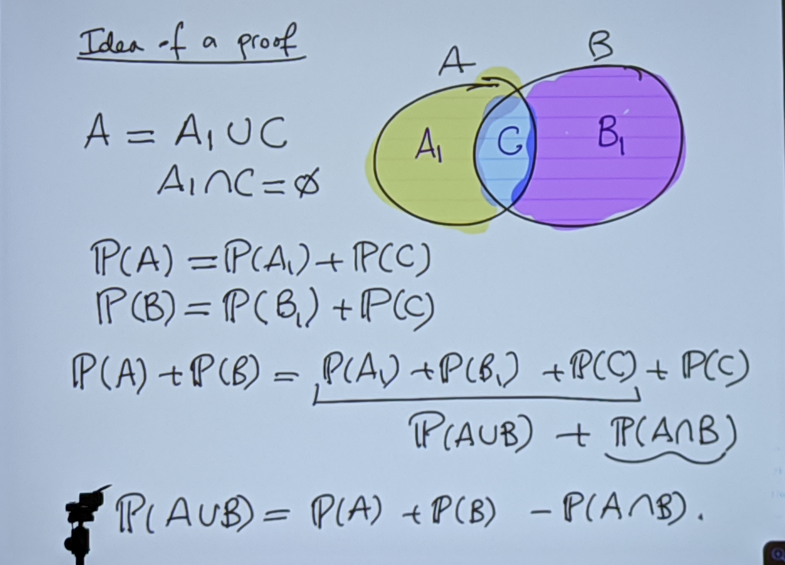

Daria Shutina, CS, $2^{nd}$ year

------

# Probability and Random Processes

[TOC]

## Organization stuff

nstege@jacobs-university.de 

Teams link: https://teams.microsoft.com/_?tenantId=f78e973e-5c0b-4ab8-bbd7-9887c95a8ebd#/school/conversations/General?groupId=9b2928da-a70d-41b9-9ba8-c828df8332ab&threadId=19:y5mgGU61uWlfOP95M0fwVjqsEZQoBiP6g7s3xbOW7nw1@thread.tacv2&ctx=channel

## 22-09-07

$\Omega$ is a sample space. $A \in \Omega$ is an event

$P[\Omega] = 1$

$A \cap B = \varnothing \ \Rightarrow \ P[A \cup B] = P[A] + P[B]$

### The Union Law

$P[A \cup B] = P[A] + P[B] - P[A \cap B]$

## 22-09-15

### Inclusion-exclusion principle 

$$
P(A_1 \cup...\cup A_n) = \underset{1 \leqslant i \leqslant n}{\sum} A_i - \underset{i < j}{\sum} A_i \cap A_j + \underset{i < j < k}{\sum} A_i \cap A_j \cap A_k - \ ... \ + (-1)^{n -1} P(\underset{1 \leqslant i \leqslant n}{\bigcap} A_i)
$$

### Example of envelopes

There are n envelopes and n numbers. We want to put number i into an envelope i. What is the probability that at least one number will be in the right envelope? 

$P(A_i) = \frac{1}{n}, \forall i$ 

$P(A_i \cap A_j) = \frac{(n-2)!}{n!}, \forall i,j$,  since 2 numbers are fixed and others can be in any order. There are n! options to order n elements.

$P(A_i \cap A_j \cap A_k) = \frac{(n-3)!}{n!}$ 

$...$

$P(A_1 \cap ... \cap A_n) = \frac{1}{n!}$

$P(A_1 \cup ... \cup A_n) = \frac{1}{n} n \ - \ \frac{(n-2)!}{n!} \dbinom n 2 + \ ... \ + (-1)^{n - 1} \frac{1}{n} = 1 - \frac{1}{2!} + \frac{1}{3!} - ... + (-1)^{n-1} \frac{1}{n!}$

If $n \rightarrow \infty$, then $P$ limits to $\frac{1}{e} \approx 0.37$ (the formula in a line higher is a Taylor series of $e^x$ where $x = 1$). 

### Secretary problem (Задача о разборчивой невесте)

There is one position and $n$ candidates, and we need to choose the best candidate. With what probability can at least one candidate be the best? 

It is the same as $P(A_1 \cup ... \cup A_n$) which limits to $\frac{1}{e} \approx 0.37$. So if you have a lot of candidates, it could be a good strategy to reject first 30%. 

## 22-09-16

### Geometric probability 

$\Omega$ -- sample space 

$A \subset \Omega$ -- set of favorable outcomes. $P(A) = \frac{\#A}{\#\Omega}$

**Monte Carlo method** -- randomly choose objects for a lot of times. 

Ways to count probability: 

- by length (intervals)
- by volume/area

#### Example: meet between noon and 1pm

Alex and Anna want to meet between 12pm and 1pm. They choose independently at what time to show up. When sb comes, he/she waits for 15 minutes and then leaves. What is the probability that they meet? 

$T_1$ -- time that Alex shows up. $0 \leqslant T_1 \leqslant 1$

$T_2$ -- time that Anna show up $0 \leqslant T_2 \leqslant 1$

$0 \leqslant |T_1 - T_2| \leqslant \frac{1}{4}$

$P = \frac{S_1}{S_0} = (1 - 0.75) \cdot 2 = \frac{1}{2}$

#### Example 2: Buffon's needle

There are parallel lines in a distance of 1. There is a needle of length 1.

Need to keep track of:

- y -- coordinate of the center of the needle. $0 \leqslant y \leqslant  1$

- $\alpha$ -- angle that the needle forms with the line (in the plane which is parallel to the surface). $0 \leqslant \alpha \leqslant  \pi$

  

$P = \frac{\int_0^\pi \frac{sin x}{2} dx}{\frac{1}{2} \pi} = \frac{-cos x |_0^\pi}{\pi} = \frac{2}{\pi}$ 

#### Example 3: Bertrand's paradox /todo

A chord of a circle of radius 1 is chosen. What is the probability that the length of the chord would be at least $\sqrt{3}$ ? 

The points are on the circle. The coordinate of a point is between 0 and $2\pi$. The distance between two points should be at least $120\degree$. 

We can peek the middle point $p$ inside the circle, then draw a chord, where  $p$ is a center of the chord. 

Now the length of the chord is $2 \sqrt{1 - x^2}$, where $x$ is a distance between $p$ and the center of the circle. Should be $\geqslant \sqrt{3} \ \Rightarrow \ x \leqslant \frac{1}{2} \ \Rightarrow \ P = \frac{1}{4}$

wtf

## 22-09-21

### The conditional probability

$A, B \ : \ P(A) \neq 0, \ P(B) \neq 0$. 

$P[A|B] = \frac{P[A \cap B]}{P[B]}$, where $P[A|B]$ -- "A given B" -- probability of A in case B has already occurred. 

### Conditioning: special case $\Omega$

$P[A] = P[A \cap B] + p[A \cap B^c] = P[A|B] \cdot P[B] + P[A|B^c] \cdot P[B^c]$

In general, $P[A] = \underset{i = 1}{\overset{n}{\sum}} p[A \cap B_i] = \underset{i = 1}{\overset{n}{\sum}} P[A|B_i] P[B_i]$

#### Example: 5 coins

There are 5 coins: two double-headed, one double-tailed and two normal. One of the coins is randomly taken. What is the probability that we get a head? 

$B_1$ -- "got double-headed", $B_2$ -- "got double-tailed", $B_3$ -- "got normal". 

$P[H] = \underset{1}{\overset{3}{\sum}} P[A|B_i] P[B_i] =  \underbrace{1 \cdot \frac{2}{5}}_{B_1} + \underbrace{0 \cdot \frac{1}{5}}_{B_2} + \underbrace{\frac{1}{2} \cdot \frac{2}{5}}_{B_3} = 0.6$

### Independent events

$A$ and $B$ are independent, when   $P[A|B] = P[A]$   or   $P[A \cap B] = P[A] \cdot P[B]$

In general, $A_1,..., A_n$ are independent, when $\forall \{ i_1,..,i_k \ | \ i_j \in [1..n], \forall j \} \ \ : \ \ P[\underset{j = 1}{\overset{k}{\bigcap}} A_{i_j}] = \underset{j = 1}{\overset{k}{\prod}} P[A_{i_j}]$

#### Example: a pair of dies

A pair of dies is rolled. 

A: the first die's score $\geqslant 3$.  $P[A] = \frac{1}{2}$

B: The second die's score $\geqslant 5$.   $P[B] = \frac{1}{3}$

C: Aim of the scores $=6$.   $P[C] = \frac{5}{36}$

$P[A \cap B] = \frac{1}{6}, \ \ P[A \cap C] = \frac{1}{12}, \ \ P[B \cap C] = \frac{1}{36}$

$A$ and $B$ are independent:  $P[A \cap B] = \frac{1}{6}$

$A$ and $C$ are dependent: $P[A \cap C] \neq \frac{5}{72}$ 

$B$ and $C$ are dependent:  $P[B \cap C] \neq \frac{5}{108}$

### Random walks

Random walk means you can move eigther to the right, either to the left with the probability of $\frac{1}{2}$.

#### Example: an X-axis \todo

There is an X-axis and numbers 0,1,2,3. We can move to the right or to the left with the prob. of $\frac{1}{2}$. If we get to 0 or 3, we stop. What is the probability that we stop in 0?

$p_i$ = Prob. of stopping in 0 if we start in $i$. 

$p_0 = 1$,  $p_3 = 0$

$p_1 = p_2 \cdot \frac{1}{2} + \frac{1}{2} = \frac{p_2 + 1}{2}$ 

$p_2 = p_3 \cdot \frac{1}{2} + p_1 \cdot \frac{1}{2}$ 

## 22-09-23

$\Omega = B_1 \cup B_2$,   $B_1 \cap B_2 = \varnothing$

$P[B_1 | A ] = \frac{P[B_1 \cap A]}{P[A]} = \frac{P[A|B_1] \cdot P[B_1]}{P[A \cap B_1] + P[A \cup B_2]} =  \frac{P[A|B_1] \cdot P[B_1]}{P[A|B_1] \cdot P[B_1] + P[A|B_2] \cdot P[B_2]}$

### Example 1: transmission channel 

Two types of messages can be sent: 0 and 1. We assume that 40% of the time 1 is got. 

$\Omega = I_0 \cup I_1$;       $I_1$ = "input is 1",  $I_0$ = "input is 0";    

​                             $O_1$ = "output is 1",  $O_0$ = "output is 0"; 

$P[I_1] = 0.4$,  $P[I_0] = 0.6$

$P[O_1 | I_1] = 0.9$,  $P[O_0|I_0] = 0.8$

$P[O_0|I_1] = 1 - P[O_1|I_1] = 0.1$

$P[O_0] = P[O_0] \cap P[I_0] + P[O_0] \cap P[I_1] = P[O_0|I_0] \cdot P[I_0] + P[O_0 | I_1] \cdot P[I_1] = 0.52$

### Random variables

Let $(\Omega, P)$ be a space. A function $X : \Omega \rightarrow R$

#### Example 1: three coin throwings

$X : \Omega \rightarrow \texttt{[\# of heads]} $

#### Example 2: three throwings of a fair die

$X_1 : \Omega \rightarrow \texttt{[sum of outcomes]}$

$X_2 : \Omega \rightarrow \{ \texttt{ 0,1  :  [two similar numbers in a row?]} \}$

The probability mass function of a randim variable X with X of values $x_1,...$ :     $p(x_i) = P[X = x_i]$

## 22-09-28

### Random variables

Let $(\Omega, P)$ be a probability space. 

$X \ : \ \Omega \rightarrow R$ is a *real-valued random variable*.

$X \ : \ \Omega \rightarrow R^n$ is a *vector-valued random variable*. 

The probability *mass function* of a random variable $X$ with values $x_1,..,x_n$ is defined by $p(x_i) = P[X = x_i]$

Mandatory conditions:

$0 \leqslant p(x_i) \leqslant 1$

$\sum \limits_1^n p(x_i) = 1$

#### Bernoulli random variables

A random variable $X$ is called the Bernoulli random variable if it takes only two values: $0$ and $1$, and $P[X=1] = p, \ P[X=0] = 1-p$

For example, $X = \{ \ \texttt{`got a head'}, \ \texttt{`got a tail'} \ \}$

#### Bernoulli distribution

The coins if thown $n$ times. $p$ is the prob. of getting a head. What is the probability that we get $k$ heads?

$X$ -- how many times there was a heads.
$$
p[X=k] = \left \{ \begin{array}{l}
    \binom{n}{k} p^k (1-p)^{n-k}, \ k \in [0, n] \\
    0, \ k \notin [0, n]
\end{array} \right .
$$

#### Geometric distribution

The coin is thrown untill a heads shows up. The prob. of getting a head s is $p$. 

$X$ -- first occurance of a heads. 
$$
p[X=k] = \left \{ \begin{array}{l}
    (1-p)^{k-1} p, \ k \geqslant 1 \\
    0, \ k < 1
\end{array} \right .
$$

##### Example: more than $k$ heads

$P[X > k] = \sum \limits_{i=k+1}^{\infty} p(1-p)^{i-1} = p(1-p)^k \cdot (1 + (1-p) + (1-p)^2 + ...) =p(1-p)^k \cdot \frac{1}{1-(1-p)} = (1-p)^k$

#### Poisson distribution

Particles are created at a random time. 

The probability that a practicle is created in a time segment $[t_0, t_1]$ depends on $\Delta t = t_0 - t_1$ and does not depend on the amount of already created particles. Also, the prob. is $\approx \lambda \cdot \Delta t$ for small $\Delta t$.
$$
p[X=k] = \left \{ \begin{array}{l}
    \frac{\lambda^k}{k!}e^{-\lambda}, \ k \geqslant 0 \\
    0, \ k < 0
\end{array} \right .
$$

##### Example: participants and phones

There are $n$ people in a room. $p$ is the prob. that a person's phone rings. What is the probability that $k$ phones will ring? 

$\lambda = \frac{p}{n}$  -- constant;  $\lambda \rightarrow 0, \ n \rightarrow \infty$

$P[X=0] = p^0 (1-p)^n = (1 + \frac{- \lambda}{n}^n) \ \underset{n \rightarrow \infty}{\longrightarrow} \ e^{-\lambda}$

$P[X = 1] = \binom{n}{1} p (1-p)^{n-1} = np (1-p)^{n-1} = \frac{\lambda(1+\frac{-\lambda}{n})^n}{1+\frac{-\lambda}{n}} \ \underset{n \rightarrow \infty}{\longrightarrow} \ \lambda e^{-\lambda}$

$P[X=k] = \binom{n}{k}p^k(1-p)^{n-k} = \frac{n(n-1)...(n-k+1)}{k!} \cdot \frac{\lambda^k}{n^k} \cdot \frac{(1 + \frac{-\lambda}{n})^n}{(1 + \frac{-\lambda}{n})^k} = \frac{\lambda^k}{k!}e^{-\lambda} \cdot \frac{n(n-1)...(n-k+1)}{(n- \lambda)^k} \ \underset{n \rightarrow \infty}{\longrightarrow} \ \frac{\lambda^k}{k!}e^{-\lambda}$

### Distribution function

Let $X \ : \ \Omega \rightarrow R$ be a random variable. 

$F_X \ : \ R \rightarrow [0,1]$ -- the *probability distribution function* of $X$.

$F_X(t) = P[X \leqslant t]$

***The probability distribution function properties:***

1. $F_X$ is increasing:  $\forall t_1 < t_2 \ : \ F_X(t_1) \leqslant F_X(t_2)$
2. $F_X$ is right-continuous:   $\lim \limits_{s \rightarrow t+} F_X(s) = F_X(t)$
3. $\lim \limits_{s \rightarrow +\infty} F_X(s) = 1$
4. $\lim \limits_{s \rightarrow -\infty} F_X(s) = 0$

***Remark:***

$P[x > t] = 1 - P[x \leqslant t] = 1 - F_X(t)$

$P[x < t] = F_X(t-) = \lim \limits_{s \rightarrow t-} F_X(s)$

### Density function

Captures the density on the axis. There are no distinct points, so we use a delimiter to count the probability. 
$$
f(x) = \lim \limits_{\epsilon \rightarrow 0} \frac{\texttt{mass} \in (x - \epsilon, x + \epsilon)}{2 \epsilon}
$$

$f(x) \geqslant 0, \ \forall x$

$\int \limits_{-\infty}^{+\infty} f(x) = 1$

### Continuous random variables

$X : \Omega \ \rightarrow R$   is called continuous, if   $\exists \ f_X \ : \ R \rightarrow R \ \geqslant 0, \forall t$,   such that   $F_X(t) = \int \limits_{-\infty}^t f_X(x) dx$

$P[X > t] = 1 - F_X(t)$

$P[X \leqslant t] = \lim \limits_{s \rightarrow t+} F_X(s)$

$P[X < t] = \lim \limits_{s \rightarrow t-} F_X(s)$

$P[X = t] = F_X(t) - \lim \limits_{s \rightarrow t-} F_X(s)$

$F_X(t + \epsilon) - F_X(t) = \int \limits_t^{t + \epsilon} f_X(x) dx = \epsilon \cdot f_X(t)$

$\lim \limits_{\epsilon \rightarrow 0} \frac{F_X(t + \epsilon) - F_X(t)}{\epsilon} = f_X(t)$

#### Example

Find a  probability density function ($f_X$) that satisfies the following properties:

$\left \{ \begin{array}{l} f_X(t) \geqslant 0, \forall t \\ \int \limits_{-\infty}^{+\infty} f_X(x) dx = 1 \\ \end{array} \right .$

$f_X = \frac{e^{-|t|}}{2}$

$\int \limits_{-\infty}^{+\infty}\frac{ e^{-|x|}}{2} dx = (-1)e^{-x} |_{0}^{+\infty} = 1$

## 22-10-07

### Uniform distribution

A random variable has a uniform distribution over the interval $[a, b]$ if its probability density function is given by
$$
f_x(t) = 
\left \{
\begin{array}{l}
\frac{1}{b-a}, \ t \in [a, b] \\
0, \textnormal{ otherwise}
\end{array}
\right .
$$
In other words, a random variable X is uniformly distributed in the interval $I = [a, b]$ if the probability that $X$ belongs to a segment $I \in [a, b] $is proportional to the length of $I$.

The distribution function of a random variable with a uniform distribution is given by
$$
F_x(t) = 
\left \{
\begin{array}{l}
0, \ t \leqslant a \\
\frac{t-a}{b-a}, \ a \leqslant t \leqslant b \\
1, \ t \geqslant  b
\end{array}
\right .
$$
*Proof:*

$t \leqslant a \ \Rightarrow \ \int \limits_{-\infty}^t f_x(x)dx = 0$

$a \leqslant t \leqslant b \ \Rightarrow \ \int \limits_{-\infty}^t f_X(x)dx = \frac{x}{b-a}|_a^t = \frac{t-a}{b-a}$

$t \geqslant b \ \Rightarrow \ \int \limits_{-\infty}^t f_x(x)dx = \frac{x}{b-a} |_a^b = 1$

#### Example 1: $Y = X^2$ \todo

#### Example 2: $Y = \sin X$ \todo

$P[-\frac{\pi}{4} \leqslant x \leqslant \frac{\pi}{4}] = \frac{\frac{\pi}{2}}{\pi} = 0.5$

$P[\frac{-\sqrt{2}}{2} \leqslant Y \leqslant \frac{\sqrt{2}}{2}] = \frac{1}{2}$

Let us find a distribution function for $Y$:

$-1 \leqslant t \leqslant 1$

$F_Y(t) = P[Y \leqslant t] = P[\sin X \leqslant t] = P[X \leqslant \arcsin t] = \frac{\frac{\pi}{2} + \arcsin t}{\pi} = \frac{1}{2} + \frac{\arcsin t}{\pi}$

$f_y(t) = \frac{d}{dt} F_y(t) = (\frac{\arcsin t}{\pi})' = \frac{1}{\pi} \frac{1}{\sqrt{1 - t^2}}$

### Exponential random variables

A continuous random variable $X$ has an exponential distribution with a parameter $\lambda$ if
$$
f_X(t) = 
\left \{
\begin{array}{l}
\lambda e^{-\lambda t}, \ t \geqslant 0 \\
0, \ t < 0
\end{array}
\right .
$$
$\int \limits_{-\infty}^{+\infty} f_x(t) dt = \int \limits_0^{+\infty}\lambda e^{-\lambda t}dt = (-1) e^{-\lambda t}|_0^{+\infty} = 1$

The distribution function for a random variable with an exponential distribution is given by
$$
F_X(t) =
\left \{
\begin{array}{l}
1 - e^{-\lambda t}, \ t \geqslant 0 \\
0, \ t < 0
\end{array}
\right .
$$
*Proof:*

$\int \limits_{0}^{t} \lambda e^{-\lambda x} dx = (-1)e^{-\lambda x}|_0^t = 1 - e^{-\lambda t}$

$P[X > t] = 1 - F_X(t) = e^{-\lambda t}$

$P[X > t_1 + t_2 | X > t_1] = \frac{P[X > t_1 +t_2 \ \&\& \ X > t_1]}{P[X > t_1]} = \frac{P[X > t_1 + t_2]}{P[X > t_1]} = \frac{e^{-\lambda (t_1 + t_2)}}{e^{-\lambda  t_1}} = e^{-\lambda t_2} = P[X > t_2]$

### Gaussian (normal) random variables

A continuous random variable X is said to have Gaussian or normal distribution with parameters $(\mu, \sigma^2)$ if the probability density function is given by
$$
f_X(t) = \frac{1}{\sigma \sqrt{2\pi}} e^{-\frac{(x-\mu)^2}{2 \sigma^2}}
$$

## 22-10-19

### Expectation

A discrete variable $X$ with values $x_1, ..., x_n$ obtained with probabilities $p_1, ..., p_n$. 
$$
E(X) = \sum \limits_1^n p_ix_i
$$

#### For Bernoulli variables

$E(X) = p \cdot 1 + (1 - p) \cdot 0 = p$

#### For binomial variables 

$E(X) = \sum \limits_0^n k \cdot P(X = k) = \sum \limits_1^n k \cdot \binom{n}{k} \cdot p^k (1-p)^{n-k} = \sum \limits_1^n \frac{k \cdot n!}{k! (n-k)!} \cdot p^k(1-p)^{n-k} = \sum \limits_1^n \frac{(n-1)! \cdot n}{(k-1)!(n-k)!} \cdot p^k (1-p)^{n-k} =$

$ = n \cdot \sum \limits_1^{n} \binom{n-1}{k-1} \cdot p^k (1-p)^{n-k} = n \cdot \sum \limits_0^{n-1} \binom{n-1}{k} p^{k+1} (1-p)^{(n-1) - k} = np \cdot (p + 1 - p)^{n-1} = np$

#### For geometric distribution

$E(X) = \sum \limits_1^{\infty} i \cdot p \cdot (1-p)^{i-1} = \sum \limits_1^{\infty} p (1-p)^{i-1} + \sum \limits_2^{\infty} p(1-p)^{i-1} + \sum \limits_3^{\infty} p(1-p)^{i-1} + ... = $

$= \sum \limits_1^{\infty} P[X \geqslant i] = \sum \limits_1^{\infty} (1 - p)^{i - 1} = \frac{1}{p}$

### Theorem

$X$ takes values $0, 1, 2,...$. Then $E(X) = \sum \limits_1^{\infty} P[X \geqslant i]$

*Proof:*

$E(X) = \sum \limits_0^{\infty} i \cdot p_i = p_1 1 \ + \ p_2 2 \ + \ p_3 3 \ + \ p_4 4 \ + \ ... \ + \ p_2 2 \ + \ p_3 3 \ + \ p_4 4 \ + \ ... \ + \ p_3 3 \ + \ p_4 4 \ + \ ... = \sum \limits_1^{\infty} P[X \geqslant i]$ 

## 22-10-21

### Properties of expectation

Let $X$, $Y$ be random variables and $c$ a constant. 

1. *Linearity:*  $E(cX + y) = cE(X) + E(Y)$
2. *Comparison:*  $X \leqslant Y \ \Rightarrow \ E(X) \leqslant E(Y)$
3. $f \ : \ R \rightarrow R \ \Longrightarrow \ E(X) = \sum \limits_1^n p_i \cdot f(x_i)$

### Example 1: envelops and numbers

Suppose n letters are placed in n envelopes. $X$ -- # of letters placed in the right envelope. Find $E(X)$. 

$E(X) = 0 \cdot \frac{1}{3} + 1 \cdot \frac{1}{2} + 3 \cdot \frac{1}{6} = 1$

A general case:

$X = X_1 + ... + X_n$, where $X_i = 
\left \{ \begin{array}{l} 1, \ \textnormal{if i-th number is in the i-th letter} \\ 0, \ \textnormal{otherwise} \end{array}  \right .$

$E(X_i) = \frac{(n-1)!}{n!} \cdot 1 + (1 - \frac{(n-1)!}{n!}) \cdot 0 = \frac{1}{n}$

 $E(X) = \sum \limits_1^n E(X_i) = n \cdot \frac{1}{n} = 1$

### Example 2: elevator stops

There are $m$ people in an elevator. The elevator goes up a building with $n$ floors and stops at each floor where at least one person wants to get off.  $X$ -- # of stops. Find $E(X)$. 

$X_i = 
\left \{ \begin{array}{l} 1, \ \textnormal{if elevator stops at i-th floor} \\ 0, \ \textnormal{otherwise} \end{array}  \right .$

$X = X_1 + ... + X_n$

The prob. that the nobody goes off on the $i$-th floor is $\underbrace{(\frac{n-1}{n})^m}_{X_i = 0}$

$\Rightarrow \ $ the prob. that $\geqslant 1$ people go off is $\underbrace{1 - (\frac{n-1}{n})^m}_{X_i = 1}$ . 

$E(X_i) \ =  \ (1 - (\frac{n-1}{n})^m) \cdot 1 \ + \ (\frac{n-1}{n})^m \cdot 0 \ = \ 1 - (\frac{n-1}{n})^m$

$E(X) = \sum \limits_1^n E(X_i) = n \cdot (1 - (\frac{n-1}{n})^m)$

## 22-10-28

### Expectation as an integral

$X$ is a continuous random variable. 

$f(X)$ is a probability density function

$E(X) = \int \limits_{-\infty}^{+\infty} x f(x) dx$

#### Example 1

$f(x) = \left \{ \begin{array}{l} \frac{1}{b - a}, \ a \leqslant x \leqslant b \\ 0, \ \textnormal{otherwise } \end{array} \right .$

$E(X) = \int \limits_{-\infty}^{+\infty} x f(x) dx = \int \limits_a^b \frac{x}{b - a} dx = \frac{x^2}{2(b-a)}|_{a}^b = \frac{b+a}{2}$

#### Example 2

$f(x) = \left \{ \begin{array}{l} 2x, \ 0 \leqslant x \leqslant 1 \\ 0, \ \textnormal{otherwise } \end{array} \right .$

$E(X) = \int \limits_{-\infty}^{+\infty} x f(x) dx = \int \limits_0^1 2x dx = \frac{2x^3}{3}|_0^1 = \frac{2}{3}$

### Expectation of a non-negative random variable

$X$ is a non-negative continuous random variable 

$F_X(t)$ is a distribution function. $F_X(t) = P[X \leqslant t]$

$E(X) = \int \limits_0^{\infty} P[X \geqslant t] dt = \int \limits_0^{\infty} (1 - F_X(t))dt$

#### Example

$f(x) = \left \{ \begin{array}{l} \lambda  e^{-\lambda  x }, \ x > 0 \\ 0, \ x \leqslant 0 \end{array} \right .$

$F(t) = \left \{ \begin{array}{l} 1 - e^{-\lambda t}, \ t > 0 \\ 0, \ t \leqslant 0 \end{array} \right .$

$E(X) = \int \limits_0^{\infty} (1 - (1 - e^{-\lambda t})) = \frac{e^{-\lambda t}}{-\lambda }|_0^{\infty} = \frac{1}{\lambda}$

#### Example: $E[\sin x]$ over $[0, \pi]$ 

$f(x) = \left \{ \begin{array}{l} \frac{1}{\pi}, \ 0 \leqslant x \leqslant \pi \\ 0, \ \textnormal{otherwise} \end{array} \right .$

We choose one number from a segment $[0, \pi]$ with a prob. of $\frac{1}{\pi}$. 

$E(\sin x) = \int \limits_0^{\pi} \sin x \frac{1}{\pi} dx = \frac{-\cos x}{\pi}|_0^{\pi} = \frac{2}{\pi} $

### Variance

-- мера разброса значений случайной величины относительно её матожидания. 

$X$ is a random variable. 

$Var(X) = E[(X - E(X))^2]$

$Var(X) = E(X^2) - E^2(X)$

#### Properties of variance 

1. $Var(cX) = c^2 Var(X)$

   $Var(cX) = E(c^2 X^2) - (E(cX))^2 = c^2 E(X^2) - c^2 E^2(X) = c^2 Var(X)$ 

2. $Var(X) \geqslant 0$

   $E(X^2) \geqslant E^2(X) \ \Rightarrow \ Var(X \geqslant 0)$

3. $Var(X+a) = Var(X)$

4. $Var(X + a) = E[ \ ( \ (x+a) - \underbrace{E[x+a]}_{\small =E[X] + E[a] = E[X] + a} )^2 \ ] = E[(x - E[X])^2] = Var(X)$

5. $X, Y$ are independent $\Longrightarrow$ $Var(X + Y) = Var(X) + Var(Y)$

   Proof is [here](#properties-of-covariance ) (№6).

   

#### Example

$f(x) = \left \{ \begin{array}{l} 1, \ 0 \leqslant x \leqslant 1 \\ 0, \ \textnormal{otherwise} \end{array} \right .$

$Var(X) = E(X^2) - E^2(X) = \int \limits_0^1 x^2 dx - (\int \limits_0^1 x dx )^2 = \frac{1}{3} - \frac{1}{4} = \frac{1}{12}$

## 22-11-02

### Joint probability mass function 

$n$ discrete random variables $x_1, ..., x_n$

jpmf is defined by $p(x_1, ..., x_n) = P[X_1 = x_1, ..., X_n = x_n]$

#### Example: chicken eggs 

A chicken lays $N$ eggs, where $N$ has a Poisson distribution with a parameter $\lambda$. 

Each egg independently hatches with probability $p$ and do not hatch with probability $1-p$. 

$X$ -- # of eggs that hatch. 

$Y$ -- # of eggs that do not hatch. 

Find the joint probability mass function of $X$ and $Y$.

$P[N = n] = e^{-\lambda} \frac{\lambda^n}{n!}, \ \ n = 0, \ 1, \ 2, ...$

Imagine we do not have $Y$:

$P[X = k] = \sum \limits_{n = 0}^{\infty} \underbrace{P[X = k | N = n]}_{\textnormal{binomial distribution}} \cdot P[N = n] = \sum \limits_{n=k}^{\infty} \binom{n}{k} p^k (1-p)^{n-k} e^{-\lambda} \frac{\lambda^n}{n!} = \frac{e^{-\lambda} p^k \lambda^k}{k!} \underbrace{\sum \limits_{n = k}^{\infty} \frac{(\lambda (1-p))^{n-k}}{(n-k)!}}_{= e^{\lambda (1-p)}} = \frac{p^k \lambda^k}{k!} e^{-\lambda p}$

Now $Y$ appears:

  $P[X = k, Y = j] = P[X = k, Y = j | N = k + j] \cdot P[N = k + j] = $ 

$= \binom{k + j}{k} p^k (1-p)^j \cdot e^{-\lambda} \frac{\lambda^{k + j}}{(k + j)!} = \frac{e^{-\lambda p} (\lambda p)^{k}}{k!} \cdot \frac{e^{-\lambda (1-p) (\lambda (1-p))^{j}}}{j!} = P[X = k] \cdot P[Y = j]$

### Theorem (expectation of joint prob)

$X_1, ..., X_n$ are *independent* random variables. 

$E(X_1 ... X_n) = E(X_1) \cdot ... \cdot E(X_n)$

*Proof:*

### Example(matrix $A$ and $E(det(A))$)

$A$ is a $2 \times 2$ matrix whose entries are independent random variables with uniform distribution over $\{1, 2, 3\}$.  Find $E(det(A))$.

$A = \begin{bmatrix} A_{11} & A_{12} \\ A_{21} & A_{22} \end{bmatrix}$

$E(A_{ij}) = (1 + 2 + 3) \cdot \frac{1}{3} = 2, \ \forall i, j$

$E(det(A)) = E(A_{11} A_{22} - A_{12} A_{21}) = E(A_{11}) E( A_{22}) - E(A_{12}) E(A_{22}) = 0$

### Covariance 

--  мера зависимости двух случайных величин.

$X$, $Y$ are random variables. 

$Cov \ ( \ X, \ Y \ ) = E \ [\ ( \ X - E[X] \ ) \ ( \ Y - E[Y] \ ) \ ]$

#### Properties of covariance 

1. $Cov(X, X) = Var(X)$  

   $E((X - E_x)(X - E_x)) \underset{(2)}{=} E(X^2) - E^2(X) = Var(X)$

2. $Cov(X, Y) = E(XY) - E(X) \cdot E(Y)$ 

   $((X - E_X)(Y - E_Y)) = E(XY) - E_X E_Y - E_X E_Y + E_X E_Y = E(XY) - E_X E_Y$

3. $X, Y$ are independent $\Longrightarrow$ $Cov(X, Y) = 0$

   $Cov(X, Y) \underset{(2)}{=} E_X E_Y - E_X E_Y = 0$

4. $X, Y$ are independent $\Longrightarrow$ $Var(X + Y) = Var(X) + Var(Y)$

   $E((X + Y)^2) - (E(X) + E(Y))^2 = E(X^2) + E(Y^2) + 2 E(XY) - E^2(X) - 2 E(X) E(Y) - E^2(Y) = Var(X) + Var(Y) - \underbrace{2 Cov(X, Y)}_{=0}$

$X, Y$ are uncorrelated $\Longleftrightarrow \ E(XY) = E(X) E(Y) \ \Longleftrightarrow \ Cov(X, Y) = 0$

#### Example

$X_1, ..., X_n$ -- independent random variables with Bernoulli distribution 

$S_n = X_1 + ... + X_n$

What is the probability mass function of $S_n$?

$P(X_i = 1) = p; \ P(X_i = 0) = 1 - p$

$S_n \in \{ \ 0, \ 1, ..., n \ \} $

​	$P(S_n = k) = \sum \underbrace{P(X_1, = 1, ..., X_u = 1, X_{u+1} = 0, ..., X_k = 1, ..., X_n = 0)}_{(*) \ = \ Randomly \ choose \ k \ variables \ that \ are \ 1, \ others \ are \ 0}$

$P(X_1, = 1, ..., X_u = 1, X_{u+1} = 0, ..., X_k = 1, ..., X_n = 0) \underset{\small X_i \ are \ ind. }{=} P(X_1 = 1) \cdot ... \cdot P(X_u = 1) ... P(X_{u+1} = 0) ... = p^k (1-p)^{n-k}$

$\Rightarrow \ S_n = \binom{n}{k} p^k (1-p)^{n-k}$

$E(S_n) = \sum \limits_1^n E(X_i) = np$

$Var(S_n) \underset{\small X_i \ are \ ind.}{=} \sum \limits_1^n Var(X_i) = \sum \limits_1^n \underbrace{E(X_i^2)}_{= p} - \underbrace{E^2(X_i)}_{= p^2} = np(1-p)$

$E(X^2) = p \cdot 1^2 + (1-p) \cdot 0^2 = p$  ([proof](#Properties of expectation))

## 22-11-04

### Joint probability density function (JPDF) of two random variables

A two-dimensional box is a subset of $R^2$ defined by $J = [a, b] \times [c, d]$

$X, Y$ -- random continuous variables.

***JPDF*** is a non-negative $f \ : \ R \rightarrow R$ such that: 

(version 1)      $\forall s, t \in R \ : \ P[X \leqslant s, Y \leqslant t] = \int \limits_{-\infty}^s \int \limits_{-\infty}^t f(x, y) dy dx$

(version 2)      for a two-dimensional box $J = [s_1, s_2] \times [t_1, t_2]$   $P[s_1 \leqslant X \leqslant  s_2, t_1 \leqslant Y \leqslant t_2] = \int \limits_{s_1}^{s_2} \int \limits_{t_1}^{t_2} f(x, y) dy dx$

(version 3)      $\forall B, B \subset R \ : \ P[X, Y \in B] = \int \int_B f(x, y) dx dy$

$\int \limits_{-\infty}^{+\infty} \int \limits_{-\infty}^{+\infty} f(x, y) dx dy = 1$

#### Example 1

$X, Y$ have a JPDF given by 

$f(x, y) = \left \{ \begin{array}{l} c(x^2 + y^2), \ 0 \leqslant x, y \leqslant 1 \\ 0, \ otherwise \end{array} \right .$

1. Find $c$

   $\int \limits_{-\infty}^{+\infty} \int \limits_{-\infty}^{+\infty} f(x, y) dx dy = \int \limits_0^1 \int \limits_0^1 c(x^2 + y^2) dx dy = \frac{2c}{3} = 1; \ c = \frac{3}{2}$

   

   

2. Find PDFs for $X$ and $Y$

   $f_{X, Y}(x, y) = \left \{ \begin{array}{l} \frac{3}{2}(x^2 + y^2), \ 0 \leqslant x, y \leqslant 1 \\ 0, \ otherwise \end{array} \right .$

   

   $P_X(x_0) = \sum \limits_y P_{X, Y}(x_0, y)$

   $ f_X(x_0) = \int \limits_{-\infty}^{+\infty} f_{X, Y}(x_0, y) dy = \left \{ \begin{array}{l} \int \limits_0^1 \frac{3}{2}(x^2 + y^2) dy, \ 0 \leqslant y \leqslant 1 \\ 0, \ otherwise \end{array} \right . =  \left \{ \begin{array}{l}  \frac{3}{2} (x^2 + \frac{1}{3}), \ 0 \leqslant y \leqslant 1 \\ 0, \ otherwise \end{array} \right . $

   $P_Y(y_0) = \sum \limits_x P_{X, Y} (x, y_0); \ f_Y(y_0) = \int \limits_{-\infty}^{+\infty} f_{X, Y} (x, y_0) dx = \left \{ \begin{array}{l}  \frac{3}{2}(y^2 + \frac{1}{3}), \ 0 \leqslant y \leqslant 1 \\ 0, \ otherwise \end{array} \right .$

#### Example 2: point from a square $[0, 1]^2$

A point $P = (x, y)$ is chosen informly and randomly from a square $[0, 1] \times [0, 1]$. 

$X$, $Y$ denote coordinates of $P$. Find PDFs for $X$ and $Y$.  

$f_{X,Y}(x, y) = \left \{ \begin{array}{l} \frac{1}{s_{[0, 1]^2}} = 1, \  0 \leqslant x, y \leqslant 1 \\ 0, \ otherwise \end{array} \right . $

$f_X(x) = \left \{ \begin{array}{l} 1, \ 0 \leqslant x \leqslant 1 \\ 0, \ otherwise \end{array} \right .$

$f_Y(y) = \left \{ \begin{array}{l} 1 , \ 0 \leqslant y \leqslant 1 \\ 0, \ otherwise \end{array} \right .$

#### Example 2: point from a circle

A point $P = (x, y)$ is chosen randomly from a circle $x^2 + y^2 \leqslant 1$

$f_{X, Y}(x, y) = \left \{ \begin{array}{l} \frac{1}{S_{circle}} = \frac{1}{\pi}, \ x^2 + y^2 \leqslant 1 \\ 0, \ otherwise \end{array} \right .$

$-1 \leqslant x \leqslant 1; \ \ \ f_X(x) = \int \limits_{-\infty}^{+\infty} f_{X, Y}(x, y) dy = \int \limits_{-\sqrt{1 - x^2}}^{\sqrt{1 - x^2}} \frac{1}{\pi} dy = \frac{y}{\pi}|_{-\sqrt{1 - x^2}}^{\sqrt{1 - x^2}} = \frac{2 \sqrt{1 - x^2}}{\pi}$

$f_X(x) = \left \{ \begin{array}{l} \frac{2 \sqrt{1 - x^2}}{\pi}, \ -1 \leqslant x \leqslant 1 \\ 0, \ otherwise \end{array} \right .$

$f_Y(y) = \left \{ \begin{array}{l} \frac{2 \sqrt{1 - y^2}}{\pi}, \ -1 \leqslant y \leqslant 1 \\ 0, \ otherwise \end{array} \right .$

### Independence 

Continuous random variables $X$, $Y$ are independent if $f_{X, Y}(x, y) = f_X(x) f_Y(y)$

#### Example 1: exponential variables

$X$ and $Y$ are independent exponential random variables with parameters $\lambda$ and $\beta$. Find the prob. of the event that $Y \leqslant X$.

$f_X(x) = \left \{ \begin{array}{l} \lambda e^{-\lambda x}, \ x \geqslant 0 \\ 0, \ x < 0 \end{array} \right .$

$f_Y(y) = \left \{ \begin{array}{l} \beta e^{-\beta y}, \ y \geqslant 0 \\ 0, \ y < 0 \end{array} \right .$

$f_{X, Y}(x, y) = f_X(x) f_Y(y) = \left \{ \begin{array}{l} \lambda \beta e^{-(\lambda x + \beta y)}, , \ x, y \geqslant 0 \\ 0, \ otherwise \end{array} \right .$

$P[Y \leqslant x] = \int \limits_0^{+\infty} \int \limits_0^x \lambda \beta e^{-(\lambda x + \beta y)}dy dx = \int \limits_0^{+\infty} \lambda e^{-\lambda x} - \lambda e^{-(\lambda + \beta)x} dx = \frac{\beta}{\lambda + \beta}$

#### Example 2: choose from the interval (0, 1)

$X$ and $Y$ are chosen randomly and *independently* from the interval $(0,1)$. Define $Z = \frac{Y}{X}$. Compute the prob. distribution function of $Z$.

$f_X(x) = \left\{ \begin{array}{l} 1, \ 0 < x < 1 \\ 0, \ otherwise \end{array} \right .$

$f_Y(y) = \left\{ \begin{array}{l} 1, \ 0 < y < 1 \\ 0, \ otherwise \end{array} \right .$

$f_{X, Y}(x, y) = \left \{ \begin{array}{l} 1, \ 0 < x, y < 1 \\ 0, \ otherwise \end{array} \right .$

$Z = \frac{Y}{X} \in [0, +\infty)$

$F_Z(t) = P[Z \leqslant t] = P[Y \leqslant tX] = \left \{ \begin{array}{l} S_{triangle} = \frac{t}{2}, t < 1 \\ S_{trapezoid} = 1 - \frac{1}{2t}, t \geqslant 1 \end{array} \right .$

## 22-11-09

### JPDF of $n$ random variables

$X_1, ..., X_n$ -- continuous random variables. 

$f(X_1, ..., X_n)$ is a joint probability density function if
$$
\forall B \subset R^n \ : \ P[(X_1,...,X_n) \in B] = \underset{B}{\int \int} f(x_1,...,x_n) dx_1 ... dx_n
$$

### Conditional probability mass function

$X$ and $Y$ are discrete random variables. 

$p_Y(y) = P[Y = y] > 0$

The conditional probability mass function of $X$ with condition $Y = y$ is defined by 
$$
p_{X|Y}(x|y) = P[X = x | Y = y] = \frac{P[X = x, Y=y]}{P[Y=y]} = \frac{p_{X,Y}(x, y)}{p_Y(y)}
$$

#### Example 1

Find prob. of $X$ give $Y$.

#### Example 2: a coin and streaks of Heads. 

A coin is flipped 3 times. 

$N$ = # of Heads,  $S$ = length of the longest streak of Heads. 

Determine the joint probability mass function of $N$ given $S$ and $S$ given $N$.

### Independence based on conditional prob

$X$ and $Y$ are *independent* random variables if $p_{X|Y} (x, y) = p_{X}(x), \forall y$

## 22-11-11

### Conditional expectation

$X$, $Y$ are random variables.

$x_1, ..., x_n$ -- values for $X$. 

$E(X|Y=y)$ -- cond. expectation of $X$ given $Y$.

$E(X|Y=y) = \sum \limits_i x_i p_{X|Y}(x_i, y)$

#### Example

$p_{X, Y}(x, y)$ is defined by the table:

 

$E[X|Y=-1] = (-1) \cdot \frac{1}{5} + 0 \cdot \frac{1}{5} + 1 \cdot \frac{3}{5} = \frac{2}{5}$

$E(X | Y = 0) = \frac{1}{5}$

$E(X | Y = 1) = (-1) \cdot \frac{1}{3} + 0 \cdot \frac{2}{3} + 1 \cdot 0 = -\frac{1}{3}$

## 22-11-16

### \todo

#### Example

$X$ is a standard Normal random variable. Estimate $N(t)$. 

$f_X(x) = \frac{1}{\sqrt{2\pi}} e^{-\frac{x^2}{2}}$

$N(t) = P[|X| \geqslant t] \underset{\small f_X(x) \ is \ symmetric}{=} 2 P[X \geqslant t] = 2 \int \limits_t^{\infty} \frac{1}{\sqrt{2\pi}} e^{-\frac{x^2}{2}} dx \leqslant$

$\leqslant \frac{2}{\sqrt{2\pi}} \int \limits_t^{\infty} \frac{x}{t} e^{-\frac{x^2}{2}}dx = \frac{2}{\sqrt{2\pi} t} \cdot (-e^{-\frac{x^2}{2}}|_t^{\infty}) = \frac{2}{\sqrt{2\pi}t} e^{-\frac{t^2}{2}}$

### Markov's inequality

Useful for large $t$  (otherwise, the upper bound for $P$ will be bigger than $1$, senseless)

A positive random variable $X$ has expectation $\mu$. Then
$$
N(t) = P[X \leqslant t] \ \leqslant \ \frac{\mu}{t}, \ \ \forall t > 0
$$

*Proof:*

Compare $X$ with another random variable $Y$, such that 

$Y = \left \{ \begin{array}{l} 0, \ X \leqslant t \\ t, \ X \geqslant t \end{array} \right.$

$Y \leqslant X, \ \forall t > 0 \ \Rightarrow \ E(Y) \leqslant E(X), \forall t > 0$

$\left . \begin{array}{r} E(Y) = 0 \cdot P[X \leqslant t] + t \cdot P[X \geqslant t] \\ E(X) = \mu \end{array} \right \} \ \Rightarrow \ P[X \geqslant t] = \frac{\mu}{t}, \ \forall t > 0$

#### Example

The probability of a coin to land on heads is $\frac{1}{6}$. The coin is flipped $24$ times. 

Find a bound of the probability it lands on heads at least $20$ times. 

$X$ -- the amount of heads. 

$E(X) = 24 \cdot \frac{1}{6} = 4$

$P[\#head \geqslant 20] = \frac{E(X)}{20} = \frac{1}{5}$

### Chebyshev's inequality

Random variable $X$ has finite expectations and finite variance. Then 
$$
P(|X - E(X)| > t) \leqslant \frac{Var(X)}{t^2}
$$

#### \todo insert a pic from slides

We can estimate the probability that a random variable is outside the segment 

